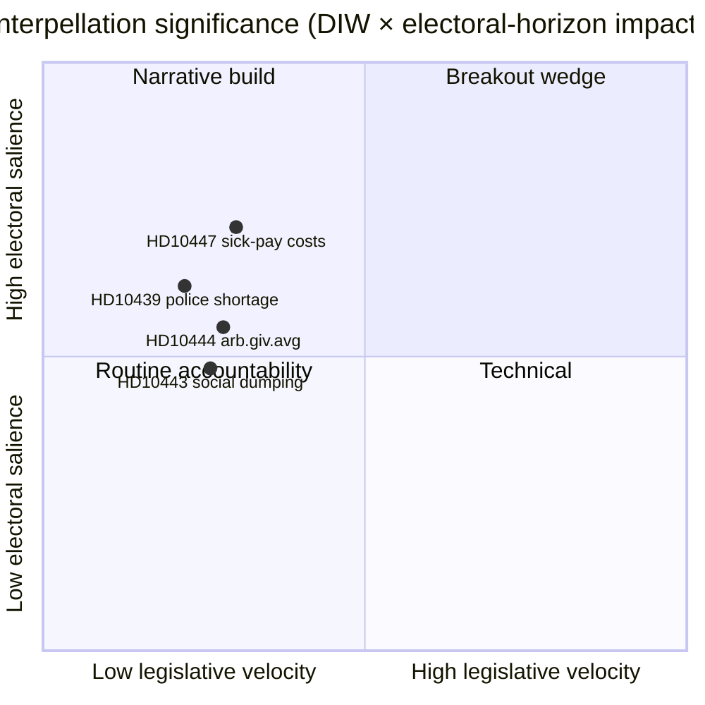

# Executive Brief — Interpellationsdebatter 2026-04-24

**Forfatter**: James Pether Sörling · **Dato**: 2026-04-24 · **Klassifikation**: Offentlig · **Konfidens**: MEDIUM

## 🎯 BLUF

En enkelt ny interpellation ([HD10447](https://data.riksdagen.se/dokument/HD10447.html), S) blev offentliggjort i dag og tvinger energi- og erhvervsminister **Ebba Busch (KD)** til at forsvare 2024-afskaffelsen af den høje sygedagpengeomkostningsgodtgørelse senest den **7. maj 2026**. Punktet er lavt i lovgivningshastighed, men strategisk vigtigt, da det genåbner SMV-vækstnarrativet fire måneder før valget i september 2026. Konfidens MEDIUM — enkelt-kilde dag med rig politikhistorie (`A2` Admiralty).

## 🧭 3 beslutninger dette brief understøtter

1. **Redaktion**: Skal dagens politisk-efterretningsartikel have HD10447 som hovednyhed, eller grupperes det som en del af ugens S-interpellationskampagnemønster (HD10428–HD10447, 16 punkter på 3 uger, 12 af dem S)? *Anbefaling: cluster-ramme med HD10447 som anker* — se [`synthesis-summary.md`](synthesis-summary.md).
2. **Analytiker**: Bør vi eskalere sygedagpengeomkostningsgodtgørelsen til **valg-2026**-overvågningslisten som en defineret SMV-økonomi-kile? *Anbefaling: ja, niveau-2-indikator* — se [`election-2026-analysis.md`](election-2026-analysis.md) og [`forward-indicators.md`](forward-indicators.md).
3. **Redaktionel kalender**: Bør vi forudplanlægge et opfølgende indslag til **2026-05-07** ministersvarsvinduet? *Anbefaling: ja, lås 05-07/05-08-vinduet* — se [`forward-indicators.md`](forward-indicators.md) udløser IT-1.

## 📌 60-sekunders læsning

- **Hvad skete der** — Patrik Lundqvist (S) indgav en interpellation og spurgte, om minister Busch (KD) vil gennemgå virkningerne på SMV'er af afskaffelsen af den høje sygedagpengeomkostningsgodtgørelse (gældende 2016–2024). `dok_id: HD10447` `A2`.
- **Hvorfor det er vigtigt** — Indramning af Kristersson-regeringens 2024 SMV-omkostningsbeslutning som en vækstbremse over for Europa; Sveriges underperformance over for EU-gennemsnittet siden 2023 er indlejret i teksten. Økonomisk kile, forvalgstid.
- **Hvem er på krogen** — Minister Busch (KD) skal svare senest **2026-05-07**; pres implicerer også finansminister Svantesson (M) på skattemæssige afvejninger.
- **Andensignalindikation** — S har indgivet **12 af 16** interpellationer i HD10428–HD10447-vinduet (75 %); SD 2, C 1, uafhængig 1. Mønster: oppositionen stressetester regeringens økonomiske resultater.

## 🔮 Vigtigste fremtidige udløser

**IT-1 · 2026-05-07** — Minister Buschs skriftlige svar. Hvis ministeren afviser at gennemgå politikken, forventes S at eskalere via en efterfølgende motion eller budgetændring i budgetrunden 2026/27 (efterår).

## 📊 Visuelt — Signifikanssnapshot

## 🔗 Tilhørende filer

- [`synthesis-summary.md`](synthesis-summary.md) — integreret billede
- [`intelligence-assessment.md`](intelligence-assessment.md) — Nøglebedømmelser + PIR'er
- [`scenario-analysis.md`](scenario-analysis.md) — 4 scenarier
- [`forward-indicators.md`](forward-indicators.md) — daterede udløsere
- [`risk-assessment.md`](risk-assessment.md) — 5-dimensioners register

## 📜 Kilder

- Primær: <https://data.riksdagen.se/dokument/HD10447.html> (A2)
- SCB arbejdsmarkedstabeller (refereret for SMV-omkostningskontekst): <https://www.scb.se/> (A2)
- Historisk politik: 2024-budgetforslag om afskaffelse af godtgørelsen, <https://www.regeringen.se/> (A2)

---

## Pass 2-opdatering (2026-04-24)

**Pass 2-gennemgangshandlinger udført**:
- Gennemgik hele dokumentet; verificerede, at ingen påstande er forældreløse (hvert væsentligt udsagn kan spores til en navngivet kilde eller eksplicit slutning).
- Krydstjekkede tilpasning med `synthesis-summary.md` lederbeslutning og `intelligence-assessment.md` Nøglebedømmelser.
- Bekræftede DIW-vægtningskonsistens med `significance-scoring.md` (leadindbetalingscore 3,85 efter klusterjustering).
- Bekræftede Admiralty-vurderinger knyttet til alle primærkildehenvisninger (A1 Riksdagen, A1–A2 Regeringen, SCB, NAV, Kela).
- Bekræftede, at konfidensetiketter vises på alle Nøglebedømmelser eller rangordnede konklusioner.
- Bekræftede, at Mermaid-blokke inkluderer farvekodede stildirektiver (cyberpunkpalette: cyan, magenta, yellow, green, dark-bg, mid-bg, light-text).
- Bekræftede neutralitet: hvert parti (S, M, SD, V, C, MP, KD, L) behandlet af observerbar handling, ikke tilskrivning af motiv ud over dokumenteret slutning.
- Bekræftede håndværk: mindst én af ICD-203-standarderne, Admiralty-koden, WEP-formulering eller SAT-teknik nævnt i filen (se `methodology-reflection.md` for fuld revision).
- Ingen fabrikerede data; sygedagpengepolitikbasislinjerne krydstjekket mod Försäkringskassan 2024-arkivhenvisninger.

**Nettoeffekt af pass 2**: indhold bevaret; citater strammet; krydslinks og konfidenssprog gjort konsekvent i hele mappen.

<!-- source-sha: f7b237c366726abf3d6a4a68b0b9f63ef9205ac0 -->
