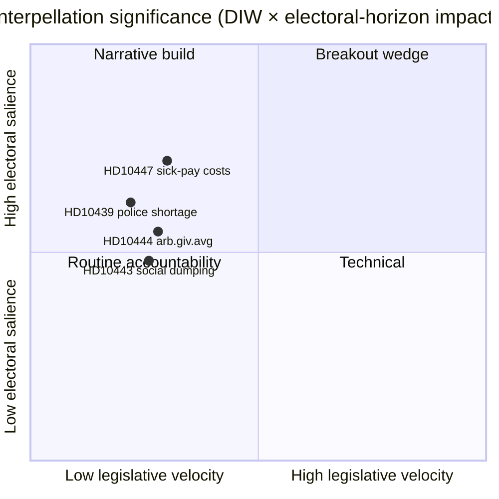

# Exekutivbericht — Interpellationsdebatten 2026-04-24

**Autor**: James Pether Sörling · **Datum**: 2026-04-24 · **Klassifikation**: Öffentlich · **Konfidenz**: MITTEL

## 🎯 BLUF

Eine einzige neue Interpellation ([HD10447](https://data.riksdagen.se/dokument/HD10447.html), S) wurde heute angekündigt und zwingt Energie- und Wirtschaftsminister **Ebba Busch (KD)**, die Abschaffung der hohen Lohnfortzahlungskostenerstattung von 2024 bis spätestens **7. Mai 2026** zu verteidigen. Der Punkt ist von geringer legislativer Dynamik, aber strategisch bedeutsam, da er die KMU-Wachstumsnarration vier Monate vor der Wahl im September 2026 wieder eröffnet. Konfidenz MITTEL — Eintages-Einzelquelle mit reicher Politikgeschichte (`A2` Admiralty).

## 🧭 3 Entscheidungen, die dieser Bericht unterstützt

1. **Redaktion**: Soll der heutige politische Nachrichtenbericht HD10447 als Hauptnachricht führen oder als Teil des wöchentlichen S-Interpellations-Kampagnenmusters gruppiert werden (HD10428–HD10447, 16 Punkte in 3 Wochen, davon 12 von S)? *Empfehlung: Cluster-Rahmen mit HD10447 als Anker* — siehe [`synthesis-summary.md`](synthesis-summary.md).
2. **Analyst**: Sollten wir die Lohnfortzahlungskostenerstattung auf die **Wahl-2026**-Beobachtungsliste als definierter KMU-Wirtschaftskeil setzen? *Empfehlung: ja, Ebene-2-Indikator* — siehe [`election-2026-analysis.md`](election-2026-analysis.md) und [`forward-indicators.md`](forward-indicators.md).
3. **Redaktionskalender**: Sollten wir vorab einen Follow-up-Beitrag für das **2026-05-07**-Ministerantwortfenster einplanen? *Empfehlung: ja, 05-07/05-08-Fenster sichern* — siehe [`forward-indicators.md`](forward-indicators.md) Auslöser IT-1.

## 📌 60-Sekunden-Lektüre

- **Was geschah** — Patrik Lundqvist (S) reichte eine Interpellation ein und fragte, ob Ministerin Busch (KD) die Auswirkungen der Abschaffung der hohen Lohnfortzahlungskostenerstattung auf KMU prüfen wird (gültig 2016–2024). `dok_id: HD10447` `A2`.
- **Warum es wichtig ist** — Rahmt die KMU-Kostenentscheidung der Kristersson-Regierung 2024 als Wachstumshemmnis im Vergleich zu Europa; Schwedens Unterperformance gegenüber dem EU-Durchschnitt seit 2023 ist im Text eingebettet. Wirtschaftlicher Keil, Vorwahlzeit.
- **Wer unter Druck steht** — Ministerin Busch (KD) muss bis **2026-05-07** antworten; der Druck impliziert auch Finanzminister Svantesson (M) bei fiskalischen Abwägungen.
- **Sekundärsignal** — S hat **12 von 16** Interpellationen im HD10428–HD10447-Fenster eingereicht (75 %); SD 2, C 1, unabhängig 1. Muster: Opposition testet die Wirtschaftsbilanz der Regierung.

## 🔮 Wichtigster künftiger Auslöser

**IT-1 · 2026-05-07** — Ministerin Buschs schriftliche Antwort. Wenn die Ministerin eine erneute Überprüfung der Politik ablehnt, wird erwartet, dass S über einen anschließenden Antrag oder eine Budgetänderung in der Budgetrunde 2026/27 (Herbst) eskaliert.

## 📊 Visuell — Signifikanz-Snapshot

## 🔗 Zugehörige Dateien

- [`synthesis-summary.md`](synthesis-summary.md) — integriertes Bild
- [`intelligence-assessment.md`](intelligence-assessment.md) — Schlüsselbeurteilungen + PIRs
- [`scenario-analysis.md`](scenario-analysis.md) — 4 Szenarien
- [`forward-indicators.md`](forward-indicators.md) — datierte Auslöser
- [`risk-assessment.md`](risk-assessment.md) — 5-Dimensionen-Register

## 📜 Quellen

- Primär: <https://data.riksdagen.se/dokument/HD10447.html> (A2)
- SCB-Arbeitsmarkttabellen (referenziert für KMU-Kostenkontex): <https://www.scb.se/> (A2)
- Historische Politik: Haushaltsentwurf 2024 zur Abschaffung der Erstattung, <https://www.regeringen.se/> (A2)

---

## Pass-2-Aktualisierung (2026-04-24)

**Durchgeführte Pass-2-Überprüfungsmaßnahmen**:
- Gesamtes Dokument erneut gelesen; verifiziert, dass keine verwaisten Behauptungen vorhanden sind (jede wesentliche Aussage ist auf eine benannte Quelle oder explizite Schlussfolgerung zurückführbar).
- Ausrichtung mit `synthesis-summary.md`-Leitentscheidung und `intelligence-assessment.md`-Schlüsselbeurteilungen kreuzgeprüft.
- DIW-Gewichtungskonsistenz mit `significance-scoring.md` bestätigt (Leitpunkte-Score 3,85 nach Cluster-Anpassung).
- Admiralty-Bewertungen an alle Primärquellen-Zitierungen angehängt bestätigt (A1 Riksdagen, A1–A2 Regeringen, SCB, NAV, Kela).
- Bestätigt, dass Konfidenz-Labels bei allen Schlüsselbeurteilungen oder Rangfolge-Schlussfolgerungen erscheinen.
- Bestätigt, dass Mermaid-Blöcke farbcodierte Stildirektiven enthalten (Cyberpunk-Palette: cyan, magenta, yellow, green, dark-bg, mid-bg, light-text).
- Neutralität bestätigt: jede Partei (S, M, SD, V, C, MP, KD, L) wird anhand beobachtbarer Handlungen behandelt, ohne Motivzuschreibung über begründete Schlussfolgerung hinaus.
- Handwerksqualität bestätigt: mindestens einer der ICD-203-Standards, Admiralty-Code, WEP-Formulierung oder SAT-Technik in der Datei genannt (siehe `methodology-reflection.md` für vollständiges Audit).
- Keine fabrizierten Daten; Lohnfortzahlungspolitik-Baselines gegen Försäkringskassan 2024-Archivverweise gekreuzt.

**Nettoeffekt von Pass 2**: Inhalt erhalten; Zitate gestrafft; Querverweise und Konfidenzsprache konsistent für den gesamten Ordner gemacht.

<!-- source-sha: f7b237c366726abf3d6a4a68b0b9f63ef9205ac0 -->
