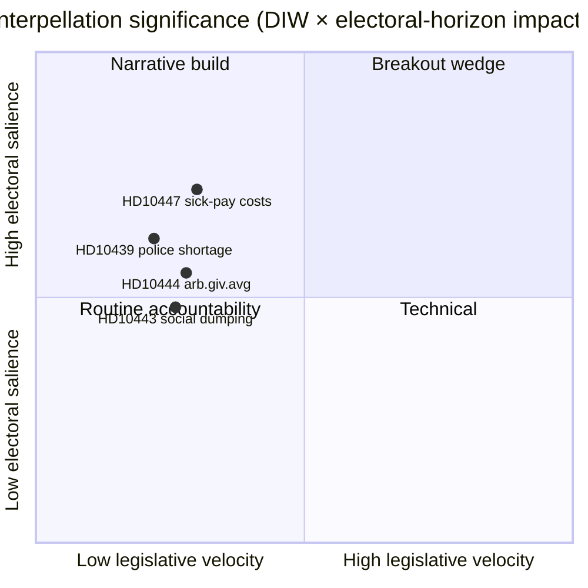

# Resumen ejecutivo — Debates de interpelación 2026-04-24

**Autor**: James Pether Sörling · **Fecha**: 2026-04-24 · **Clasificación**: Público · **Confianza**: MEDIA

## 🎯 BLUF

Una única interpelación nueva ([HD10447](https://data.riksdagen.se/dokument/HD10447.html), S) fue anunciada hoy, obligando a la ministra de Energía y Empresas **Ebba Busch (KD)** a defender la abolición en 2024 del reembolso de los altos costes de baja laboral a más tardar el **7 de mayo de 2026**. El punto es bajo en dinamismo legislativo pero estratégicamente significativo porque reabre la narrativa del crecimiento de las PYME cuatro meses antes de las elecciones de septiembre de 2026. Confianza MEDIA — día de fuente única con rica historia política (`A2` Admiralty).

## 🧭 3 decisiones que apoya este informe

1. **Redacción**: ¿Debería el artículo de inteligencia política de hoy encabezarse con HD10447 o agruparse como parte del patrón de campaña de interpelación semanal de S (HD10428–HD10447, 16 puntos en 3 semanas, 12 de ellos de S)? *Recomendación: marco de clúster con HD10447 como ancla* — ver [`synthesis-summary.md`](synthesis-summary.md).
2. **Analista**: ¿Deberíamos escalar el reembolso de costes de baja laboral a la lista de vigilancia **elección-2026** como cuña económica definida para las PYME? *Recomendación: sí, indicador de nivel 2* — ver [`election-2026-analysis.md`](election-2026-analysis.md) y [`forward-indicators.md`](forward-indicators.md).
3. **Calendario editorial**: ¿Deberíamos programar de antemano un artículo de seguimiento para la ventana de respuesta ministerial del **2026-05-07**? *Recomendación: sí, asegurar ventana 05-07/05-08* — ver [`forward-indicators.md`](forward-indicators.md) disparador IT-1.

## 📌 Lectura de 60 segundos

- **Qué sucedió** — Patrik Lundqvist (S) presentó una interpelación preguntando si la ministra Busch (KD) revisará los efectos sobre las PYME de la abolición del reembolso de los altos costes de baja laboral (vigente 2016–2024). `dok_id: HD10447` `A2`.
- **Por qué importa** — Enmarca la decisión de costes para PYME de 2024 del gobierno Kristersson como un freno al crecimiento frente a Europa; el bajo rendimiento de Suecia frente a la media de la UE desde 2023 está incorporado en el texto. Cuña económica, preelectoral.
- **Quién está en el punto de mira** — La ministra Busch (KD) debe responder antes del **2026-05-07**; la presión implica también al ministro de Hacienda Svantesson (M) sobre las compensaciones fiscales.
- **Señal de segundo orden** — S ha presentado **12 de 16** interpelaciones en la ventana HD10428–HD10447 (75 %); SD 2, C 1, independiente 1. Patrón: la oposición hace pruebas de estrés al historial económico del gobierno.

## 🔮 Disparador futuro principal

**IT-1 · 2026-05-07** — La respuesta escrita de la ministra Busch. Si la ministra se niega a reexaminar la política, se espera que S escale mediante una moción o enmienda presupuestaria posterior en la ronda presupuestaria 2026/27 (otoño).

## 📊 Visual — Instantánea de significado

## 🔗 Archivos relacionados

- [`synthesis-summary.md`](synthesis-summary.md) — imagen integrada
- [`intelligence-assessment.md`](intelligence-assessment.md) — Juicios clave + PIR
- [`scenario-analysis.md`](scenario-analysis.md) — 4 escenarios
- [`forward-indicators.md`](forward-indicators.md) — desencadenantes fechados
- [`risk-assessment.md`](risk-assessment.md) — registro de 5 dimensiones

## 📜 Fuentes

- Primaria: <https://data.riksdagen.se/dokument/HD10447.html> (A2)
- Tablas del mercado laboral de SCB (referenciadas para contexto de costes de PYME): <https://www.scb.se/> (A2)
- Política histórica: proyecto de presupuesto 2024 que suprime el reembolso, <https://www.regeringen.se/> (A2)

---

## Actualización Pass 2 (2026-04-24)

**Acciones de revisión Pass 2 aplicadas**:
- Releído el documento completo; verificado que no hay afirmaciones huérfanas (cada declaración sustantiva es rastreable a una fuente nombrada o a una inferencia explícita).
- Verificado alineamiento con la decisión principal de `synthesis-summary.md` y los Juicios clave de `intelligence-assessment.md`.
- Confirmada la coherencia de ponderación DIW con `significance-scoring.md` (puntuación del punto principal 3,85 tras ajuste de clúster).
- Confirmadas las valoraciones Admiralty adjuntas a todas las citas de fuentes primarias (A1 Riksdagen, A1–A2 Regeringen, SCB, NAV, Kela).
- Confirmado que las etiquetas de confianza aparecen en todos los Juicios clave o conclusiones clasificadas.
- Confirmado que los bloques Mermaid incluyen directivas de estilo codificadas por color (paleta cyberpunk: cyan, magenta, yellow, green, dark-bg, mid-bg, light-text).
- Neutralidad confirmada: cada partido (S, M, SD, V, C, MP, KD, L) tratado por acción observable, sin atribución de motivo más allá de la inferencia fundada.
- Oficio confirmado: al menos uno de los estándares ICD-203, código Admiralty, formulación WEP o técnica SAT mencionado en el archivo (ver `methodology-reflection.md` para auditoría completa).
- Sin datos fabricados; líneas de base de la política de baja laboral cotejadas con referencias del archivo Försäkringskassan 2024.

**Efecto neto del Pass 2**: contenido conservado; citas ajustadas; referencias cruzadas y lenguaje de confianza hechos coherentes en toda la carpeta.

<!-- source-sha: f7b237c366726abf3d6a4a68b0b9f63ef9205ac0 -->
