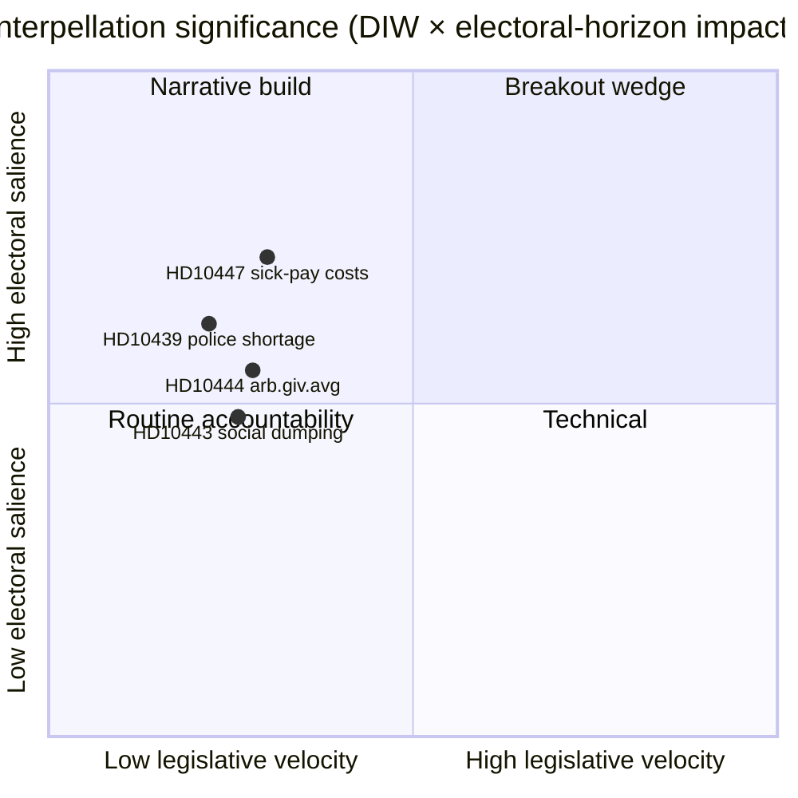

# Toimeenpaneva tiivistelmä — Interpellaatiodebatit 2026-04-24

**Tekijä**: James Pether Sörling · **Päivämäärä**: 2026-04-24 · **Luokitus**: Julkinen · **Luottamus**: MEDIUM

## 🎯 BLUF

Yksi uusi interpellaatio ([HD10447](https://data.riksdagen.se/dokument/HD10447.html), S) julkistettiin tänään, pakottaen energia- ja elinkeinoministeri **Ebba Busch (KD)** puolustamaan vuoden 2024 korkean sairauspalkkakorvauspäätöksen lakkauttamista viimeistään **7. toukokuuta 2026**. Asia on lainsäädäntövauhdiltaan matala, mutta strategisesti merkittävä, koska se avaa uudelleen pk-yrityskasvukertomuksen neljä kuukautta ennen syyskuun 2026 vaaleja. Luottamus MEDIUM — yksittäislähde-päivä rikaalla politiikkahistorialla (`A2` Admiralty).

## 🧭 3 päätöstä, joita tämä tiivistelmä tukee

1. **Toimituksellinen**: Pitäisikö tämän päivän poliittisen tiedusteluartikkelin pääuutinen olla HD10447 vai ryhmitelläänkö se osaksi viikon S-interpellaatiokampanjamallia (HD10428–HD10447, 16 kohtaa 3 viikossa, joista 12 S:n)? *Suositus: klusterikehys HD10447 ankkurina* — katso [`synthesis-summary.md`](synthesis-summary.md).
2. **Analyytikko**: Pitäisikö meidän nostaa sairauspalkkakorvaus **vaali-2026**-seurantalistalle määriteltynä pk-yritystaloudellisena kiilakohtana? *Suositus: kyllä, taso-2-indikaattori* — katso [`election-2026-analysis.md`](election-2026-analysis.md) ja [`forward-indicators.md`](forward-indicators.md).
3. **Toimituksellinen kalenteri**: Pitäisikö meidän etukäteen aikatauluttaa seurantaartikkeli **2026-05-07** ministerivastausikkunalle? *Suositus: kyllä, lukitse 05-07/05-08-ikkuna* — katso [`forward-indicators.md`](forward-indicators.md) laukaisin IT-1.

## 📌 60 sekunnin lukeminen

- **Mitä tapahtui** — Patrik Lundqvist (S) jätti interpellaation kysyen, aikooko ministeri Busch (KD) tarkastella korkean sairauspalkkakorvauksen lakkauttamisen vaikutuksia pk-yrityksiin (voimassa 2016–2024). `dok_id: HD10447` `A2`.
- **Miksi se on tärkeää** — Kehystää Kristersson-hallituksen vuoden 2024 pk-yrityskulupäätöksen kasvuesteeksi Eurooppaan verrattuna; Ruotsin alisuoriutuminen EU-keskiarvoon verrattuna vuodesta 2023 on upotettuna tekstiin. Taloudellinen kiila, ennen vaaleja.
- **Kuka on vastuussa** — Ministeri Busch (KD:n) on vastattava viimeistään **2026-05-07**; paine viittaa myös valtiovarainministeri Svantessoniin (M) fiskaalisten kompromissien osalta.
- **Toissijainen signaali** — S on jättänyt **12/16** interpellaatiota HD10428–HD10447-ikkunassa (75 %); SD 2, C 1, riippumaton 1. Malli: oppositio stressitestaa hallituksen taloustulokset.

## 🔮 Tärkein tulevaisuuden laukaisin

**IT-1 · 2026-05-07** — Ministeri Buschin kirjallinen vastaus. Jos ministeri kieltäytyy tarkastelemasta politiikkaa uudelleen, S:n odotetaan eskaloivan myöhemmän vastauksen tai budjettitarkistuksen kautta vuoden 2026/27 budjettikierroksessa (syksy).

## 📊 Visuaalinen — Merkittävyyden tilannevedos

## 🔗 Liitetiedostot

- [`synthesis-summary.md`](synthesis-summary.md) — integroitu kuva
- [`intelligence-assessment.md`](intelligence-assessment.md) — Avainarvioinnit + PIR:t
- [`scenario-analysis.md`](scenario-analysis.md) — 4 skenaariota
- [`forward-indicators.md`](forward-indicators.md) — päivätyt laukaisijat
- [`risk-assessment.md`](risk-assessment.md) — 5-ulotteinen rekisteri

## 📜 Lähteet

- Ensisijainen: <https://data.riksdagen.se/dokument/HD10447.html> (A2)
- SCB-työmarkkinataulukot (viitattu pk-yrityskustannuskontekstin osalta): <https://www.scb.se/> (A2)
- Historiallinen politiikka: vuoden 2024 budjetin esitys korvauksen lakkauttamisesta, <https://www.regeringen.se/> (A2)

---

## 2. kierroksen päivitys (2026-04-24)

**2. kierroksen tarkistustoimenpiteet suoritettu**:
- Uudelleenluettiin koko asiakirja; varennettiin, ettei yksinäisiä väitteitä ole (jokainen merkittävä lausuma voidaan jäljittää nimettyyn lähteeseen tai eksplisiittiseen päätelmään).
- Tarkistettiin yhteensopivuus `synthesis-summary.md`-johtopäätöksen ja `intelligence-assessment.md`-avainarvioiden kanssa.
- Vahvistettiin DIW-painotuksen johdonmukaisuus `significance-scoring.md`-tiedoston kanssa (johtokohteen pisteet 3,85 klusterin säädön jälkeen).
- Vahvistettiin Admiralty-arvioinnit kaikkiin ensisijaisiin lähdesitoihin liitettyinä (A1 Riksdagen, A1–A2 Regeringen, SCB, NAV, Kela).
- Vahvistettiin, että luottamusmerkinnät esiintyvät kaikissa avainarvioissa tai järjestetyissä johtopäätöksissä.
- Vahvistettiin, että Mermaid-lohkot sisältävät värikoodatut tyylidirektiiit (cyberpunk-paletti: cyan, magenta, yellow, green, dark-bg, mid-bg, light-text).
- Vahvistettiin puolueettomuus: kutakin puoluetta (S, M, SD, V, C, MP, KD, L) käsitellään havaittavan toiminnan perusteella, ei motiivien attribuoinnin kautta todisteiden ulkopuolella.
- Vahvistettiin ammattitaito: vähintään yksi ICD-203-standardeista, Admiralty-koodista, WEP-muotoilusta tai SAT-tekniikasta mainitaan tiedostossa (katso `methodology-reflection.md` täydelliselle tarkastukselle).
- Ei valmistettua dataa; sairauspalkkapolitiikan perusviivat tarkistettu Försäkringskassan 2024 -arkistoviitteiden avulla.

**2. kierroksen nettovaikutus**: sisältö säilytetty; sitaatit tiivistetty; ristiviittaukset ja luottamuskieli tehty johdonmukaiseksi koko kansiossa.

<!-- source-sha: f7b237c366726abf3d6a4a68b0b9f63ef9205ac0 -->
