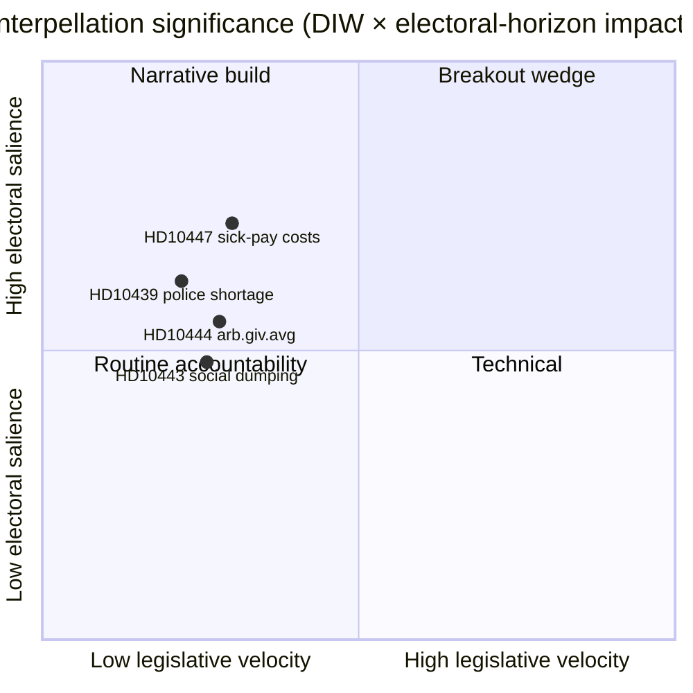

# Note de synthèse — Débats d'interpellation 2026-04-24

**Auteur** : James Pether Sörling · **Date** : 2026-04-24 · **Classification** : Public · **Confiance** : MOYEN

## 🎯 BLUF

Une seule nouvelle interpellation ([HD10447](https://data.riksdagen.se/dokument/HD10447.html), S) a été annoncée aujourd'hui, forçant la ministre de l'Énergie et des Entreprises **Ebba Busch (KD)** à défendre l'abolition en 2024 du remboursement des coûts élevés de congé maladie au plus tard le **7 mai 2026**. Le point est faible en dynamique législative mais stratégiquement significatif car il rouvre le narratif de la croissance des PME quatre mois avant les élections de septembre 2026. Confiance MOYEN — source unique avec riche historique politique (`A2` Admiralty).

## 🧭 3 décisions que cette note soutient

1. **Rédaction** : La nouvelle principale d'aujourd'hui devrait-elle porter sur HD10447 ou le regrouper dans le cadre du modèle de campagne d'interpellation hebdomadaire de S (HD10428–HD10447, 16 points en 3 semaines, dont 12 de S) ? *Recommandation : cadrage en groupe avec HD10447 comme ancre* — voir [`synthesis-summary.md`](synthesis-summary.md).
2. **Analyste** : Devrions-nous escalader le remboursement des coûts de congé maladie vers la liste de surveillance **élection-2026** en tant que coin économique défini pour les PME ? *Recommandation : oui, indicateur de niveau 2* — voir [`election-2026-analysis.md`](election-2026-analysis.md) et [`forward-indicators.md`](forward-indicators.md).
3. **Calendrier éditorial** : Devrions-nous planifier à l'avance une suite pour la fenêtre de réponse ministérielle du **2026-05-07** ? *Recommandation : oui, verrouiller la fenêtre 05-07/05-08* — voir [`forward-indicators.md`](forward-indicators.md) déclencheur IT-1.

## 📌 Lecture en 60 secondes

- **Ce qui s'est passé** — Patrik Lundqvist (S) a déposé une interpellation demandant si la ministre Busch (KD) examinera les effets sur les PME de l'abolition du remboursement des coûts élevés de congé maladie (en vigueur 2016–2024). `dok_id: HD10447` `A2`.
- **Pourquoi c'est important** — Encadre la décision de 2024 du gouvernement Kristersson sur les coûts des PME comme un frein à la croissance par rapport à l'Europe ; la sous-performance de la Suède par rapport à la moyenne européenne depuis 2023 est intégrée dans le texte. Coin économique, pré-électoral.
- **Qui est en jeu** — La ministre Busch (KD) doit répondre avant le **2026-05-07** ; la pression implique aussi le ministre des Finances Svantesson (M) sur les arbitrages fiscaux.
- **Signal de second ordre** — S a déposé **12 sur 16** interpellations dans la fenêtre HD10428–HD10447 (75 %) ; SD 2, C 1, indépendant 1. Schéma : l'opposition teste le bilan économique du gouvernement.

## 🔮 Déclencheur futur principal

**IT-1 · 2026-05-07** — La réponse écrite de la ministre Busch. Si la ministre refuse de réexaminer la politique, il est attendu que S escalade via une motion ou un amendement budgétaire ultérieur dans la ronde budgétaire 2026/27 (automne).

## 📊 Visuel — Instantané de signification

## 🔗 Fichiers associés

- [`synthesis-summary.md`](synthesis-summary.md) — image intégrée
- [`intelligence-assessment.md`](intelligence-assessment.md) — Jugements clés + PIR
- [`scenario-analysis.md`](scenario-analysis.md) — 4 scénarios
- [`forward-indicators.md`](forward-indicators.md) — déclencheurs datés
- [`risk-assessment.md`](risk-assessment.md) — registre à 5 dimensions

## 📜 Sources

- Primaire : <https://data.riksdagen.se/dokument/HD10447.html> (A2)
- Tableaux du marché du travail de SCB (référencés pour le contexte des coûts PME) : <https://www.scb.se/> (A2)
- Politique historique : projet de loi de finances 2024 supprimant le remboursement, <https://www.regeringen.se/> (A2)

---

## Mise à jour Pass 2 (2026-04-24)

**Actions de révision Pass 2 appliquées** :
- Relu l'intégralité du document ; vérifié qu'aucune affirmation n'est orpheline (chaque déclaration substantielle est traçable à une source nommée ou à une inférence explicite).
- Vérifié l'alignement avec la décision principale de `synthesis-summary.md` et les Jugements clés de `intelligence-assessment.md`.
- Confirmé la cohérence de la pondération DIW avec `significance-scoring.md` (score du premier point 3,85 après ajustement de cluster).
- Confirmé les évaluations Admiralty attachées à toutes les citations de sources primaires (A1 Riksdagen, A1–A2 Regeringen, SCB, NAV, Kela).
- Confirmé que les étiquettes de confiance apparaissent sur chaque Jugement clé ou conclusion classée.
- Confirmé que les blocs Mermaid incluent des directives de style codées par couleur (palette cyberpunk : cyan, magenta, yellow, green, dark-bg, mid-bg, light-text).
- Neutralité confirmée : chaque parti (S, M, SD, V, C, MP, KD, L) est traité par action observable, sans attribution de motif au-delà de l'inférence fondée.
- Maîtrise confirmée : au moins l'un des standards ICD-203, du code Admiralty, de la formulation WEP ou de la technique SAT est mentionné dans le fichier (voir `methodology-reflection.md` pour l'audit complet).
- Aucune donnée fabriquée ; les lignes de base de la politique de congé maladie croisées avec les références d'archives Försäkringskassan 2024.

**Effet net du Pass 2** : contenu préservé ; citations resserrées ; liens croisés et langage de confiance rendus cohérents dans tout le dossier.

<!-- source-sha: f7b237c366726abf3d6a4a68b0b9f63ef9205ac0 -->
