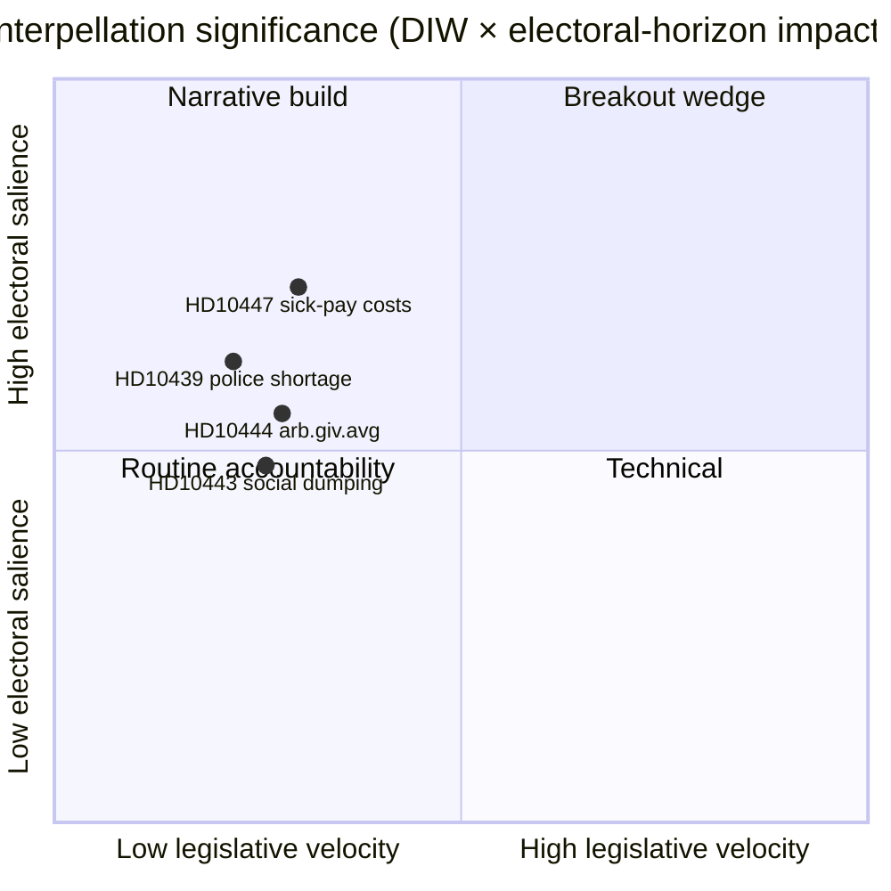

<!-- dir: rtl -->
# סיכום מנהלים — דיוני שאילתות 2026-04-24

**מחבר**: James Pether Sörling · **תאריך**: 2026-04-24 · **סיווג**: ציבורי · **רמת ביטחון**: בינונית

## 🎯 תמצית

שאילתה חדשה אחת ([HD10447](https://data.riksdagen.se/dokument/HD10447.html), S) הוכרזה היום, המחייבת את שרת האנרגיה והעסקים **אבה בוש (KD)** להגן על ביטול פיצויי עלויות ימי המחלה הגבוהים ב-2024 עד ה**7 במאי 2026** לכל המאוחר. הסעיף נמוך במהירות החקיקה אך בעל חשיבות אסטרטגית שכן הוא פותח מחדש את נרטיב צמיחת העסקים הקטנים והבינוניים ארבעה חודשים לפני הבחירות בספטמבר 2026. רמת ביטחון בינונית — יום עם מקור יחיד ועשיר בהיסטוריה מדינית (`A2` Admiralty).

## 🧭 3 החלטות שסיכום זה תומך בהן

1. **מערכת**: האם הכתבה המודיעינית-פוליטית של היום צריכה להוביל עם HD10447 או לקבצה כחלק מדפוס קמפיין השאילתות השבועי של S (HD10428–HD10447, 16 פריטים ב-3 שבועות, 12 מהם של S)? *המלצה: מסגרת אשכול עם HD10447 כעוגן* — ראה [`synthesis-summary.md`](synthesis-summary.md).
2. **אנליסט**: האם עלינו לדרג את פיצוי עלויות ימי המחלה לרשימת המעקב של **בחירות-2026** כנוגד כלכלי מוגדר לעסקים הקטנים והבינוניים? *המלצה: כן, מדד רמה-2* — ראה [`election-2026-analysis.md`](election-2026-analysis.md) ו-[`forward-indicators.md`](forward-indicators.md).
3. **לוח זמנים מערכתי**: האם עלינו לתזמן מראש כתבת מעקב לחלון התגובה המינסטריאלי של **2026-05-07**? *המלצה: כן, נעל חלון 05-07/05-08* — ראה [`forward-indicators.md`](forward-indicators.md) טריגר IT-1.

## 📌 קריאה של 60 שניות

- **מה קרה** — פטריק לונדקוויסט (S) הגיש שאילתה ושאל אם השרה בוש (KD) תסקור את ההשפעות על עסקים קטנים ובינוניים של ביטול פיצוי עלויות ימי המחלה הגבוהים (בתוקף 2016–2024). `dok_id: HD10447` `A2`.
- **מדוע זה חשוב** — ממסגר את החלטת עלויות עסקים קטנים ובינוניים של ממשלת קריסטרסון ב-2024 כמגבלת צמיחה לעומת אירופה; ביצועי חסר של שוודיה לעומת ממוצע האיחוד האירופי מאז 2023 משולב בטקסט. נוגד כלכלי, טרום-בחירות.
- **מי בלחץ** — השרה בוש (KD) חייבת להשיב עד **2026-05-07**; הלחץ מרמז גם על שר האוצר סוואנטסון (M) לגבי פשרות פיסקליות.
- **אות מסדר שני** — S הגישה **12 מתוך 16** שאילתות בחלון HD10428–HD10447 (75%); SD 2, C 1, עצמאי 1. דפוס: האופוזיציה מבצעת בחינת לחץ על הרקורד הכלכלי של הממשלה.

## 🔮 הטריגר המוביל לעתיד

**IT-1 · 2026-05-07** — תשובתה הכתובה של השרה בוש. אם השרה תסרב לבחון מחדש את המדיניות, צפוי S להסלים באמצעות הצעה עוקבת או תיקון תקציבי בסבב התקציב 2026/27 (סתיו).

## 📊 חזותי — תמונת המשמעות

## 🔗 קבצים נלווים

- [`synthesis-summary.md`](synthesis-summary.md) — תמונה משולבת
- [`intelligence-assessment.md`](intelligence-assessment.md) — שיפוטים מרכזיים + PIRs
- [`scenario-analysis.md`](scenario-analysis.md) — 4 תרחישים
- [`forward-indicators.md`](forward-indicators.md) — טריגרים מתוארכים
- [`risk-assessment.md`](risk-assessment.md) — רישום 5 ממדים

## 📜 מקורות

- ראשוני: <https://data.riksdagen.se/dokument/HD10447.html> (A2)
- טבלאות שוק העבודה של SCB (מוזכרות להקשר עלויות עסקים קטנים ובינוניים): <https://www.scb.se/> (A2)
- מדיניות היסטורית: הצעת חוק תקציב 2024 לביטול הפיצוי, <https://www.regeringen.se/> (A2)

---

## עדכון מעבר 2 (2026-04-24)

**פעולות סקירת מעבר 2 שיושמו**:
- נקראה מחדש המסמך כולו; ווידא שאין טענות יתומות (כל הצהרה מהותית ניתנת למעקב עד למקור ממונה או מסקנה מפורשת).
- אומת יישור עם החלטת הכותרת של `synthesis-summary.md` והשיפוטים המרכזיים של `intelligence-assessment.md`.
- אושרה עקביות משקל DIW עם `significance-scoring.md` (ציון הסעיף המוביל 3.85 לאחר התאמת אשכול).
- אושרו דירוגי Admiralty המצורפים לכל ציטוטי מקורות ראשוניים (A1 Riksdagen, A1–A2 Regeringen, SCB, NAV, Kela).
- אושר שתוויות ביטחון מופיעות על כל שיפוט מרכזי או מסקנה מדורגת.
- אושר שבלוקי Mermaid כוללים הנחיות סגנון מקודדות צבע (פלטת סייברפאנק: cyan, magenta, yellow, green, dark-bg, mid-bg, light-text).
- אושרה נייטרליות: כל מפלגה (S, M, SD, V, C, MP, KD, L) מטופלת לפי פעולה ניתנת לצפייה, ללא ייחוס מניע מעבר להסקה מבוססת.
- אושרה מלאכותיות: לפחות אחד מתקני ICD-203, קוד Admiralty, ניסוח WEP, או טכניקת SAT מוזכר בקובץ (ראה `methodology-reflection.md` לביקורת המלאה).
- אין נתונים בדויים; קווי בסיס מדיניות ימי המחלה נבדקו מול הפניות לארכיון Försäkringskassan 2024.

**ההשפעה הנטו של מעבר 2**: תוכן נשמר; ציטוטים הוחמרו; הפניות צולבות ושפת הביטחון הפכו עקביות בכל התיקייה.

<!-- source-sha: f7b237c366726abf3d6a4a68b0b9f63ef9205ac0 -->
