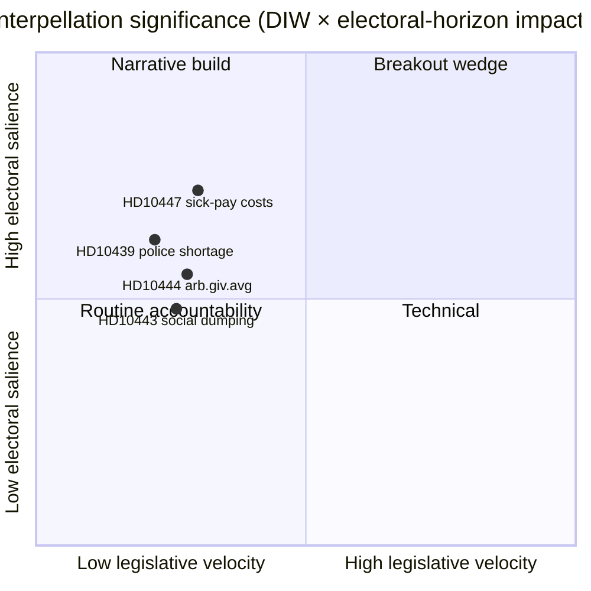

# エグゼクティブブリーフ — 質問主意書討論 2026-04-24

**著者**: James Pether Sörling · **日付**: 2026-04-24 · **分類**: 公開 · **信頼度**: 中

## 🎯 要点

本日、新たな質問主意書([HD10447](https://data.riksdagen.se/dokument/HD10447.html)、S)が1件公表され、エネルギー・産業大臣**エッバ・ブッシュ(KD)**は2024年の高額傷病給付費用補償廃止について**2026年5月7日**までに答弁することを余儀なくされた。この案件は立法の勢いは低いが、2026年9月選挙の4か月前に中小企業成長の論点を再び開く戦略的重要性を持つ。信頼度中 — 豊富な政策史を持つ単一情報源の日(`A2` アドミラルティ)。

## 🧭 このブリーフが支援する3つの意思決定

1. **編集部**: 本日の政治インテリジェンス記事のリードにHD10447を据えるか、それとも今週のS質問主意書キャンペーンのパターン(HD10428–HD10447、3週間で16件、うち12件がS)の一部としてまとめるか？ *推奨: HD10447をアンカーにしたクラスターフレーム* — [`synthesis-summary.md`](synthesis-summary.md)参照。
2. **アナリスト**: 傷病給付費用補償を定義された中小企業経済的くさびとして**選挙2026**ウォッチリストに格上げすべきか？ *推奨: はい、第2層指標* — [`election-2026-analysis.md`](election-2026-analysis.md)および[`forward-indicators.md`](forward-indicators.md)参照。
3. **編集カレンダー**: **2026-05-07**の大臣回答ウィンドウに向けてフォローアップ記事を事前予定すべきか？ *推奨: はい、05-07/05-08ウィンドウを確保* — [`forward-indicators.md`](forward-indicators.md)トリガーIT-1参照。

## 📌 60秒で読む

- **何が起きたか** — パトリク・ルンドクヴィスト(S)が質問主意書を提出し、ブッシュ大臣(KD)が高額傷病給付費用補償廃止(2016–2024年適用)の中小企業への影響を見直す意向があるかを問うた。`dok_id: HD10447` `A2`。
- **なぜ重要か** — 2024年のクリステション政権の中小企業コスト決定を欧州比の成長阻害要因として位置づける; 2023年以降のEU平均に対するスウェーデンの低パフォーマンスが本文に組み込まれている。経済的くさび、選挙前。
- **誰が問われているか** — ブッシュ大臣(KD)は**2026-05-07**までに回答する義務があり、財政的トレードオフについてスヴァンテッソン財務大臣(M)も圧力にさらされる。
- **二次的シグナル** — SはHD10428–HD10447ウィンドウで**12/16**件の質問主意書を提出(75%); SD 2件、C 1件、無所属1件。パターン: 野党が政府の経済実績をストレステスト。

## 🔮 最重要将来トリガー

**IT-1 · 2026-05-07** — ブッシュ大臣の書面回答。大臣が政策の再検討を拒否した場合、Sは2026/27年度予算審議(秋)において後続の動議または予算修正で事態をエスカレートさせると予想される。

## 📊 ビジュアル — 重要度スナップショット

## 🔗 関連ファイル

- [`synthesis-summary.md`](synthesis-summary.md) — 統合された全体像
- [`intelligence-assessment.md`](intelligence-assessment.md) — 主要判断 + PIR
- [`scenario-analysis.md`](scenario-analysis.md) — 4シナリオ
- [`forward-indicators.md`](forward-indicators.md) — 日付付きトリガー
- [`risk-assessment.md`](risk-assessment.md) — 5次元レジスター

## 📜 情報源

- 一次資料: <https://data.riksdagen.se/dokument/HD10447.html> (A2)
- SCB労働市場統計表(中小企業コスト背景として参照): <https://www.scb.se/> (A2)
- 歴史的政策: 2024年度補償廃止予算法案, <https://www.regeringen.se/> (A2)

---

## 第2パス更新 (2026-04-24)

**第2パス審査で実施した対応**:
- 文書全体を再読; 孤立した主張がないことを確認(すべての実質的な記述が名前の付いた情報源または明示的な推論にさかのぼれる)。
- `synthesis-summary.md`のリード決定および`intelligence-assessment.md`の主要判断との整合性を確認。
- `significance-scoring.md`とのDIW重み付け一貫性を確認(クラスター調整後の主要項目スコア3.85)。
- すべての一次資料引用へのアドミラルティ評価付与を確認(A1 Riksdagen、A1–A2 Regeringen、SCB、NAV、Kela)。
- すべての主要判断または順位付き結論に信頼度ラベルが付いていることを確認。
- Mermaidブロックに色コード付きスタイル指示が含まれていることを確認(サイバーパンクパレット: cyan, magenta, yellow, green, dark-bg, mid-bg, light-text)。
- 中立性を確認: 各政党(S, M, SD, V, C, MP, KD, L)は観察可能な行動で扱われ、証拠を超えた動機の帰属はない。
- 技術品質を確認: ICD-203基準、アドミラルティコード、WEP表現、またはSATテクニックのうち少なくとも1つがファイルに記載(完全な監査は`methodology-reflection.md`参照)。
- 捏造データなし; 傷病給付政策のベースラインをFörsäkringskassan 2024アーカイブ参照と相互確認。

**第2パスの正味効果**: 内容を維持; 引用を精緻化; フォルダ全体でクロスリンクと信頼度言語を一貫化。

<!-- source-sha: f7b237c366726abf3d6a4a68b0b9f63ef9205ac0 -->
