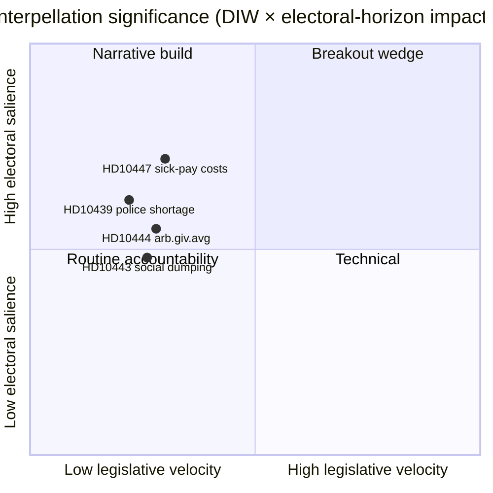

# 집행 요약 — 질문 토론 2026-04-24

**저자**: James Pether Sörling · **날짜**: 2026-04-24 · **분류**: 공개 · **신뢰도**: 보통

## 🎯 핵심 요약

오늘 새로운 질문([HD10447](https://data.riksdagen.se/dokument/HD10447.html), S)이 하나 발표되었으며, 에너지·산업부 장관 **에바 부쉬(KD)**는 **2026년 5월 7일**까지 2024년 고액 상병급여 비용 보상 폐지를 방어해야 한다. 이 안건은 입법 속도가 낮지만 2026년 9월 선거 4개월 전 중소기업 성장 서사를 재개하기 때문에 전략적으로 중요하다. 신뢰도 보통 — 풍부한 정책 역사를 가진 단일 출처 일(`A2` 해군 제독).

## 🧭 이 브리핑이 지원하는 3가지 결정

1. **편집부**: 오늘의 정치 정보 기사가 HD10447을 주요 뉴스로 다뤄야 하는가, 아니면 이번 주 S의 질문 캠페인 패턴(HD10428–HD10447, 3주 동안 16건, 그 중 12건이 S)의 일부로 묶어야 하는가? *권고: HD10447을 앵커로 하는 클러스터 프레임* — [`synthesis-summary.md`](synthesis-summary.md) 참조.
2. **분석가**: 상병급여 비용 보상을 중소기업 경제 쐐기로 정의하여 **2026년 선거** 감시 목록에 올려야 하는가? *권고: 예, 2단계 지표* — [`election-2026-analysis.md`](election-2026-analysis.md) 및 [`forward-indicators.md`](forward-indicators.md) 참조.
3. **편집 일정**: **2026-05-07** 장관 답변 창에 대한 후속 기사를 미리 예약해야 하는가? *권고: 예, 05-07/05-08 창 확보* — [`forward-indicators.md`](forward-indicators.md) 트리거 IT-1 참조.

## 📌 60초 읽기

- **무슨 일이 있었나** — Patrik Lundqvist (S)가 장관 Busch (KD)에게 고액 상병급여 비용 보상 폐지(2016–2024년 시행)의 중소기업에 대한 영향을 검토할 의향이 있는지 묻는 질문을 제출했다. `dok_id: HD10447` `A2`.
- **왜 중요한가** — 2024년 크리스테르손 정부의 중소기업 비용 결정을 유럽 대비 성장 장애물로 규정; 2023년 이후 EU 평균 대비 스웨덴의 저성과가 본문에 내포되어 있다. 경제적 쐐기, 선거 전.
- **누가 책임지는가** — 장관 Busch (KD)는 **2026-05-07**까지 답변해야 하며; 재정적 절충에 관해 Svantesson 재무장관(M)도 압박을 받는다.
- **이차 신호** — S는 HD10428–HD10447 창에서 **12/16**건 질문 제출(75%); SD 2건, C 1건, 무소속 1건. 패턴: 야당이 정부의 경제 실적을 스트레스 테스트.

## 🔮 주요 미래 트리거

**IT-1 · 2026-05-07** — 장관 Busch의 서면 답변. 장관이 정책 재검토를 거부할 경우, S는 2026/27 예산안(가을) 심사에서 후속 동의안 또는 예산 수정안을 통해 상황을 고조시킬 것으로 예상된다.

## 📊 시각 자료 — 중요도 스냅샷

## 🔗 관련 파일

- [`synthesis-summary.md`](synthesis-summary.md) — 통합 그림
- [`intelligence-assessment.md`](intelligence-assessment.md) — 핵심 판단 + PIR
- [`scenario-analysis.md`](scenario-analysis.md) — 4가지 시나리오
- [`forward-indicators.md`](forward-indicators.md) — 날짜가 기재된 트리거
- [`risk-assessment.md`](risk-assessment.md) — 5차원 레지스터

## 📜 출처

- 주요: <https://data.riksdagen.se/dokument/HD10447.html> (A2)
- SCB 노동시장 표(중소기업 비용 맥락 참조): <https://www.scb.se/> (A2)
- 역사적 정책: 2024년 보상 폐지 예산 법안, <https://www.regeringen.se/> (A2)

---

## 2차 통과 업데이트 (2026-04-24)

**2차 통과 검토 조치 적용**:
- 전체 문서 재독; 고립된 주장이 없음을 확인(모든 실질적인 진술이 명명된 출처 또는 명시적 추론으로 추적 가능).
- `synthesis-summary.md` 리드 결정 및 `intelligence-assessment.md` 핵심 판단과의 정렬 교차 확인.
- `significance-scoring.md`와의 DIW 가중치 일관성 확인(클러스터 조정 후 주요 항목 점수 3.85).
- 모든 일차 출처 인용에 해군 제독 등급이 부착되었음을 확인(A1 Riksdagen, A1–A2 Regeringen, SCB, NAV, Kela).
- 모든 핵심 판단 또는 순위 결론에 신뢰도 레이블이 표시됨을 확인.
- Mermaid 블록에 색상 코드화된 스타일 지시문이 포함되었음을 확인(사이버펑크 팔레트: cyan, magenta, yellow, green, dark-bg, mid-bg, light-text).
- 중립성 확인: 각 정당(S, M, SD, V, C, MP, KD, L)이 관찰 가능한 행동으로 처리되며, 증거를 넘어서는 동기 귀속 없음.
- 기술 품질 확인: ICD-203 기준, 해군 제독 코드, WEP 표현, 또는 SAT 기법 중 하나 이상이 파일에 언급(전체 감사는 `methodology-reflection.md` 참조).
- 조작된 데이터 없음; 상병급여 정책 기준선을 Försäkringskassan 2024 아카이브 참조와 교차 확인.

**2차 통과 순효과**: 내용 보존; 인용 강화; 폴더 전체에서 교차 링크 및 신뢰도 언어 일관성 확보.

<!-- source-sha: f7b237c366726abf3d6a4a68b0b9f63ef9205ac0 -->
