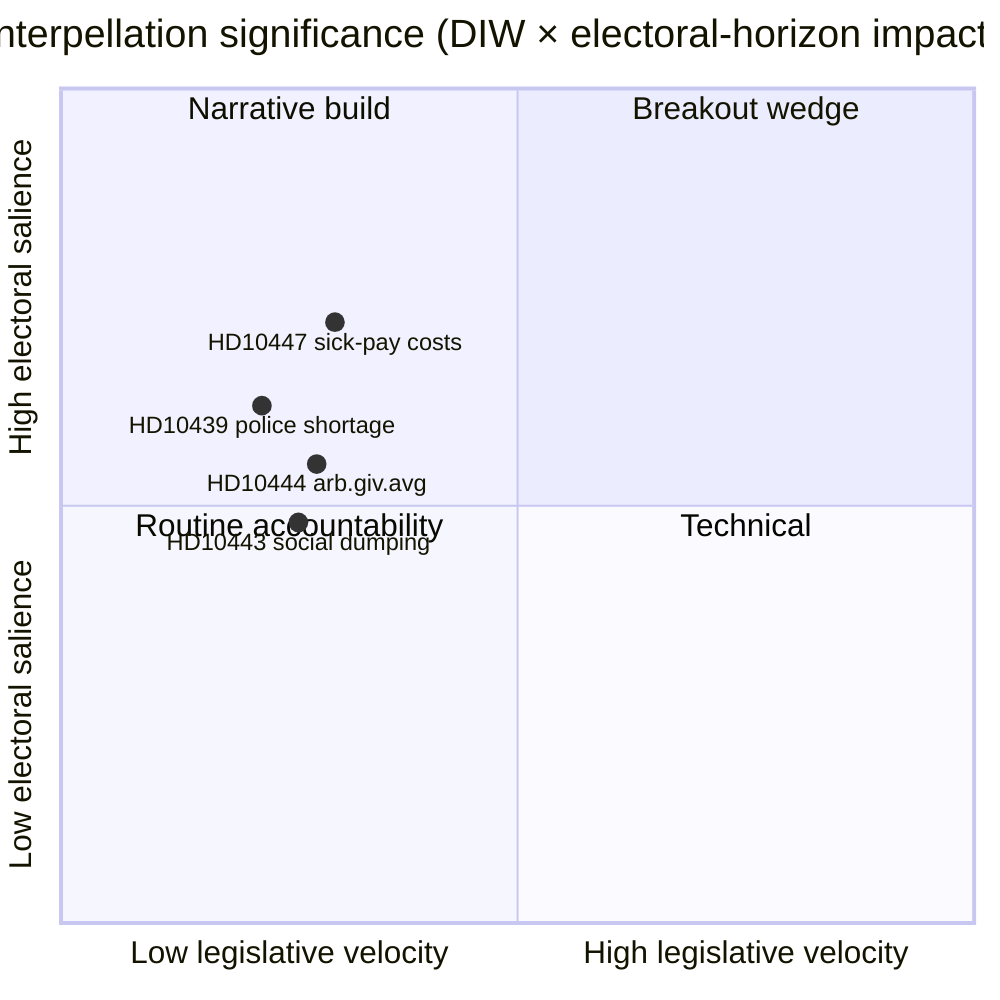

# Uitvoerend overzicht — Interpellatiedebatten 2026-04-24

**Auteur**: James Pether Sörling · **Datum**: 2026-04-24 · **Classificatie**: Openbaar · **Betrouwbaarheid**: GEMIDDELD

## 🎯 BLUF

Één nieuwe interpellatie ([HD10447](https://data.riksdagen.se/dokument/HD10447.html), S) werd vandaag aangekondigd en dwingt minister van Energie en Bedrijfsleven **Ebba Busch (KD)** om de afschaffing in 2024 van de hoge ziektekostenvergoeding te verdedigen uiterlijk **7 mei 2026**. Het punt heeft een lage wetgevingssnelheid maar is strategisch belangrijk omdat het het MKB-groeinadeverhaal vier maanden voor de verkiezingen van september 2026 heropent. Betrouwbaarheid GEMIDDELD — eendagsbron met rijke politieke geschiedenis (`A2` Admiralty).

## 🧭 3 beslissingen die dit overzicht ondersteunt

1. **Redactie**: Moet het politieke nieuwsbericht van vandaag HD10447 als hoofdnieuws hebben of het groeperen als onderdeel van het wekelijkse S-interpellatie-campagnepatroon (HD10428–HD10447, 16 punten in 3 weken, waarvan 12 van S)? *Aanbeveling: clusterraamwerk met HD10447 als anker* — zie [`synthesis-summary.md`](synthesis-summary.md).
2. **Analist**: Moeten we de ziektekostenvergoeding opschalen naar de **verkiezingen-2026**-watchlist als een gedefinieerde MKB-economische wig? *Aanbeveling: ja, niveau-2-indicator* — zie [`election-2026-analysis.md`](election-2026-analysis.md) en [`forward-indicators.md`](forward-indicators.md).
3. **Redactionele agenda**: Moeten we vooraf een vervolgbericht plannen voor het ministerantwoordvenster van **2026-05-07**? *Aanbeveling: ja, vergrendel 05-07/05-08-venster* — zie [`forward-indicators.md`](forward-indicators.md) trigger IT-1.

## 📌 Lezing van 60 seconden

- **Wat er gebeurde** — Patrik Lundqvist (S) diende een interpellatie in met de vraag of minister Busch (KD) de effecten op het MKB van de afschaffing van de hoge ziektekostenvergoeding zal beoordelen (van kracht 2016–2024). `dok_id: HD10447` `A2`.
- **Waarom het belangrijk is** — Encadreert de MKB-kostenbeslissing van de Kristersson-regering in 2024 als een groeibeletsel ten opzichte van Europa; Zweden's onderprestatie ten opzichte van het EU-gemiddelde sinds 2023 is ingebed in de tekst. Economische wig, pre-verkiezingstijd.
- **Wie onder druk staat** — Minister Busch (KD) moet uiterlijk **2026-05-07** antwoorden; de druk impliceert ook minister van Financiën Svantesson (M) op fiscale afwegingen.
- **Tweedesignaalsignaal** — S heeft **12 van 16** interpellaties ingediend in het HD10428–HD10447-venster (75 %); SD 2, C 1, onafhankelijk 1. Patroon: oppositie stressttest het economische track record van de regering.

## 🔮 Belangrijkste toekomstige trigger

**IT-1 · 2026-05-07** — Het schriftelijke antwoord van minister Busch. Als de minister weigert het beleid opnieuw te onderzoeken, wordt verwacht dat S escaleert via een volgende motie of begrotingswijziging in de begrotingsronde 2026/27 (herfst).

## 📊 Visueel — Significantie-snapshot

## 🔗 Bijbehorende bestanden

- [`synthesis-summary.md`](synthesis-summary.md) — geïntegreerd beeld
- [`intelligence-assessment.md`](intelligence-assessment.md) — Sleutelbeoordeling + PIR's
- [`scenario-analysis.md`](scenario-analysis.md) — 4 scenario's
- [`forward-indicators.md`](forward-indicators.md) — gedateerde triggers
- [`risk-assessment.md`](risk-assessment.md) — 5-dimensionsregister

## 📜 Bronnen

- Primair: <https://data.riksdagen.se/dokument/HD10447.html> (A2)
- SCB-arbeidsmarkttabellen (gerefereerd voor MKB-kostenkader): <https://www.scb.se/> (A2)
- Historisch beleid: begrotingswetsvoorstel 2024 ter afschaffing van de vergoeding, <https://www.regeringen.se/> (A2)

---

## Pass 2-update (2026-04-24)

**Toegepaste Pass 2-reviewacties**:
- Volledig document herlezen; geverifieerd dat er geen verweesde beweringen zijn (elke substantiële verklaring is te herleiden tot een genoemde bron of expliciete gevolgtrekking).
- Uitlijning met `synthesis-summary.md`-hoofdbeslissing en `intelligence-assessment.md`-sleutelbeoordelingen gekruist.
- DIW-wegingsconsistentie met `significance-scoring.md` bevestigd (leidend puntscore 3,85 na clusteraanpassing).
- Admiralty-beoordelingen bevestigd bij alle primaire broncitaten (A1 Riksdagen, A1–A2 Regeringen, SCB, NAV, Kela).
- Bevestigd dat betrouwbaarheidslabels verschijnen bij alle sleutelbeoordelingen of gerangschikte conclusies.
- Bevestigd dat Mermaid-blokken kleurgecodeerde stijldirectieven bevatten (cyberpunk-pallet: cyan, magenta, yellow, green, dark-bg, mid-bg, light-text).
- Neutraliteit bevestigd: elke partij (S, M, SD, V, C, MP, KD, L) behandeld door waarneembare actie, zonder motief-toeschrijving buiten bewezen gevolgtrekking.
- Vakmanschap bevestigd: minimaal één van de ICD-203-normen, Admiralty-code, WEP-formulering of SAT-techniek vermeld in het bestand (zie `methodology-reflection.md` voor volledige audit).
- Geen gefabriceerde data; beleidsbasislijnen voor ziekteverlof gekruist met Försäkringskassan 2024-archiefverwijzingen.

**Netto-effect van Pass 2**: inhoud bewaard; citaten aangescherpt; kruisverwijzingen en betrouwbaarheidstaal consistent gemaakt in de hele map.

<!-- source-sha: f7b237c366726abf3d6a4a68b0b9f63ef9205ac0 -->
