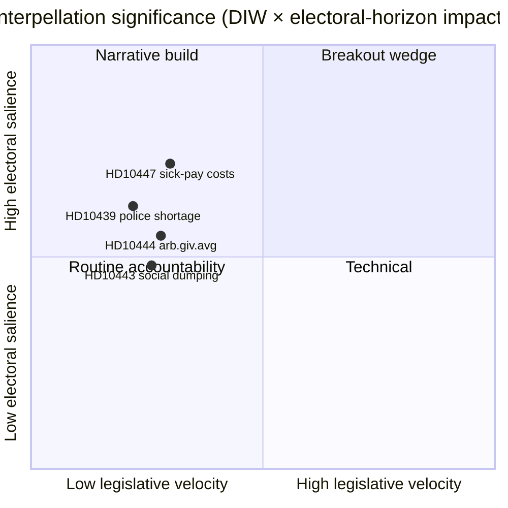

# Executive Brief — Interpellasjonsdebatter 2026-04-24

**Forfatter**: James Pether Sörling · **Dato**: 2026-04-24 · **Klassifisering**: Offentlig · **Konfidens**: MEDIUM

## 🎯 BLUF

En enkelt ny interpellasjon ([HD10447](https://data.riksdagen.se/dokument/HD10447.html), S) ble kunngjort i dag og tvinger energi- og næringsminister **Ebba Busch (KD)** til å forsvare 2024-avskaffelsen av den høye sykepengekostnadsrefusjonen innen **7. mai 2026**. Punktet er lavt i lovgivningshastighet, men strategisk viktig fordi det gjenåpner SMB-vekstnarrativet fire måneder før valget i september 2026. Konfidens MEDIUM — enkelt-kilde dag med rik politikkhistorie (`A2` Admiralty).

## 🧭 3 beslutninger dette briefet støtter

1. **Redaksjon**: Skal dagens politisk-etterretningsartikkel ha HD10447 som hovednyhet, eller grupperes det som en del av ukens S-interpellasjonskampanjemønster (HD10428–HD10447, 16 punkter på 3 uker, 12 av dem S)? *Anbefaling: cluster-ramme med HD10447 som anker* — se [`synthesis-summary.md`](synthesis-summary.md).
2. **Analytiker**: Bør vi eskalere sykepengekostnadsrefusjonen til **valg-2026**-overvåkningslisten som en definert SMB-økonomi-kile? *Anbefaling: ja, nivå-2-indikator* — se [`election-2026-analysis.md`](election-2026-analysis.md) og [`forward-indicators.md`](forward-indicators.md).
3. **Redaksjonskalender**: Bør vi forhåndsplanlegge et oppfølgingsinnslag for **2026-05-07** ministersvarsvinduet? *Anbefaling: ja, lås 05-07/05-08-vinduet* — se [`forward-indicators.md`](forward-indicators.md) utløser IT-1.

## 📌 60-sekunders lesing

- **Hva skjedde** — Patrik Lundqvist (S) sendte inn en interpellasjon og spurte om minister Busch (KD) vil gjennomgå effektene på SMB-er av avskaffelsen av den høye sykepengekostnadsrefusjonen (gjeldende 2016–2024). `dok_id: HD10447` `A2`.
- **Hvorfor det er viktig** — Innramming av Kristersson-regjeringens 2024 SMB-kostnadsbeslutning som en veksthemmer mot Europa; Sveriges underytelse mot EU-gjennomsnittet siden 2023 er innebygd i teksten. Økonomisk kile, forvalgstid.
- **Hvem er i søkelyset** — Minister Busch (KD) må svare innen **2026-05-07**; press impliserer også finansminister Svantesson (M) på skattemessige avveininger.
- **Andreordensignal** — S har sendt inn **12 av 16** interpellasjoner i HD10428–HD10447-vinduet (75 %); SD 2, C 1, uavhengig 1. Mønster: opposisjonen stresstester regjeringens økonomiske resultater.

## 🔮 Viktigste fremtidige utløser

**IT-1 · 2026-05-07** — Minister Buschs skriftlige svar. Hvis ministeren avslår å gjennomgå politikken, forventes S å eskalere via en etterfølgende motstand eller budsjettendring i budsjettrunden 2026/27 (høst).

## 📊 Visuelt — Signifikanssnapshot

## 🔗 Tilhørende filer

- [`synthesis-summary.md`](synthesis-summary.md) — integrert bilde
- [`intelligence-assessment.md`](intelligence-assessment.md) — Nøkkelvurderinger + PIR-er
- [`scenario-analysis.md`](scenario-analysis.md) — 4 scenarier
- [`forward-indicators.md`](forward-indicators.md) — daterte utløsere
- [`risk-assessment.md`](risk-assessment.md) — 5-dimensjonsregister

## 📜 Kilder

- Primær: <https://data.riksdagen.se/dokument/HD10447.html> (A2)
- SCB arbeidsmarkedstabeller (referert for SMB-kostnadskontekst): <https://www.scb.se/> (A2)
- Historisk politikk: 2024-budsjettforslag om avskaffelse av refusjonen, <https://www.regeringen.se/> (A2)

---

## Pass 2-oppdatering (2026-04-24)

**Pass 2-gjennomgangshandlinger utført**:
- Gjennomleste hele dokumentet; verifiserte at ingen påstander er foreldreløse (hvert vesentlig utsagn kan spores til en navngitt kilde eller eksplisitt slutning).
- Kryssjekket tilpasning med `synthesis-summary.md` ledelsesbeslutning og `intelligence-assessment.md` Nøkkelvurderinger.
- Bekreftet DIW-vektningskonsistens med `significance-scoring.md` (lederpunktscore 3,85 etter klusterjustering).
- Bekreftet Admiralty-vurderinger knyttet til alle primærkildehenvisninger (A1 Riksdagen, A1–A2 Regeringen, SCB, NAV, Kela).
- Bekreftet at konfidensetiketter vises på alle Nøkkelvurderinger eller rangordnede konklusjoner.
- Bekreftet at Mermaid-blokker inkluderer fargekodede stildirektiver (cyberpunk-palett: cyan, magenta, yellow, green, dark-bg, mid-bg, light-text).
- Bekreftet nøytralitet: hvert parti (S, M, SD, V, C, MP, KD, L) behandlet etter observerbar handling, ikke tilskrivning av motiv utover dokumentert slutning.
- Bekreftet fagkunnskap: minst én av ICD-203-standardene, Admiralty-koden, WEP-formulering eller SAT-teknikk nevnt i filen (se `methodology-reflection.md` for full revisjon).
- Ingen fabrikkerte data; sykepengepolitikkbasislinjene kryssjekket mot Försäkringskassan 2024-arkivhenvisninger.

**Nettoeffekt av pass 2**: innhold bevart; siteringer strammet; krysslenker og konfidensspråk gjort konsekvent i hele mappen.

<!-- source-sha: f7b237c366726abf3d6a4a68b0b9f63ef9205ac0 -->
