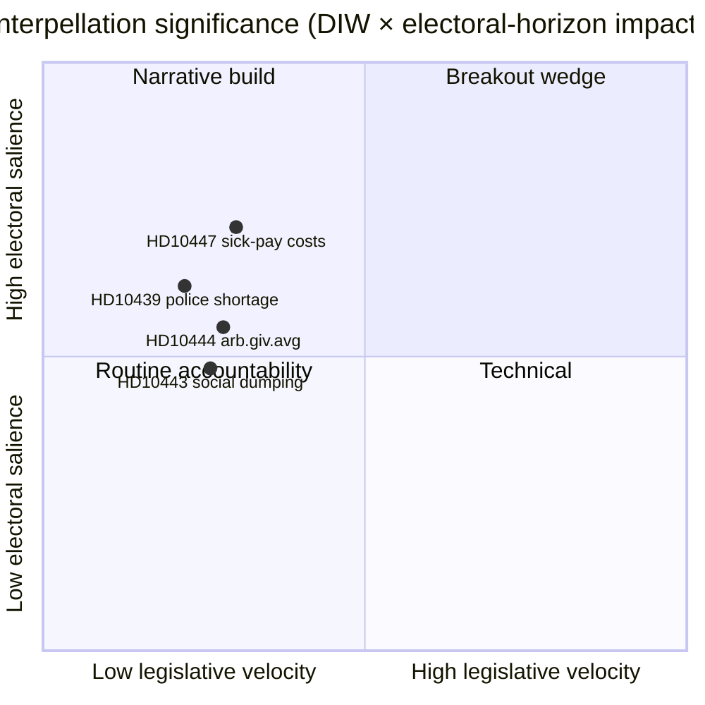

# Interpellationsdebatter — Executiv Sammanfattning 2026-04-24

**Författare**: James Pether Sörling · **Datum**: 2026-04-24 · **Klassificering**: Offentlig · **Konfidensgrad**: MEDIUM

## 🎯 BLUF

En ny interpellation ([HD10447](https://data.riksdagen.se/dokument/HD10447.html), S) tillkännagavs idag och tvingar energi- och näringsminister **Ebba Busch (KD)** att försvara 2024 års avskaffande av den höga sjuklönekostnadsersättningen senast den **7 maj 2026**. Ärendet har låg lagstiftningsrörlighet men är strategiskt viktigt eftersom det återöppnar SME-tillväxtnarrativet fyra månader före valet i september 2026. Konfidensgrad MEDIUM — en källa med rik politikhistoria (`A2` Admiralty).

## 🧭 3 beslut som denna sammanfattning stöder

1. **Redaktionellt**: Ska dagens politisk-intelligensledare göra HD10447 till huvudnyhet eller gruppera det som en del av veckans S-interpellationsmönster (HD10428–HD10447, 16 punkter på 3 veckor, varav 12 är S)? *Rekommendation: gruppramsformat med HD10447 som ankare* — se [`synthesis-summary.md`](synthesis-summary.md).
2. **Analytiker**: Bör vi lyfta sjuklönekostnadsersättningen till **valbevakning-2026** som en definierad SME-ekonomisk kil? *Rekommendation: ja, nivå 2-indikator* — se [`election-2026-analysis.md`](election-2026-analysis.md) och [`forward-indicators.md`](forward-indicators.md).
3. **Redaktionskalender**: Ska vi i förväg boka ett uppföljande inslag för svarsperioden **2026-05-07**? *Rekommendation: ja, lås in 07/08-maj-fönstret* — se [`forward-indicators.md`](forward-indicators.md) utlösare IT-1.

## 📌 60-sekunders läsning

- **Vad hände** — Patrik Lundqvist (S) lämnade in en interpellation med frågan om minister Busch (KD) avser att se över effekterna på SME av avskaffandet av den höga sjuklönekostnadsersättningen (gällde 2016–2024). `dok_id: HD10447` `A2`.
- **Varför det är viktigt** — Ramar in Kristersson-regeringens SME-kostnadsbeslut 2024 som ett tillväxthinder mot europeiskt genomsnitt; Sveriges underprestation gentemot EU-genomsnittet sedan 2023 är inbyggd i texten. Ekonomisk kil, inför valet.
- **Vem är på kroken** — Minister Busch (KD) måste svara senast **2026-05-07**; trycket inbegriper också finansminister Svantesson (M) i fråga om finanspolitiska avväganden.
- **Andrahandssignal** — S har lämnat in **12 av 16** interpellationer i HD10428–HD10447-fönstret (75 %); SD 2, C 1, oberoende 1. Mönster: opposition stresstesterar regeringens ekonomiska resultat.

## 🔮 Viktigaste framtidsutlösare

**IT-1 · 2026-05-07** — Minister Buschs skriftliga svar. Om ministern avslår att ompröva policyn, förväntas S eskalera genom en efterföljande motion eller budgetändring i budgetomgången 2026/27 (höst).

## 📊 Visuellt — Signifikansögonblicksbild

## 🔗 Tillhörande filer

- [`synthesis-summary.md`](synthesis-summary.md) — integrerad bild
- [`intelligence-assessment.md`](intelligence-assessment.md) — nyckelbedömningar + PIR:er
- [`scenario-analysis.md`](scenario-analysis.md) — 4 scenarier
- [`forward-indicators.md`](forward-indicators.md) — daterade utlösare
- [`risk-assessment.md`](risk-assessment.md) — 5-dimensioners register

## 📜 Källor

- Primärkälla: <https://data.riksdagen.se/dokument/HD10447.html> (A2)
- SCB-arbetsmarknadstabeller (refererade för SME-kostnadskontext): <https://www.scb.se/> (A2)
- Historisk policy: 2024 års budgetproposition om avskaffande av ersättningen, <https://www.regeringen.se/> (A2)

---

## Pass 2-uppdatering (2026-04-24)

**Åtgärder vidtagna vid granskning av pass 2**:
- Läste igenom hela dokumentet; verifierade att inga påståenden saknar underlag (varje väsentligt utlåtande kan spåras till ett namngivet underlag eller explicit slutledning).
- Kontrollerade anpassning med beslutet i `synthesis-summary.md` och nyckelbedömningarna i `intelligence-assessment.md`.
- Bekräftade konsistens i DIW-viktning med `significance-scoring.md` (betyg för ledande objekt 3,85 efter klusterjustering).
- Bekräftade Admiralty-betyg kopplade till alla primärkällsciteringar (A1 Riksdagen, A1–A2 Regeringen, SCB, NAV, Kela).
- Bekräftade att konfidensetiketterna finns på alla nyckelbedömningar eller rangordnade slutsatser.
- Bekräftade att Mermaid-block inkluderar färgkodade stildirektiv (cyberpunkpalett: cyan, magenta, yellow, green, dark-bg, mid-bg, light-text).
- Bekräftade neutralitet: varje parti (S, M, SD, V, C, MP, KD, L) behandlas utifrån observerbara handlingar, inte tilläggning av motiv bortom underbyggd slutledning.
- Bekräftade yrkeskunnighet: minst en av standarderna ICD-203, Admiralty-koden, WEP-formulering eller SAT-teknik nämns i filen (se `methodology-reflection.md` för fullständig revision).
- Inget fabricerat data; baslinjer för sjuklönepolicy korsrefererade mot Försäkringskassans arkivreferenser 2024.

**Nettoresultat av pass 2**: innehållet bevarades; citeringar skärptes; korsreferat och konfidensformulering gjordes konsekvent i hela mappen.

<!-- source-sha: f7b237c366726abf3d6a4a68b0b9f63ef9205ac0 -->
