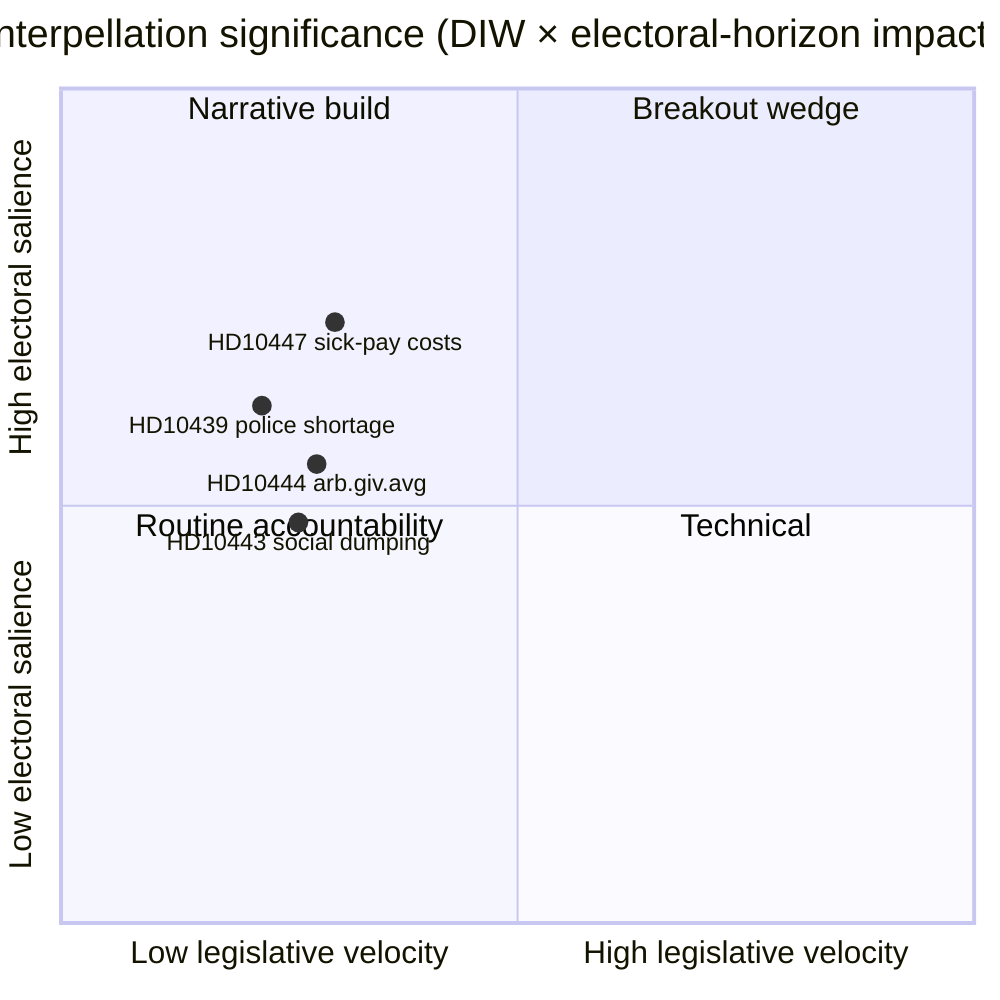

# 执行摘要 — 质询辩论 2026-04-24

**作者**: James Pether Sörling · **日期**: 2026-04-24 · **分类**: 公开 · **可信度**: 中等

## 🎯 核心摘要

今日公布了一项新的质询([HD10447](https://data.riksdagen.se/dokument/HD10447.html)，S)，迫使能源和工商业部长**埃巴·布什（KD）**最迟于**2026年5月7日**为2024年废除高额病假费用补偿一事进行答辩。该事项的立法进展较慢，但具有战略重要性，因为它在2026年9月选举前四个月重新开启了中小企业增长叙事。可信度中等——政策历史丰富的单一来源日（`A2` 海军准将）。

## 🧭 本简报支持的三项决策

1. **编辑部**：今日政治情报文章是否应以HD10447作为主要新闻，还是将其归并为本周S质询活动模式的一部分（HD10428–HD10447，3周内16条，其中12条来自S）？*建议：以HD10447为锚点的集群框架* — 参见 [`synthesis-summary.md`](synthesis-summary.md)。
2. **分析师**：是否应将病假费用补偿作为明确的中小企业经济楔子升级到**2026年选举**观察名单？*建议：是，第二层级指标* — 参见 [`election-2026-analysis.md`](election-2026-analysis.md) 和 [`forward-indicators.md`](forward-indicators.md)。
3. **编辑日历**：是否应提前为**2026-05-07**部长回应窗口安排后续报道？*建议：是，锁定05-07/05-08窗口* — 参见 [`forward-indicators.md`](forward-indicators.md) 触发器 IT-1。

## 📌 60秒速读

- **发生了什么** — Patrik Lundqvist（S）提交了一项质询，询问布什部长（KD）是否将审查废除高额病假费用补偿（2016–2024年有效）对中小企业的影响。`dok_id: HD10447` `A2`。
- **为何重要** — 将克里斯特松政府2024年的中小企业成本决定定性为相对欧洲的增长阻力；瑞典自2023年以来相对欧盟平均水平的表现不佳已嵌入文本中。经济楔子，选举前夕。
- **谁处于压力下** — 布什部长（KD）必须于**2026-05-07**前作出回应；压力也波及财政部长斯万特松（M）的财政权衡。
- **二阶信号** — S在HD10428–HD10447窗口内提交了**12/16**件质询（75%）；SD 2件，C 1件，独立1件。规律：反对党在对政府的经济记录进行压力测试。

## 🔮 最重要的未来触发因素

**IT-1 · 2026-05-07** — 布什部长的书面答复。如果部长拒绝重新审视该政策，预计S将通过2026/27年度预算（秋季）的后续动议或预算修正案来升级。

## 📊 可视化 — 重要性快照

## 🔗 配套文件

- [`synthesis-summary.md`](synthesis-summary.md) — 综合图景
- [`intelligence-assessment.md`](intelligence-assessment.md) — 关键判断 + PIR
- [`scenario-analysis.md`](scenario-analysis.md) — 4个情景
- [`forward-indicators.md`](forward-indicators.md) — 日期触发器
- [`risk-assessment.md`](risk-assessment.md) — 5维度注册表

## 📜 信息来源

- 主要来源: <https://data.riksdagen.se/dokument/HD10447.html> (A2)
- SCB劳动市场统计表（参考中小企业成本背景）: <https://www.scb.se/> (A2)
- 历史政策：2024年废除补偿的预算法案, <https://www.regeringen.se/> (A2)

---

## 第2次评审更新（2026-04-24）

**已执行的第2次评审操作**：
- 重新通读了整份文件；确认无孤立主张（每项实质性陈述均可追溯至命名来源或明确推论）。
- 交叉核查了与`synthesis-summary.md`主要决定和`intelligence-assessment.md`关键判断的一致性。
- 确认了与`significance-scoring.md`的DIW加权一致性（经集群调整后的主要条目得分3.85）。
- 确认了所有主要来源引用均附有海军准将评级（A1 Riksdagen，A1–A2 Regeringen，SCB，NAV，Kela）。
- 确认可信度标签出现在每项关键判断或排名结论上。
- 确认Mermaid块包含颜色编码的样式指令（赛博朋克调色板：cyan、magenta、yellow、green、dark-bg、mid-bg、light-text）。
- 确认中立性：每个政党（S、M、SD、V、C、MP、KD、L）均按可观察行为处理，不超出有据可查的推断归因动机。
- 确认专业性：文件中至少提及ICD-203标准、海军准将代码、WEP措辞或SAT技术之一（完整审计参见`methodology-reflection.md`）。
- 无捏造数据；病假政策基准已与Försäkringskassan 2024档案参考交叉验证。

**第2次评审净效果**：内容保留；引用加强；整个文件夹的交叉引用和可信度语言已做到一致。

<!-- source-sha: f7b237c366726abf3d6a4a68b0b9f63ef9205ac0 -->
