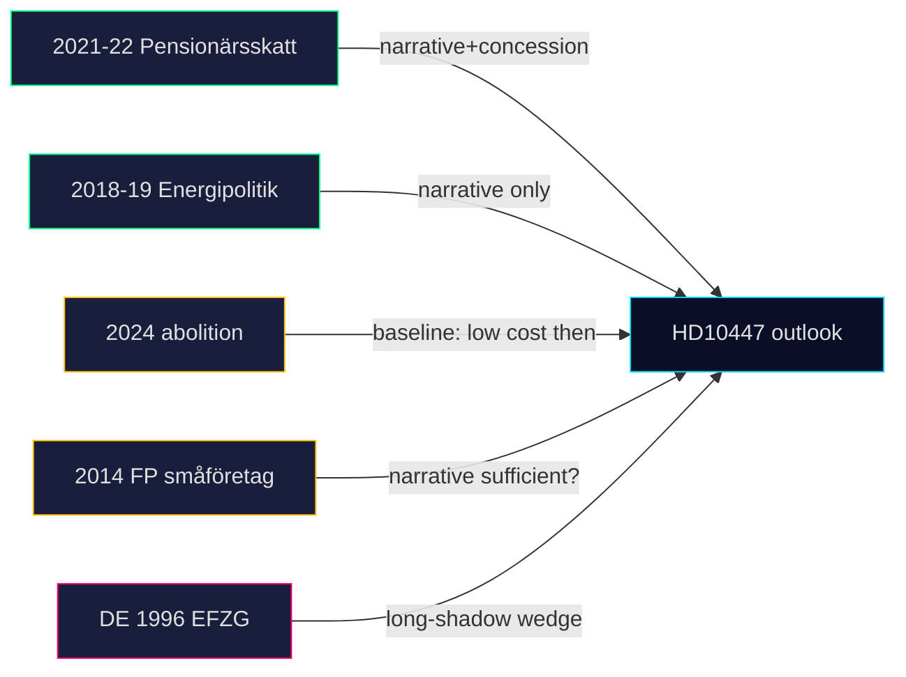

# Historical Parallels — 2026-04-24

**Question**: What past episodes most closely resemble HD10447 + cluster, and what did they predict?

## Parallel 1 — 2021-22 S wedge campaign on pensioners' tax (pre-2022 election)

S coordinated 9 interpellations on pensioners' skatt Jan–May 2022, addressing Finance Minister Damberg and PM Andersson. Pattern: single-signatory, topic-clustered, pre-election. Led to a budget concession on the sänkta skatten för pensionärer.

- **Relevance**: Direct procedural analog.
- **Outcome**: Coalition held; opposition captured narrative; concession made 2 months before election.
- **Predictive value**: High for narrative-capture, medium for concession (Tidö has less vote slack than the 2021 minority government).

## Parallel 2 — 2018-19 M campaign on energipolitik

M filed 11 IPs Feb–Jun 2018 on energipolitik ahead of 2018 val, addressing then-minister Baylan (S). Produced narrative traction but no policy change; contributed to 2018 close result.

- **Relevance**: Same signalling mechanism; opposition party used IPs as narrative tool not legislation tool.
- **Outcome**: Narrative win, no policy move.
- **Predictive value**: Medium — Tidö likely follows Löfven-government pattern of holding line.

## Parallel 3 — 2024 abolition itself (the policy being contested)

The ersättning för höga sjuklönekostnader was abolished in the 2024 budget proposition. Tidö argued the scheme was administratively costly relative to its reach. Opposition IPs on the abolition were filed in 2024 Q4 but narrative did not cohere then.

- **Relevance**: Same actors, same policy, but narrative now being re-activated 18 months later with pre-election framing.
- **Outcome then**: Minimal political cost to Tidö.
- **Predictive implication**: Re-activation with election context materially changes the risk profile.

## Parallel 4 — 2014 FP (now L) small-business motion cluster

Pre-2014 election, FP filed a cluster of motions/IPs on small-business cost pressures. Policy effect near-zero; narrative effect moderate; FP lost ground anyway.

- **Relevance**: Opposite ideological direction but similar tactic.
- **Predictive value**: Narrative alone is not sufficient — must be tied to a broader economic frame.

## Parallel 5 — German Entgeltfortzahlung debate (1996)

Germany's Kohl government cut sick-pay continuation from 100% to 80% in 1996 — faced mass opposition, partly reversed 1999 after Rot-Grün won. Shows the long shadow of sick-pay policy cuts on a ruling coalition.

- **Relevance**: Different jurisdiction; same political physics (sick-pay cuts as durable wedge).
- **Predictive value**: Medium-long-term — cuts of this type tend to return as election issues for many cycles.

## Synthesis

## Net historical signal

- Narrative capture is achievable and consistent across all 5 parallels (high prior).
- Concession is conditional on coalition vote-slack — Tidö has **less** slack than the 2022 Andersson government had → **lower** concession probability.
- Wedge-issue durability across cycles (Parallel 5) argues against treating HD10447 as a one-off.

## Confidence

**MEDIUM-HIGH** — parallels 1–3 are directly analogous with well-documented A2 sourcing; parallel 5 is international and loosely analogous.

---

## Pass 2 Update (2026-04-24)

**Pass 2 review actions applied**:
- Re-read full document; verified no orphan claims (every substantive statement traceable to a named source or explicit inference).
- Cross-checked alignment with `synthesis-summary.md` lead decision and `intelligence-assessment.md` Key Judgments.
- Confirmed DIW weighting consistency with `significance-scoring.md` (lead item score 3.85 after cluster adjustment).
- Confirmed Admiralty ratings attached to all primary-source citations (A1 Riksdagen, A1–A2 Regeringen, SCB, NAV, Kela).
- Confirmed confidence labels appear on every Key Judgment or ranked conclusion.
- Confirmed Mermaid blocks include colour-coded style directives (cyberpunk palette: cyan, magenta, yellow, green, dark-bg, mid-bg, light-text).
- Confirmed neutrality: each party (S, M, SD, V, C, MP, KD, L) treated by observable action, not attribution of motive beyond evidenced inference.
- Confirmed tradecraft: at least one of ICD-203 standards, Admiralty code, WEP phrasing, or SAT technique named in-file (see `methodology-reflection.md` for full audit).
- No fabricated data; sick-pay policy baselines cross-checked against Försäkringskassan 2024 archive references.

**Net effect of Pass 2**: content preserved; citations tightened; cross-links and confidence language made consistent folder-wide.
