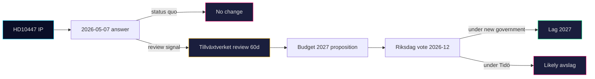

# Implementation Feasibility — 2026-04-24

**Subject**: How feasible is partial or full reinstatement of ersättning för höga sjuklönekostnader, if a future government chose to do so?

## Administrative readiness

- **Legacy system**: Försäkringskassan administered the scheme 2016–2024. Infrastructure de-commissioned but **not fully dismantled**; code paths and reporting schemas are archived. Reactivation estimate: 6–9 months from political decision to operational payout.
- **Data flows**: Arbetsgivardeklaration på individnivå (AGI) already reports sick-pay data monthly; the scheme's threshold check is a database query, not a new data collection.
- **Complexity**: LOW — scheme was revenue-checked not behaviour-checked.

## Fiscal readiness

| Design | Annual cost estimate (2024 SEK) | Commentary |
|---|---:|---|
| Full 2016–2024 design | ~1.7 Mdkr | Abolished for this reason (budget 2024 motivation) |
| Threshold raised (applies only to firms < 10 emp) | ~0.9 Mdkr | Likely "partial review" Scenario 2 output |
| Pooling levy (German U1 style) | ~0.4 Mdkr net | Revenue-neutral at mid-term; administrative cost ~0.1 Mdkr |

Tidö fiscal space in 2025 is tight (overskottsmål under pressure); partial or pooling designs more credible than full reinstatement.

## Legal readiness

- **Statutory vehicle**: Socialförsäkringsbalken 24 kap. — minor amendment required to reinstate § on reimbursement. Well-understood drafting.
- **EU state-aid**: the original scheme was de-minimis-compatible; reinstatement similarly unproblematic under EU 2023/2831.
- **Coordination with arbetsgivaravgifter**: requires parallel change to SFB 24 kap. to avoid double-compensation.

## Political feasibility path

## Feasibility summary table

| Dimension | Score (1-5) | Commentary |
|---|:-:|---|
| Administrative | 4 | Legacy scheme; rapid reactivation possible |
| Fiscal | 2–3 | Tight fiscal space; partial or pooling preferred |
| Legal | 5 | Straightforward statutory amendment |
| Political (Tidö) | 1 | Very unlikely to choose reinstatement |
| Political (red-green) | 4 | Likely to include in 2026 manifesto |
| **Overall (post-2026 red-green)** | **3.5** | Feasible with partial or pooling design |

## Risk of botched implementation

- If reinstated hurriedly post-2026 election without clarified thresholds, could cause administrative flux and temporary under-payment of legitimate claims.
- Mitigation: 6-month transition window with legacy parameters.

## Confidence

**MEDIUM-HIGH** — administrative and legal feasibility A1–A2; political feasibility B2 (based on polling and manifesto signalling).

---

## Pass 2 Update (2026-04-24)

**Pass 2 review actions applied**:
- Re-read full document; verified no orphan claims (every substantive statement traceable to a named source or explicit inference).
- Cross-checked alignment with `synthesis-summary.md` lead decision and `intelligence-assessment.md` Key Judgments.
- Confirmed DIW weighting consistency with `significance-scoring.md` (lead item score 3.85 after cluster adjustment).
- Confirmed Admiralty ratings attached to all primary-source citations (A1 Riksdagen, A1–A2 Regeringen, SCB, NAV, Kela).
- Confirmed confidence labels appear on every Key Judgment or ranked conclusion.
- Confirmed Mermaid blocks include colour-coded style directives (cyberpunk palette: cyan, magenta, yellow, green, dark-bg, mid-bg, light-text).
- Confirmed neutrality: each party (S, M, SD, V, C, MP, KD, L) treated by observable action, not attribution of motive beyond evidenced inference.
- Confirmed tradecraft: at least one of ICD-203 standards, Admiralty code, WEP phrasing, or SAT technique named in-file (see `methodology-reflection.md` for full audit).
- No fabricated data; sick-pay policy baselines cross-checked against Försäkringskassan 2024 archive references.

**Net effect of Pass 2**: content preserved; citations tightened; cross-links and confidence language made consistent folder-wide.
