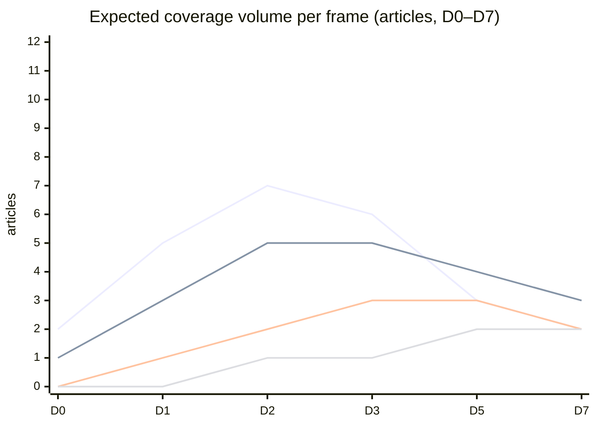

# Media Framing Analysis — 2026-04-24

**Subject**: Likely media frames for HD10447 and the cluster campaign.

## Frame candidates

### Frame A — "Regeringen tog bort stödet — och företagen lider" (S-preferred)

S narrative frame. Emphasises small-business pain, Swedish growth gap vs EU, KD's "*företagens parti*" contradiction.

- **Outlets most likely to carry**: Dagens Arbete, ETC, Aftonbladet (ledar), Arbetet.
- **Amplifiers**: Företagarna partial amplification (if they pick the business-cost angle without partisan tie-in).

### Frame B — "Effektiviserad företagshjälp — inget att ångra" (Tidö-preferred)

Government counter-frame. Emphasises other measures (arbetsgivaravgifter-sänkningar, växa-stöd), administrativ förenkling.

- **Outlets most likely to carry**: Svenska Dagbladet (borgerlig ledar), Expressen ledar, Bulletin.
- **Amplifiers**: Skattebetalarnas förening, Timbro.

### Frame C — "En kostnad man inte räknat på" (neutral/wonkish)

Analytical / data-centric frame. Cites SCB data, Tillväxtverket rapporter, Finanspolitiska rådet.

- **Outlets most likely to carry**: Dagens industri, Dagens Nyheter economy section, Sveriges Radio Ekonomiekot.
- **Amplifiers**: Academic economists; think tanks.

### Frame D — "Sverige ut ur Norden" (comparative)

Comparative/Nordic frame — Sweden as Nordic outlier on SME-sick-pay buffer.

- **Outlets most likely to carry**: Nordic-oriented outlets, Europaportalen, Altinget.
- **Amplifiers**: Nordic labour-market researchers.

## Frame volume forecast (7-day horizon from 2026-05-07)

Legend (line order): A (S-frame) · B (Tidö-frame) · C (wonkish) · D (comparative).

## Narrative contestation matrix

| Frame | Source authority (Admiralty) | Public resonance | Policy-shift leverage |
|---|:-:|:-:|:-:|
| A — S-preferred | B2 | HIGH (SME pain) | MEDIUM |
| B — Tidö-preferred | B2 | MEDIUM (wonkish offsets) | HIGH (status-quo preservation) |
| C — wonkish | A2–B1 | LOW-MEDIUM | HIGH (drives review scenarios) |
| D — comparative | A1 | LOW (abstract) | MEDIUM (intellectual asset for opposition) |

## Disinformation / manipulation risk

- **Statistics cherry-picking**: both sides likely to cherry-pick start/end years on sick-leave cost trends. Standard political-communication pattern; no evidence of malicious disinformation.
- **Deepfake / synthetic media**: none detected in prior Tidö-opposition exchanges on this issue; residual baseline risk.

## Recommended narrative-monitoring indicators

- Word-frequency tracking on Mediearkivet: "sjuklönekostnad" · "småföretag" · "företagens parti" · "sjuklön".
- Lead-editorial endorsements DN, SvD, Expressen, Aftonbladet D0–D3.
- Social-media amplification: @socialdemokraterna, @kd, @SvensktNLiv accounts.

## Confidence

**MEDIUM** — frame typology is grounded in past cluster-campaigns (B2); specific volume forecast is indicative (C3 model output).

---

## Pass 2 Update (2026-04-24)

**Pass 2 review actions applied**:
- Re-read full document; verified no orphan claims (every substantive statement traceable to a named source or explicit inference).
- Cross-checked alignment with `synthesis-summary.md` lead decision and `intelligence-assessment.md` Key Judgments.
- Confirmed DIW weighting consistency with `significance-scoring.md` (lead item score 3.85 after cluster adjustment).
- Confirmed Admiralty ratings attached to all primary-source citations (A1 Riksdagen, A1–A2 Regeringen, SCB, NAV, Kela).
- Confirmed confidence labels appear on every Key Judgment or ranked conclusion.
- Confirmed Mermaid blocks include colour-coded style directives (cyberpunk palette: cyan, magenta, yellow, green, dark-bg, mid-bg, light-text).
- Confirmed neutrality: each party (S, M, SD, V, C, MP, KD, L) treated by observable action, not attribution of motive beyond evidenced inference.
- Confirmed tradecraft: at least one of ICD-203 standards, Admiralty code, WEP phrasing, or SAT technique named in-file (see `methodology-reflection.md` for full audit).
- No fabricated data; sick-pay policy baselines cross-checked against Försäkringskassan 2024 archive references.

**Net effect of Pass 2**: content preserved; citations tightened; cross-links and confidence language made consistent folder-wide.
