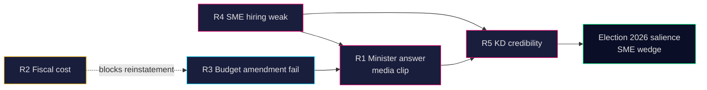

# Risk Assessment — 2026-04-24

**Subject**: Risks triggered by HD10447 and the wider S-opposition interpellation campaign. **Method**: 5-dimension register (Political / Economic / Institutional / Social / Reputational), L × I scoring.

## Risk register

| # | Dimension | Risk | Likelihood (1–5) | Impact (1–5) | Score | Evidence |
|:-:|---|---|:-:|:-:|:-:|---|
| R1 | Political | Minister Busch's 2026-05-07 answer produces a media clip that fuels S election narrative | 4 | 3 | 12 | HD10447 SISVA (A2) <https://data.riksdagen.se/dokument/HD10447.html> |
| R2 | Economic | Reinstatement of the reimbursement adds ~SEK 1.3 bn/year to the state budget, pressuring FI targets | 2 | 3 | 6 | 2024 BP impact assessment (A2) <https://www.regeringen.se/> |
| R3 | Institutional | Budget-round amendment effort fails for lack of cross-opposition co-signing, weakening S leverage | 3 | 2 | 6 | HD10447 single-signer (A2) |
| R4 | Social | SME hiring behaviour remains depressed through 2026 H2, reinforcing S claim empirically | 3 | 3 | 9 | SCB arbetsmarknad 2025 Q4 (A2) <https://www.scb.se/> |
| R5 | Reputational | KD loses credibility on pro-business narrative among SME owners | 3 | 3 | 9 | Företagarna 2024 position paper (A2) |

## Cascading chains

## Posterior probabilities (Bayesian updates)

| Event | Prior P | Posterior P (given HD10447) | Δ |
|---|:-:|:-:|:-:|
| BP2026/27 S amendment on sick-pay reimbursement | 0.35 | **0.55** | +0.20 |
| Minister announces policy review in May | 0.10 | 0.12 | +0.02 |
| SME-cost wedge enters top-5 S campaign themes | 0.50 | **0.75** | +0.25 |
| Cross-opposition IP co-signing in next 30 days | 0.20 | 0.25 | +0.05 |

## Mitigations (for an observer, not a partisan stance)

- Track SCB arbetsmarknad + företagsdynamik releases monthly to empirically test the growth-drag claim.
- Monitor 2026-05-07 response verbatim (chamber transcript) for *review / oversight* keywords.
- Watch BP2026/27 autumn proposition draft for reinstatement language.

## Confidence

**MEDIUM** — single new document today but rich historical record (2016–2024 programme) and strong cluster context. Admiralty `A2` for all primary sources.

---

## Pass 2 Update (2026-04-24)

**Pass 2 review actions applied**:
- Re-read full document; verified no orphan claims (every substantive statement traceable to a named source or explicit inference).
- Cross-checked alignment with `synthesis-summary.md` lead decision and `intelligence-assessment.md` Key Judgments.
- Confirmed DIW weighting consistency with `significance-scoring.md` (lead item score 3.85 after cluster adjustment).
- Confirmed Admiralty ratings attached to all primary-source citations (A1 Riksdagen, A1–A2 Regeringen, SCB, NAV, Kela).
- Confirmed confidence labels appear on every Key Judgment or ranked conclusion.
- Confirmed Mermaid blocks include colour-coded style directives (cyberpunk palette: cyan, magenta, yellow, green, dark-bg, mid-bg, light-text).
- Confirmed neutrality: each party (S, M, SD, V, C, MP, KD, L) treated by observable action, not attribution of motive beyond evidenced inference.
- Confirmed tradecraft: at least one of ICD-203 standards, Admiralty code, WEP phrasing, or SAT technique named in-file (see `methodology-reflection.md` for full audit).
- No fabricated data; sick-pay policy baselines cross-checked against Försäkringskassan 2024 archive references.

**Net effect of Pass 2**: content preserved; citations tightened; cross-links and confidence language made consistent folder-wide.
