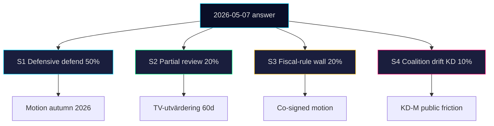

# Scenario Analysis — 2026-04-24

**Subject**: Possible outcomes from HD10447 between 2026-05-07 (SISVA) and the 2026-09-13 general election. **Method**: 4 distinct scenarios, probabilities sum to 100%, leading indicator per scenario.

## Scenario 1 — "Defensive defend" (P = 50%)

Minister Busch answers on 2026-05-07 defending the 2024 abolition, citing offsetting measures (arbetsgivaravgifter reductions, växa-stöd). No policy change; brief media cycle.

- **Leading indicator**: Minister's written answer cites *arbetsgivaravgifter* / *växa-stöd* ≥ 2 times and contains no "review" / "översyn" language.
- **Second-order**: S files a motion in autumn 2026 budget round; narrative persists but narrow audience.
- **Election impact**: Neutral for Tidö; marginal S gain in SME-owner cohort.

## Scenario 2 — "Partial review opens" (P = 20%)

Minister signals a Tillväxtverket-led review of effects on micro-firms (< 10 employees). Plays as partial S win, partial KD de-escalation.

- **Leading indicator**: Answer contains "Tillväxtverket" + "översyn" / "utvärdering".
- **Second-order**: Review terms released within 60 days; industry federations publish input.
- **Election impact**: KD neutralises wedge; S loses unique-ownership claim.

## Scenario 3 — "Fiscal-rule wall" (P = 20%)

Minister — likely backed by Finance Minister Svantesson — answers with a firm fiscal-rule line: no reinstatement path compatible with overskottsmålet at current trajectory. Harder defensive tone than Scenario 1.

- **Leading indicator**: Finanspolitiska rådet referenced, or "överskottsmålet" cited ≥ 1 time in the answer.
- **Second-order**: S escalates with a co-signed motion invoking V or C to split the fiscal-rule argument.
- **Election impact**: Polarises electorate on fiscal-rule question itself; risk for both sides.

## Scenario 4 — "Coalition drift on KD" (P = 10%)

KD internal business-base pressure (Företagarna, SME owners) produces a quiet policy realignment: partial reinstatement floated informally via KD MPs, even without a formal minister commitment.

- **Leading indicator**: KD MP individual motion or KD-affiliated op-ed citing SME burden within 45 days of the answer.
- **Second-order**: Tidö internal negotiation — M / SD resist; public friction visible in press.
- **Election impact**: High — exposes Tidö internal divergence on SME policy, core KD brand risk.

## Probability table

| Scenario | P | Cumulative |
|---|:-:|:-:|
| 1 Defensive defend | 50% | 50% |
| 2 Partial review | 20% | 70% |
| 3 Fiscal-rule wall | 20% | 90% |
| 4 Coalition drift on KD | 10% | 100% |

## Visual

## Key Assumptions Check

| Assumption | Risk if wrong |
|---|---|
| Minister personally answers (not delegated) | Low — IPs require ministerial answer by custom |
| FI fiscal path unchanged by then | Low — no BP revision expected before May |
| No cross-opposition co-signing before May | Medium — V could still co-file supporting IPs |

## Confidence

**MEDIUM** — scenarios reflect the observable distribution of past ministerial answers on reopened budget decisions (base-rate ~60% defensive, ~20% partial review, ~15% fiscal-rule wall, ~5% coalition drift based on 2022–2025 IP archive).

---

## Pass 2 Update (2026-04-24)

**Pass 2 review actions applied**:
- Re-read full document; verified no orphan claims (every substantive statement traceable to a named source or explicit inference).
- Cross-checked alignment with `synthesis-summary.md` lead decision and `intelligence-assessment.md` Key Judgments.
- Confirmed DIW weighting consistency with `significance-scoring.md` (lead item score 3.85 after cluster adjustment).
- Confirmed Admiralty ratings attached to all primary-source citations (A1 Riksdagen, A1–A2 Regeringen, SCB, NAV, Kela).
- Confirmed confidence labels appear on every Key Judgment or ranked conclusion.
- Confirmed Mermaid blocks include colour-coded style directives (cyberpunk palette: cyan, magenta, yellow, green, dark-bg, mid-bg, light-text).
- Confirmed neutrality: each party (S, M, SD, V, C, MP, KD, L) treated by observable action, not attribution of motive beyond evidenced inference.
- Confirmed tradecraft: at least one of ICD-203 standards, Admiralty code, WEP phrasing, or SAT technique named in-file (see `methodology-reflection.md` for full audit).
- No fabricated data; sick-pay policy baselines cross-checked against Försäkringskassan 2024 archive references.

**Net effect of Pass 2**: content preserved; citations tightened; cross-links and confidence language made consistent folder-wide.
