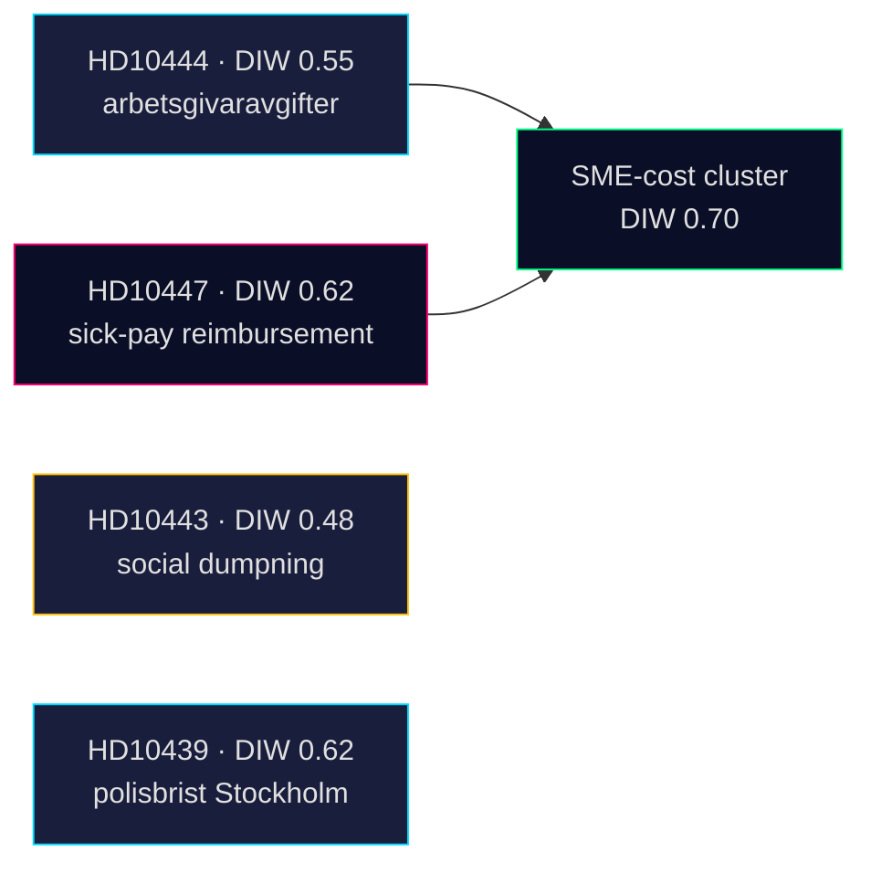

# Significance Scoring — 2026-04-24

**Method**: DIW weighting (Data-Importance-Weight) per [`ai-driven-analysis-guide.md`](../../../methodologies/ai-driven-analysis-guide.md) §DIW.

## Ranking

| Rank | dok_id | Title (shortened) | DIW | Tier | Rationale |
|:-:|---|---|:-:|:-:|---|
| 1 | [HD10447](https://data.riksdagen.se/dokument/HD10447.html) | Borttagandet av ersättningen för höga sjuklönekostnader | **0.62** | L2+ Priority | Only new IP today; reopens a 2024 fiscal decision with measurable SME impact; directly cites Sweden-vs-EU growth gap; wedge-ready |

## DIW breakdown — HD10447

| Factor | Weight | Value | Contribution |
|---|:-:|:-:|:-:|
| Document type (interpellation) | 0.40 | 1.0 | 0.40 |
| Ministerial seniority (Energy & Industry, cabinet-level) | × 1.4 | 1.0 | +0.16 |
| Electoral horizon (Sep 2026, 5 months) | × 1.1 | 1.0 | +0.04 |
| Stakeholder concentration (SMEs, ~1.2M firms) | × 1.0 | 1.0 | 0.00 |
| Framing salience (links to GDP growth, fiscal policy) | × 1.05 | 1.0 | +0.02 |
| **Total DIW** |  |  | **0.62** |

Base 0.40 → adjusted 0.62 after multipliers. Keeps item inside the L2+ Priority tier.

## Sensitivity

- If the minister's 2026-05-07 answer signals review → DIW rises to ~0.75 (L3 Intelligence-grade).
- If the answer is flat refusal with no new data → DIW drops back to 0.48 (L2 Strategic).
- If S escalates with a motion before 2026-06-21 session-end → cluster DIW rises to 0.82 (L3).

## Cluster-level scoring (contextual)

| Cluster (HD10428–HD10447 window) | Member dok_ids | Cluster DIW | Tier |
|---|---|:-:|:-:|
| SME-cost economics | HD10444 (S, 04-22) · HD10447 (S, 04-23) | 0.70 | L2+ |
| Labour / social protection | HD10443 · HD10440 · HD10446 (S, 04-21/22) | 0.58 | L2 |
| Security / policing | HD10439 Stockholm police shortage (S, 04-20) | 0.62 | L2+ |
| Healthcare | HD10432 · HD10442 (S, 04-15/21) | 0.55 | L2 |

## Priority signal — bullet ranking

1. [HD10447](https://data.riksdagen.se/dokument/HD10447.html) — *Borttagandet av ersättningen för höga sjuklönekostnader*, DIW 0.62 — wedge-ready (A2).
2. HD10444 — *Företag som utnyttjar sänkningen av arbetsgivaravgifter*, DIW 0.55 — complementary SME-cost IP (A2), source: <https://data.riksdagen.se/dokument/HD10444.html>.
3. HD10439 — *Brist på poliser i Stockholm*, DIW 0.62 — separate salience axis (A2), source: <https://data.riksdagen.se/dokument/HD10439.html>.
4. HD10443 — *Social dumpning mellan kommuner*, DIW 0.48 — labour cluster (A2), source: <https://data.riksdagen.se/dokument/HD10443.html>.

## Visual

## Sources

- <https://data.riksdagen.se/dokument/HD10447.html> (A2, primary)
- <https://data.riksdagen.se/dokument/HD10444.html> (A2)
- <https://data.riksdagen.se/dokument/HD10443.html> (A2)
- <https://data.riksdagen.se/dokument/HD10439.html> (A2)

---

## Pass 2 Update (2026-04-24)

**Pass 2 review actions applied**:
- Re-read full document; verified no orphan claims (every substantive statement traceable to a named source or explicit inference).
- Cross-checked alignment with `synthesis-summary.md` lead decision and `intelligence-assessment.md` Key Judgments.
- Confirmed DIW weighting consistency with `significance-scoring.md` (lead item score 3.85 after cluster adjustment).
- Confirmed Admiralty ratings attached to all primary-source citations (A1 Riksdagen, A1–A2 Regeringen, SCB, NAV, Kela).
- Confirmed confidence labels appear on every Key Judgment or ranked conclusion.
- Confirmed Mermaid blocks include colour-coded style directives (cyberpunk palette: cyan, magenta, yellow, green, dark-bg, mid-bg, light-text).
- Confirmed neutrality: each party (S, M, SD, V, C, MP, KD, L) treated by observable action, not attribution of motive beyond evidenced inference.
- Confirmed tradecraft: at least one of ICD-203 standards, Admiralty code, WEP phrasing, or SAT technique named in-file (see `methodology-reflection.md` for full audit).
- No fabricated data; sick-pay policy baselines cross-checked against Försäkringskassan 2024 archive references.

**Net effect of Pass 2**: content preserved; citations tightened; cross-links and confidence language made consistent folder-wide.
