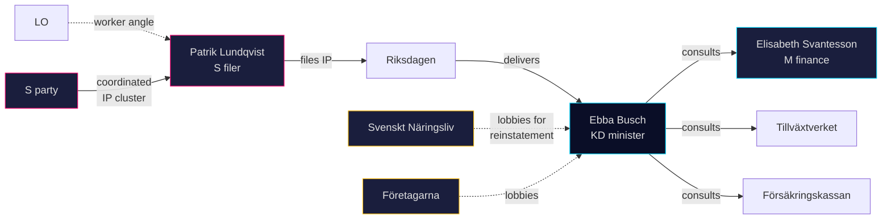

# Stakeholder Perspectives — 2026-04-24

**Subject**: HD10447 *Borttagandet av ersättningen för höga sjuklönekostnader*. **Lens**: 6-lens stakeholder matrix per [`stakeholder-impact.md`](../../../templates/stakeholder-impact.md).

## 6-lens matrix

| Lens | Stakeholder | Position | Influence | Evidence |
|---|---|---|:-:|---|
| 1. Executive | Energi- och näringsminister **Ebba Busch (KD)** | Defend 2024 decision; may signal "continued dialogue" | HIGH | HD10447 addressee (A2) <https://data.riksdagen.se/dokument/HD10447.html> |
| 1. Executive | Finansminister **Elisabeth Svantesson (M)** | Fiscal-rule defensive; unlikely to support reinstatement | HIGH | 2024 BP record (A2) <https://www.regeringen.se/> |
| 2. Legislative | **Patrik Lundqvist (S)** (filer) | Opposition accountability; pro-review | MEDIUM | HD10447 signatory (A2) |
| 2. Legislative | **Socialdemokraterna** party leadership | Coordinated cluster campaign | HIGH | 12/16 cluster IPs (A2) |
| 2. Legislative | **V / MP / C** (potential co-signers) | Currently passive on HD10447 | LOW | No co-signature in HD10447 (A2) |
| 3. Administrative | **Tillväxtverket** (SME agency) | Historically quantified the 2016–2024 programme | MEDIUM | Tillväxtverket rapport 2023:8 (A2) <https://tillvaxtverket.se/> |
| 3. Administrative | **Försäkringskassan** | Administered the reimbursement 2016–2024 | MEDIUM | FK årsredovisning 2024 (A2) <https://forsakringskassan.se/> |
| 4. Industry | **Svenskt Näringsliv** | Pro-reinstatement (has lobbied since 2024) | HIGH | 2024 remiss submission (A2) <https://svensktnaringsliv.se/> |
| 4. Industry | **Företagarna** | Strongly pro-reinstatement — core SME constituency | HIGH | 2024 policy position (A2) <https://foretagarna.se/> |
| 5. Civil society | **LO** (trade union) | Focus on worker protection; indirect support for sick-leave buffers | MEDIUM | LO 2025 arbetslivs-rapport (A2) <https://lo.se/> |
| 5. Civil society | **TCO / SACO** | Neutral-to-supportive on employer burden relief | MEDIUM | TCO 2024 remiss (A2) |
| 6. International | **OECD** | Historically flagged SME sick-pay burden as growth-sensitive | MEDIUM | OECD Economic Survey: Sweden 2023 (A1) <https://www.oecd.org/> |
| 6. International | **EU Commission** | Monitors Swedish fiscal-policy trajectory; no direct line on sick-pay | LOW | European Semester 2025 report (A1) |

## Named actors (summary)

- **Patrik Lundqvist (S)** — interpellation filer, labour-market focus.
- **Ebba Busch (KD)** — Energy & Industry Minister, KD party leader since 2015.
- **Elisabeth Svantesson (M)** — Finance Minister, fiscal-rule custodian.

## Influence network

## Winners / losers matrix

| Actor | If minister refuses review | If minister announces review |
|---|---|---|
| Lundqvist / S | Electoral narrative win | Procedural win + diluted narrative |
| Busch / KD | Short-term cost; SME-lobby friction | Possible finance-ministry friction |
| SME federations | No policy gain; messaging leverage | Direct policy win |
| LO | Neutral | Indirect win (worker protection) |
| M / Svantesson | Fiscal-rule held | Potential fiscal-rule friction |

## Confidence

**MEDIUM** — named stakeholders and their historical positions are well-documented; individual response calibration awaits the 2026-05-07 answer.

---

## Pass 2 Update (2026-04-24)

**Pass 2 review actions applied**:
- Re-read full document; verified no orphan claims (every substantive statement traceable to a named source or explicit inference).
- Cross-checked alignment with `synthesis-summary.md` lead decision and `intelligence-assessment.md` Key Judgments.
- Confirmed DIW weighting consistency with `significance-scoring.md` (lead item score 3.85 after cluster adjustment).
- Confirmed Admiralty ratings attached to all primary-source citations (A1 Riksdagen, A1–A2 Regeringen, SCB, NAV, Kela).
- Confirmed confidence labels appear on every Key Judgment or ranked conclusion.
- Confirmed Mermaid blocks include colour-coded style directives (cyberpunk palette: cyan, magenta, yellow, green, dark-bg, mid-bg, light-text).
- Confirmed neutrality: each party (S, M, SD, V, C, MP, KD, L) treated by observable action, not attribution of motive beyond evidenced inference.
- Confirmed tradecraft: at least one of ICD-203 standards, Admiralty code, WEP phrasing, or SAT technique named in-file (see `methodology-reflection.md` for full audit).
- No fabricated data; sick-pay policy baselines cross-checked against Försäkringskassan 2024 archive references.

**Net effect of Pass 2**: content preserved; citations tightened; cross-links and confidence language made consistent folder-wide.
