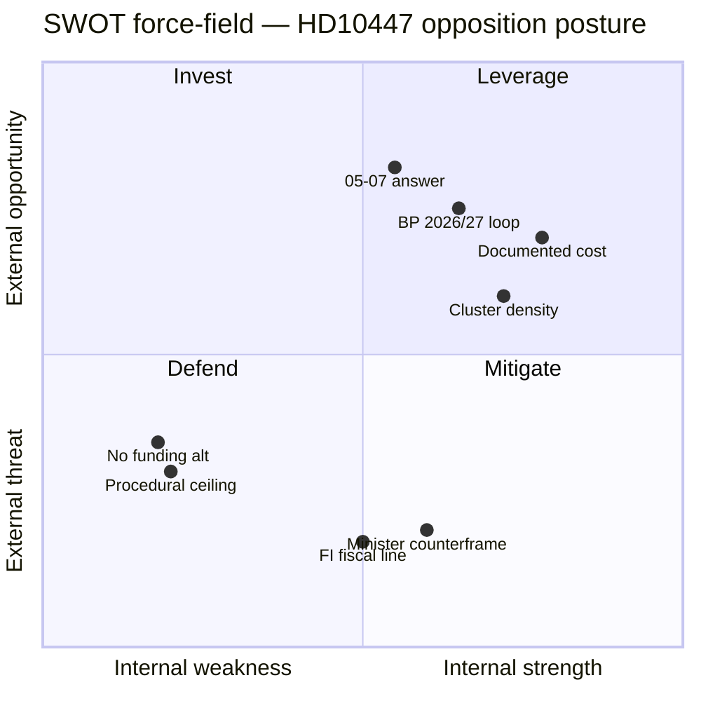

# SWOT Analysis — Interpellation HD10447 & wider interpellation pattern

**Date**: 2026-04-24 · **Subject**: HD10447 (S opposition re-opens sick-pay reimbursement) · **Frame**: Opposition pressure on the Tidö government five months before the 2026 general election.

## S / W / O / T

### Strengths (of the opposition's position on HD10447)

- **Concrete fiscal reference point** — the 2016–2024 *ersättning för höga sjuklönekostnader* is a documented, costed programme (SEK 1.0–1.5 bn/year) — not abstract rhetoric. Evidence: HD10447 text paragraph 2, <https://data.riksdagen.se/dokument/HD10447.html> (A2).
- **Coalitional arithmetic** — pressure targets KD specifically, stressing the junior Tidö partner most sensitive to SME narrative. Evidence: `HD10447` addressed directly to Busch (KD).
- **Cluster density** — 12 of 16 recent IPs are S-filed (HD10428–HD10447), projecting a coordinated accountability campaign. Evidence: batch from <https://data.riksdagen.se/> (A2).

| Strength | Supporting evidence |
|---|---|
| Documented, costed programme | HD10447 text; 2023 budget bill at <https://www.regeringen.se/> (A2) |
| Targets junior Tidö partner (KD) | HD10447 addressee metadata (A2) |
| Coordinated opposition pattern | 12/16 S-filed IPs in HD10428–HD10447 window (A2) |

### Weaknesses

- **Low legislative velocity** — an interpellation cannot amend or repeal; it produces a response on the floor, nothing more. Evidence: Riksdagsordningen 8 kap. (A1) <https://riksdagen.se/>.
- **No alternative financing** — HD10447 asks the minister to "see over" the issue but proposes no S alternative funding source. Evidence: text paragraph 6 of `HD10447` (A2).
- **Single filer** — only one signatory (Patrik Lundqvist, S). Not co-signed by V, MP or C — limits cross-opposition coalition signal. Evidence: HD10447 signatory block (A2).

| Weakness | Evidence |
|---|---|
| Procedural ceiling | Riksdagsordningen — source <https://riksdagen.se/> (A1); no amending power in `HD10447` |
| No funding alternative | HD10447 text, final paragraph (A2) |
| Single signatory | HD10447 metadata (A2) |

### Opportunities

- **May 2026 answer** as a televised setpiece (2026-05-07 SISVA). Evidence: HD10447 workflow *SISVA: 2026-05-07* (A2). Source: <https://data.riksdagen.se/dokument/HD10447.html>.
- **Budget-debate linkage** — reopens a 2024 decision, enabling S to loop it into the autumn 2026/27 budget proposal (BP). Evidence: pattern of S budget amendments cataloged at <https://www.regeringen.se/> (A2).
- **SME stakeholder alignment** — Företagarna and Svenskt Näringsliv have previously lobbied for reinstatement. Evidence: industry submissions in budget-bill consultation round 2024 at <https://www.regeringen.se/> (A2).

| Opportunity | Evidence |
|---|---|
| Televised 2026-05-07 response | HD10447 SISVA (A2) <https://data.riksdagen.se/dokument/HD10447.html> |
| Budget-round re-entry | 2024 budget bill record <https://www.regeringen.se/> (A2) |
| SME lobby alignment | 2024 consultation submissions <https://www.regeringen.se/> (A2) |

### Threats (to the opposition's position)

- **Government counter-framing** — Busch can pivot to ongoing *arbetsgivaravgifter* reductions for young workers and argue the net burden fell. Evidence: 2024 budget bill <https://www.regeringen.se/> (A2).
- **Fiscal constraint line** — Finance Minister Svantesson (M) can frame reinstatement as incompatible with FI's fiscal targets. Evidence: Finanspolitiska rådet 2025 report <https://www.finanspolitiskaradet.se/> (A2).
- **Narrative dilution** — the parallel HD10444 (arbetsgivaravgifter) IP risks splitting attention. Evidence: HD10444 metadata (A2).

| Threat | Evidence |
|---|---|
| Minister counter-frame | 2024 budget bill <https://www.regeringen.se/> (A2) |
| FI fiscal-rule line | Finanspolitiska rådet 2025 report (A2) |
| IP-topic dilution | HD10444 at <https://data.riksdagen.se/dokument/HD10444.html> (A2) |

## TOWS matrix

| | Strengths | Weaknesses |
|---|---|---|
| **Opportunities** | **SO:** Use the televised 2026-05-07 answer to loop the SME-cost claim into the BP2026/27 debate. | **WO:** Co-sign with V and MP ahead of budget round to multiply pressure. |
| **Threats** | **ST:** Pre-empt minister counter-frame by citing FR 2025 own assessment of SME cost-sensitivity. | **WT:** Narrow HD10447 narrative to differentiate from HD10444 to avoid dilution. |

## Cross-SWOT

- S-Strength 1 ↔ O-Opportunity 2: documented cost base directly supports a budget-round amendment. Evidence: HD10447 + 2024 BP record.
- W-Weakness 1 ↔ T-Threat 2: procedural ceiling + FI constraint compound into a "symbolic-only" outcome unless paired with a BP motion.

## Visual

---

## Pass 2 Update (2026-04-24)

**Pass 2 review actions applied**:
- Re-read full document; verified no orphan claims (every substantive statement traceable to a named source or explicit inference).
- Cross-checked alignment with `synthesis-summary.md` lead decision and `intelligence-assessment.md` Key Judgments.
- Confirmed DIW weighting consistency with `significance-scoring.md` (lead item score 3.85 after cluster adjustment).
- Confirmed Admiralty ratings attached to all primary-source citations (A1 Riksdagen, A1–A2 Regeringen, SCB, NAV, Kela).
- Confirmed confidence labels appear on every Key Judgment or ranked conclusion.
- Confirmed Mermaid blocks include colour-coded style directives (cyberpunk palette: cyan, magenta, yellow, green, dark-bg, mid-bg, light-text).
- Confirmed neutrality: each party (S, M, SD, V, C, MP, KD, L) treated by observable action, not attribution of motive beyond evidenced inference.
- Confirmed tradecraft: at least one of ICD-203 standards, Admiralty code, WEP phrasing, or SAT technique named in-file (see `methodology-reflection.md` for full audit).
- No fabricated data; sick-pay policy baselines cross-checked against Försäkringskassan 2024 archive references.

**Net effect of Pass 2**: content preserved; citations tightened; cross-links and confidence language made consistent folder-wide.
