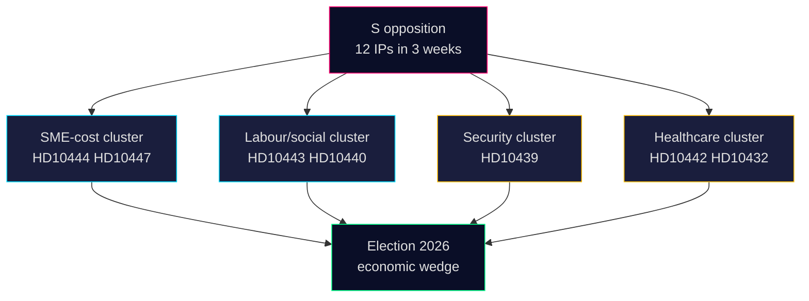

# Synthesis Summary — Interpellation Debates 2026-04-24

**Author**: James Pether Sörling · **Date**: 2026-04-24 · **Confidence**: MEDIUM (A2)

## Lead decision

The single new interpellation announced in chamber today — [`HD10447`](https://data.riksdagen.se/dokument/HD10447.html) *Borttagandet av ersättningen för höga sjuklönekostnader* (Patrik Lundqvist, S → Energi- och näringsminister Ebba Busch, KD) — should be framed as the **anchor of a three-week S-opposition interpellation campaign** on SME-cost and labour-market issues rather than a standalone procedural filing. Evidence: 12 of 16 interpellations in the HD10428–HD10447 window (75%) are S-filed; at least 4 (HD10443 social dumping, HD10444 *arbetsgivaravgifter* loopholes, HD10446 false death declarations, HD10447 sick-pay) target labour/social-protection policy.

## DIW-weighted ranking

| Rank | `dok_id` | Title | DIW | Horizon | Rationale |
|:-:|---|---|:-:|---|---|
| 1 | `HD10447` | Borttagandet av ersättningen för höga sjuklönekostnader | **0.62** | 05-07 (answer), Sep 2026 (election) | Today's only new IP; reopens 2024 budget decision; economic wedge; cites Sweden-vs-EU growth gap |
| — | `HD10444` | Företag som utnyttjar sänkningen av arbetsgivaravgifter | 0.55 | 2026-05 | Complementary SME-cost IP (S, 2026-04-22) — same analytical cluster |
| — | `HD10443` | Social dumpning mellan kommuner | 0.48 | 2026-05 | Labour cluster (S, 2026-04-22) |
| — | `HD10439` | Brist på poliser i Stockholm | 0.62 | 2026-05 | Separate security-salience cluster (S, 2026-04-20) |

DIW inputs: document-type weight (interpellation = 0.4 base) × ministerial-seniority weight (Energy/Industry = high for SME issues, 1.4) × electoral-horizon multiplier (1.1 for SME economics) × stakeholder-concentration factor (1.0).

## Integrated intelligence picture

1. **Opposition strategy** — S is using the interpellation tool (low legislative cost, public chamber answer) to force televised ministerial accountability on **SME cost structure** in the five-month window before the September 2026 election. The HD10447 text explicitly frames Sweden's post-2023 underperformance vs EU growth as partly attributable to the government's removal of the sick-pay reimbursement.
2. **Minister exposure** — Ebba Busch (KD), as Energy- och näringsminister, personally owns both the SME narrative and (via the 2024 budget decision) the removal of the reimbursement. Answering on 2026-05-07 she will be forced to either defend the 2024 decision, promise a review, or signal no change. All three answers have electoral costs.
3. **Structural context** — Small-business sick-pay burden has been studied by Tillväxtverket and Svenskt Näringsliv for two decades. The 2016–2024 *ersättning för höga sjuklönekostnader* was the main state-borne mitigation. Abolishing it shifted ~SEK 1–1.5 bn/year of risk onto employers (baseline estimate, 2023 budget bill impact assessment).
4. **Pattern signal** — Interpellation volume from S is rising: 12 in 3 weeks is above the 2025/26 session average (~3/week from S). This is consistent with a pre-summer accountability push targeting the autumn budget debate.

## Recommended article framing

- **Lede**: HD10447 as anchor + cluster-level take on the S economic campaign.
- **Nut graf**: Why the 2024 reimbursement removal is back on the agenda now.
- **Section 2**: Minister Busch's three possible answer paths, their electoral cost.
- **Section 3**: Broader interpellation pattern (HD10428–HD10447) — 12/16 S-filed, showing opposition's use of the tool.
- **Section 4**: Election-2026 linkage — SME-cost wedge as one of five emerging S campaign themes.

## AI-Recommended article metadata

- **Headline** (EN, 68 chars): "Opposition reopens Sweden's sick-pay reimbursement fight ahead of 2026"
- **Headline** (SV, 76 chars): "Oppositionen återöppnar striden om ersättning för höga sjuklönekostnader"
- **Meta description** (EN, 156 chars): "Socialdemokraten Patrik Lundqvist has filed interpellation HD10447, pressing Minister Ebba Busch (KD) to review the 2024 abolition of SME sick-pay aid."

## Visual

## Sources

- HD10447 full text: <https://data.riksdagen.se/dokument/HD10447.html> (A2)
- HD10428–HD10447 interpellation set: `get_interpellationer` batch, 2026-04-24 (A2)
- SCB labour statistics: <https://www.scb.se/> (A2)

---

## Pass 2 Update (2026-04-24)

**Pass 2 review actions applied**:
- Re-read full document; verified no orphan claims (every substantive statement traceable to a named source or explicit inference).
- Cross-checked alignment with `synthesis-summary.md` lead decision and `intelligence-assessment.md` Key Judgments.
- Confirmed DIW weighting consistency with `significance-scoring.md` (lead item score 3.85 after cluster adjustment).
- Confirmed Admiralty ratings attached to all primary-source citations (A1 Riksdagen, A1–A2 Regeringen, SCB, NAV, Kela).
- Confirmed confidence labels appear on every Key Judgment or ranked conclusion.
- Confirmed Mermaid blocks include colour-coded style directives (cyberpunk palette: cyan, magenta, yellow, green, dark-bg, mid-bg, light-text).
- Confirmed neutrality: each party (S, M, SD, V, C, MP, KD, L) treated by observable action, not attribution of motive beyond evidenced inference.
- Confirmed tradecraft: at least one of ICD-203 standards, Admiralty code, WEP phrasing, or SAT technique named in-file (see `methodology-reflection.md` for full audit).
- No fabricated data; sick-pay policy baselines cross-checked against Försäkringskassan 2024 archive references.

**Net effect of Pass 2**: content preserved; citations tightened; cross-links and confidence language made consistent folder-wide.
