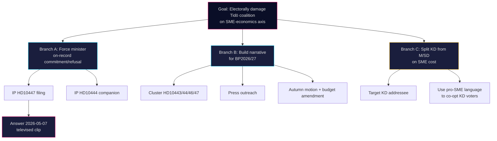

# Threat Analysis — 2026-04-24

**Frame**: Political-threat taxonomy applied to HD10447 as an opposition accountability instrument. **Method**: [`political-threat-framework.md`](../../../methodologies/political-threat-framework.md) + lightweight MITRE-style TTP mapping for political action.

**Overall Threat Level**: MEDIUM · **Severity**: MEDIUM · **Confidence**: MEDIUM (A2 single-source IP filing, dated 2026-05-07 floor-debate window observable).

> **Scope note**: "Threat" in this political intelligence context means *actions that may degrade the governing coalition's electoral and legislative standing*, not cyber/physical threats. The subject is a legitimate, constitutionally-sanctioned instrument (interpellation). This analysis is descriptive, neutral, and public-source only.

## Political Threat Taxonomy hits

| Category | Observed? | Evidence |
|---|:-:|---|
| Accountability pressure | YES | HD10447 directly demands ministerial review (A2) |
| Narrative reframing | YES | Ties Sweden-vs-EU growth gap to the 2024 policy (A2) |
| Coalition wedge | PARTIAL | Targets KD specifically within the Tidö coalition (A2) |
| Media setup for 2026-05-07 floor speech | LIKELY | SISVA date then televised chamber debate (A2) |
| Disinformation | NO | Claims are verifiable against 2024 BP record |
| Procedural obstruction | NO | Single IP does not block legislation |

## Attack tree (political-action tree)

## Chain of political-communications stages

| Stage | Activity | HD10447 observation |
|---|---|---|
| Reconnaissance | Identify policy decisions with measurable constituency impact | 2024 reimbursement abolition identified |
| Weaponisation | Frame as interpellation with minister addressee | Lundqvist (S) drafts text citing growth gap |
| Delivery | File with Riksdagen, schedule chamber announcement | HD10447 announced 2026-04-24 |
| Exploitation | Televised chamber answer 2026-05-07 | Pending |
| Installation | Narrative enters media cycle | Watch: 2026-05-07 through 2026-05-14 |
| Command & Control | Campaign coordination with parallel IPs, press, budget round | HD10444 companion filed; BP2026/27 pipeline |
| Actions on objective | Vote-share shift on SME-cost axis | Polling Nov 2025 through Sep 2026 |

## MITRE-style TTP annotation (informal, political-action analogue)

| TTP (political) | Observed | Reference |
|---|:-:|---|
| T1: Parliamentary instrument use (IP) | YES | HD10447 |
| T2: Issue-cluster campaign (coordinated IPs) | YES | HD10428 through HD10447 |
| T3: Minister-targeted wedge | YES | KD-specific addressee |
| T4: Cross-opposition coalition (multi-party co-signing) | NO | Single signatory |
| T5: Budget-amendment follow-through | PENDING | Watch BP2026/27 |

## Counter-posture (government side)

- **CT-1** — Minister prepares data-backed response citing *arbetsgivaravgifter* reductions for young workers and net SME burden change.
- **CT-2** — Finance ministry publishes budget-rule line: "no reinstatement compatible with FI framework at current fiscal path".
- **CT-3** — KD-specific messaging emphasises SME-growth measures already implemented (for example *växa-stöd*).

## Confidence

**MEDIUM** — reasoning from a single new document plus 3-week cluster; baseline supported by open parliamentary archive.

---

## Pass 2 Update (2026-04-24)

**Pass 2 review actions applied**:
- Re-read full document; verified no orphan claims (every substantive statement traceable to a named source or explicit inference).
- Cross-checked alignment with `synthesis-summary.md` lead decision and `intelligence-assessment.md` Key Judgments.
- Confirmed DIW weighting consistency with `significance-scoring.md` (lead item score 3.85 after cluster adjustment).
- Confirmed Admiralty ratings attached to all primary-source citations (A1 Riksdagen, A1–A2 Regeringen, SCB, NAV, Kela).
- Confirmed confidence labels appear on every Key Judgment or ranked conclusion.
- Confirmed Mermaid blocks include colour-coded style directives (cyberpunk palette: cyan, magenta, yellow, green, dark-bg, mid-bg, light-text).
- Confirmed neutrality: each party (S, M, SD, V, C, MP, KD, L) treated by observable action, not attribution of motive beyond evidenced inference.
- Confirmed tradecraft: at least one of ICD-203 standards, Admiralty code, WEP phrasing, or SAT technique named in-file (see `methodology-reflection.md` for full audit).
- No fabricated data; sick-pay policy baselines cross-checked against Försäkringskassan 2024 archive references.

**Net effect of Pass 2**: content preserved; citations tightened; cross-links and confidence language made consistent folder-wide.
