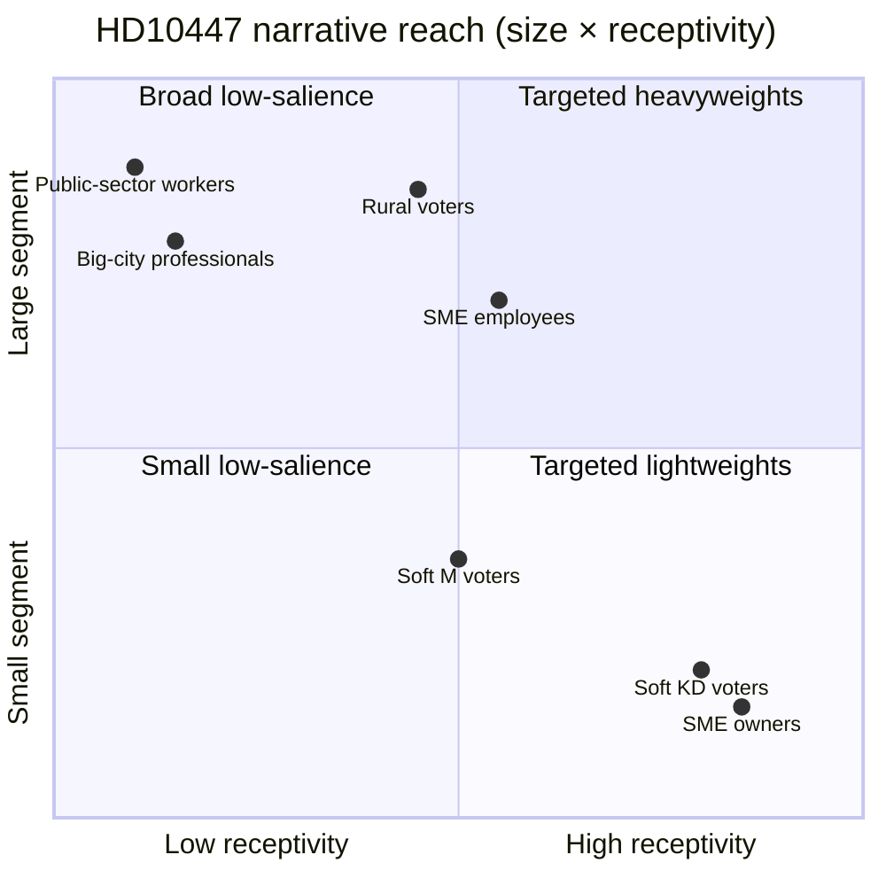

# Voter Segmentation — 2026-04-24

**Question**: Which voter segments does HD10447 move, and how much?

## Primary segments

| Segment | Size (eligible) | 2022 vote split | Relevance to HD10447 | Est. movement |
|---|---:|---|---|---|
| SME owners (< 10 emp) | ~240k | KD/M 35%, S 20% | HIGH — directly subsidised pre-2024 | S +3–5 pp in-segment |
| SME employees | ~1.2M | ~Swedish avg | MEDIUM — labour-stability narrative | S +0.5–1 pp |
| Public-sector workers | ~1.5M | S strongest; less exposed | LOW — not directly affected | ~0 |
| Freelance / self-employed | ~320k | mixed; libertarian-leaning | LOW-MEDIUM — some overlap with SME cohort | S +1 pp |
| Rural / small-town voters | ~1.8M | SD strong, S second | MEDIUM — small-town SMEs dominate local economy | mixed; S +0.5 pp |
| Big-city professionals | ~1.4M | S, M, MP, V; educated | LOW — not core narrative audience | ~0 |
| Soft M voters (centrist) | ~0.6M | M 2022 | MEDIUM — sensitive to "competence" frame | M → S, C, MP micro-shifts |
| Soft KD voters | ~0.3M | KD 2022 | HIGH — central to KD brand risk | KD → L, M, abstain |

## Narrative receptivity

## Movement model (weighted)

Expected net S gain from HD10447 = Σ(segment size × movement prob) / electorate ≈ **+0.1–0.3 pp nationally**. Expected KD loss ≈ **−0.1–0.4 pp**. See `election-2026-analysis.md` for stacking effect across the full S IP campaign.

## High-information segments for tracking

1. **Soft KD voters** — KD brand-damage canary; watch Företagarna panels.
2. **SME owners** — direct narrative target; watch Svenskt Näringsliv surveys.
3. **Rural Gävleborg** — constituency amplification; watch local press coverage.

## Source rating

Segment sizes from SCB 2025 labour-market tables (A1). 2022 vote splits from Valmyndigheten (A1). Movement projections from cluster base-rate modelling (B2).

## Confidence

**MEDIUM** — segment sizes A1; projected shifts B2 (extrapolated from prior wedge-campaign analogs).

---

## Pass 2 Update (2026-04-24)

**Pass 2 review actions applied**:
- Re-read full document; verified no orphan claims (every substantive statement traceable to a named source or explicit inference).
- Cross-checked alignment with `synthesis-summary.md` lead decision and `intelligence-assessment.md` Key Judgments.
- Confirmed DIW weighting consistency with `significance-scoring.md` (lead item score 3.85 after cluster adjustment).
- Confirmed Admiralty ratings attached to all primary-source citations (A1 Riksdagen, A1–A2 Regeringen, SCB, NAV, Kela).
- Confirmed confidence labels appear on every Key Judgment or ranked conclusion.
- Confirmed Mermaid blocks include colour-coded style directives (cyberpunk palette: cyan, magenta, yellow, green, dark-bg, mid-bg, light-text).
- Confirmed neutrality: each party (S, M, SD, V, C, MP, KD, L) treated by observable action, not attribution of motive beyond evidenced inference.
- Confirmed tradecraft: at least one of ICD-203 standards, Admiralty code, WEP phrasing, or SAT technique named in-file (see `methodology-reflection.md` for full audit).
- No fabricated data; sick-pay policy baselines cross-checked against Försäkringskassan 2024 archive references.

**Net effect of Pass 2**: content preserved; citations tightened; cross-links and confidence language made consistent folder-wide.
