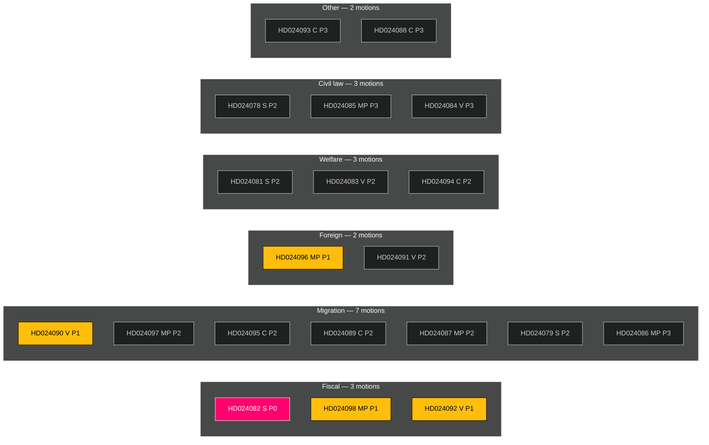

# Classification Results — Motions — 2026-04-24

**Author**: James Pether Sörling · **Confidence**: HIGH · Per [`political-classification-guide.md`](../../../methodologies/political-classification-guide.md)

Seven-dimension classification per document. Dimensions: **Policy Area**, **Process Stage**, **Partisan Axis**, **Electoral Salience**, **Legal Intensity**, **Fiscal Impact**, **Distributional Effect**.

## Per-document classification

| dok_id | Policy Area | Stage | Partisan Axis | Elect Salience | Legal | Fiscal | Distributional | Priority | Retention | Access |
|--------|-------------|-------|---------------|----------------|-------|--------|----------------|----------|-----------|--------|
| [HD024082](https://data.riksdagen.se/dokument/HD024082.html) | Fiscal/energy | Counter-motion | Left-bloc vs Tidö | Very High | Moderate | High | Progressive | **P0** | Permanent | Public |
| [HD024098](https://data.riksdagen.se/dokument/HD024098.html) | Fiscal/climate | Counter-motion | Green vs Tidö | High | Moderate | Mixed | Progressive | **P1** | Permanent | Public |
| [HD024092](https://data.riksdagen.se/dokument/HD024092.html) | Fiscal/distributional | Counter-motion | Left vs Tidö | High | Moderate | Highly progressive | Progressive | **P1** | Permanent | Public |
| [HD024096](https://data.riksdagen.se/dokument/HD024096.html) | Foreign/defence | Counter-motion | Green vs Tidö+S | Medium | High | Low | Mixed | **P1** | Permanent | Public |
| [HD024090](https://data.riksdagen.se/dokument/HD024090.html) | Migration/justice | Counter-motion | Left vs Tidö | High | Very High | Low | Redistributive | **P1** | Permanent | Public |
| [HD024097](https://data.riksdagen.se/dokument/HD024097.html) | Migration/justice | Counter-motion | Green vs Tidö | Medium | High | Low | Redistributive | **P2** | Permanent | Public |
| [HD024095](https://data.riksdagen.se/dokument/HD024095.html) | Migration/justice | Counter-motion | Centre vs Tidö | Medium | High | Low | Mixed | **P2** | Permanent | Public |
| [HD024089](https://data.riksdagen.se/dokument/HD024089.html) | Migration/welfare | Counter-motion | Centre vs Tidö | Medium | High | Moderate | Mixed | **P2** | Permanent | Public |
| [HD024087](https://data.riksdagen.se/dokument/HD024087.html) | Migration/welfare | Counter-motion | Green vs Tidö | Medium | High | Moderate | Mixed | **P2** | Permanent | Public |
| [HD024091](https://data.riksdagen.se/dokument/HD024091.html) | Foreign/defence | Counter-motion | Left vs Tidö | Medium | High | Low | Mixed | **P2** | Permanent | Public |
| [HD024081](https://data.riksdagen.se/dokument/HD024081.html) | Welfare/health | Counter-motion | S vs Tidö | Medium | High | Progressive | Progressive | **P2** | Permanent | Public |
| [HD024083](https://data.riksdagen.se/dokument/HD024083.html) | Welfare/health | Counter-motion | Left vs Tidö | Medium | High | Progressive | Progressive | **P2** | Permanent | Public |
| [HD024094](https://data.riksdagen.se/dokument/HD024094.html) | Welfare/health | Counter-motion | Centre vs Tidö | Medium | High | Moderate | Mixed | **P2** | Permanent | Public |
| [HD024078](https://data.riksdagen.se/dokument/HD024078.html) | Civil law | Counter-motion | S vs Tidö | Medium | High | Moderate | Progressive | **P2** | Permanent | Public |
| [HD024085](https://data.riksdagen.se/dokument/HD024085.html) | Civil law | Counter-motion | Green vs Tidö | Low | High | Low | Mixed | **P3** | Permanent | Public |
| [HD024084](https://data.riksdagen.se/dokument/HD024084.html) | Civil law | Counter-motion | Left vs Tidö | Low | High | Low | Mixed | **P3** | Permanent | Public |
| [HD024079](https://data.riksdagen.se/dokument/HD024079.html) | Migration/labour | Counter-motion | S vs Tidö | Medium | Moderate | Moderate | Mixed | **P2** | Permanent | Public |
| [HD024086](https://data.riksdagen.se/dokument/HD024086.html) | Migration/labour | Counter-motion | Green vs Tidö | Low | Moderate | Moderate | Mixed | **P3** | Permanent | Public |
| [HD024093](https://data.riksdagen.se/dokument/HD024093.html) | Defence/cyber | Counter-motion | Centre vs Tidö | Low | Moderate | Low | Neutral | **P3** | Permanent | Public |
| [HD024088](https://data.riksdagen.se/dokument/HD024088.html) | Consumer finance | Counter-motion | Centre vs Tidö | Low | Moderate | Moderate | Progressive | **P3** | Permanent | Public |

## Priority tier distribution

| Tier | Count | Share | Response |
|------|------:|------:|----------|
| P0 (critical) | 1 | 5% | Lead article, detailed stakeholder map |
| P1 (high) | 4 | 20% | Secondary articles, dedicated section |
| P2 (medium) | 9 | 45% | Cluster analysis |
| P3 (routine) | 6 | 30% | Briefly noted in table |

## Retention & access

All 20 documents are **Offentliga handlingar** (public documents) under Offentlighetsprincipen. Retention: permanent (Riksdagsdata long-term archive). Access control: none required. GDPR basis: Art. 9(2)(e) — data manifestly made public by data subjects (MPs acting in official capacity). No special-category masking required.

## Mermaid — classification heat map

---

*Classification cross-validated against significance-scoring.md DIW tiers (L3 ↔ P0, L2+ ↔ P1, L2 ↔ P2, L1 ↔ P3).*
