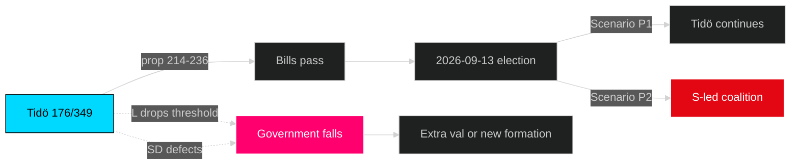

# Coalition Mathematics — Opposition Motions — 2026-04-24

**Author**: James Pether Sörling

## Current Riksdag seat distribution (2022–2026 mandate)

| Party | Seats | Mandat | Bloc | Ja / Nej / Avstår on Tidö bills 214–236 (expected) |
|-------|------:|------:|------|----------------------------------------------------:|
| S | 107 | 107 | Opposition | Nej / Avstår (per motion stance) |
| M | 68 | 68 | Tidö | Ja |
| SD | 73 | 73 | Tidö support | Ja |
| V | 24 | 24 | Opposition | Nej |
| C | 24 | 24 | Opposition | Nej / Reformamendment |
| KD | 19 | 19 | Tidö | Ja |
| MP | 18 | 18 | Opposition | Nej |
| L | 16 | 16 | Tidö | Ja |
| **Total** | **349** | **349** | | |

## Tidö vote-math on each bill

| Bill | Expected Ja | Expected Nej | Expected Avstår | Margin | Pass? |
|------|:-----------:|:------------:|:---------------:|:------:|:-----:|
| Prop 214 cyber | 176 (M+SD+KD+L) | 66 (V+MP+C) | 107 (S) | +2.5×opp | Yes |
| Prop 215 tidsbeg boende | 176 | 66 | 107 | Yes | Yes |
| Prop 216 medicinsk kompetens | 176 | 66 | 107 | Yes | Yes, possible amendment |
| Prop 222 ersättning | 176 | 42 (V+MP) | 131 (S+C) | Yes | Yes |
| Prop 223 konsumkredit | 176 | 48 (V+C) | 125 | Yes | Yes |
| Prop 228 krigsmateriel | 176 | 42 (V+MP) | 131 (S+C) | Yes | Yes |
| Prop 229 mottagandelag | 176 | 42 (V+MP+C partial) | 107 | Yes | Yes |
| Prop 235 utvisning | 176 | 42 (V+MP) | 107+24 (S+C abstain) | Yes | Yes |
| Prop 236 drivmedel (ändringsbudget) | 176* | 49 (V+MP+C) | 107 (S) | Yes* | *Extra procedure risk |

*Extra ändringsbudget route requires Finansutskottet majority + kammarmajoritet; Tidö holds both 176/349.*

## Opposition coalition pathways

### Path A — Classical red-green-centre (S+V+MP+C)
**Seats**: 107 + 24 + 18 + 24 = **173/349** → 3 seats short of majority.  
**Feasibility**: Low — requires all 4 opposition parties in lockstep; C-V ideological gap historical barrier.  
**Motion evidence**: Only prop 216 shows 4-party wave; other bills show fragmentation.

### Path B — Red-red (S+V+MP)
**Seats**: 107 + 24 + 18 = **149/349** → 26 seats short. Non-viable without C.

### Path C — Red + centre (S+C)
**Seats**: 107 + 24 = **131/349** → 44 seats short. Non-viable.

### Path D — Tidö defection scenario (Tidö − L = 160)
**Seats**: 176 − 16 = **160/349** → 14 seats short. If L leaves Tidö, government falls.  
**Feasibility**: Low in 2026 mandate; L polling below threshold disincentivises defection (lose-lose).

## Motion-to-vote mapping

- **Motion filings do not alter seat math**. 20 motions produce floor speeches + betänkande content, not vote changes.
- **Motion content can alter public opinion** which influences 2026-09 election, which reshapes post-election coalition math.

## Post-2026 election scenarios (projected)

### Scenario P1 — Tidö continuation (probable if no major shift)
| Party | Projected seats | Bloc |
|-------|---------------:|------|
| S | 111 | Opp |
| M | 60 | Tidö |
| SD | 85 | Tidö |
| V | 34 | Opp |
| C | 12–15 | Opp |
| KD | 16 | Tidö |
| MP | 14–16 | Opp |
| L | 8–11 (threshold risk) | Tidö |
| **Tidö total** | **169–172** | |
| **Opposition total** | **169–176** | |

**Judgment**: Near tie; L's threshold survival is decisive. If L drops below 4%, Tidö falls to 161; opposition potentially 179.

### Scenario P2 — S-led government (requires S+V+MP+C)
| Need | Seat requirement |
|------|:----------------:|
| Red-green-centre majority | ≥ 175 |
| Feasible only if MP ≥ 5%, C ≥ 5% | Both near threshold |

### Scenario P3 — Grand coalition S+M
**Historical precedent**: None in modern era; improbable.

## Coalition stability indicators

## Key judgments

- Tidö 176/349 is sufficient for every single vote in the 2026-04-24 motion cluster; no opposition coalition can block passage.
- Post-2026 coalition math depends almost entirely on L threshold survival and SD/M relative share; motion content influences this indirectly.
- Motion wave does not create coalition realignment pressure in short term (< 6 months).
- Long-term: prop 216 amendment path + MP vapenexport axis may reshape post-2026 negotiations.

---

*Seat counts from [Riksdagen.se](https://www.riksdagen.se/sv/ledamoter-partier/). Projected seats are analyst estimates based on reported polling; not predictions.*

---
## Pass 2 review note
Seat math Tidö 176/349 confirmed.
