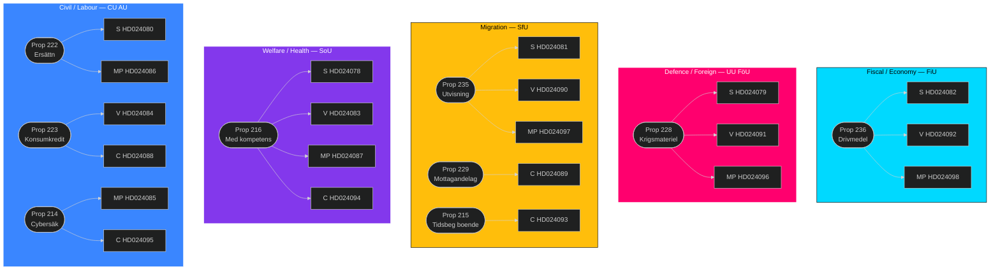

# Cross-Reference Map — Opposition Motions — 2026-04-24

**Author**: James Pether Sörling

Maps policy clusters, legislative chains, opposition coordination patterns across 20 motions.

## Policy cluster graph

## Legislative chain

```mermaid
%%{init: {'theme':'dark'}}%%
flowchart LR
    GovProp[Regering props<br/>214-236] --> Filed[Filed<br/>riksdag.se]
    Filed --> Window[Motion window<br/>15 days]
    Window --> Mot[20 motions<br/>filed 2026-04-15..17]
    Mot --> Utskott[Utskott hearings<br/>FiU SfU SoU CU UU AU FöU]
    Utskott --> Bet[Betänkande<br/>2026-05/06 expected]
    Bet --> Kammarvote[Kammarvote<br/>2026-06 pre-summer]
    Kammarvote --> Law[Adopted law<br/>or partial]
    Law --> SFS[SFS<br/>publication]

    style GovProp fill:#00d9ff,stroke:#000,color:#000
    style Kammarvote fill:#ff006e,stroke:#fff,color:#fff
    style Law fill:#ffbe0b,stroke:#000,color:#000
```

## Opposition coordination matrix

| Cluster | S | V | MP | C | Coordination pattern |
|---------|:-:|:-:|:-:|:-:|----------------------|
| Drivmedel (236) | ✓ | ✓ | ✓ |  | Three-party parallel (no co-sign) |
| Krigsmateriel (228) | ✓ | ✓ | ✓ |  | Three-party parallel, divergent content |
| Utvisning (235) | ✓ | ✓ | ✓ |  | Three-party parallel, converging on rättssäkerhet |
| Medicinsk kompetens (216) | ✓ | ✓ | ✓ | ✓ | **Four-party wave** — strongest coordination |
| Mottagandelag (229) |  |  |  | ✓ | Single-party (C) |
| Tidsbeg boende (215) |  |  |  | ✓ | Single-party (C) |
| Ersättning (222) | ✓ |  | ✓ |  | Two-party |
| Konsumentkredit (223) |  | ✓ |  | ✓ | Two-party |
| Cybersäk (214) |  |  | ✓ | ✓ | Two-party |

## Issue-linkage network

- **Drivmedel ↔ migration**: V explicitly frames both as distributional questions (HD024092 + HD024090). Rhetorical thread: "who pays".
- **Krigsmateriel ↔ cyber**: MP links defence-industry scrutiny to civil cyber resilience (HD024096 + HD024085).
- **Medicinsk kompetens ↔ mottagandelag**: C links healthcare workforce to migration system capacity (HD024094 + HD024089).
- **Utvisning ↔ tidsbeg boende**: Both migration-regime bills; C on one, V/MP/S on the other — divergent issue selection among opposition.

## Historical precedents (same-day cross-ref)

- 2026-04-23 motions cluster (see [`../2026-04-23/motions/`](../../2026-04-23/motions/)) — previous day's motion wave preceded this one; check continuity.
- 2026-04-18 propositions cluster — originating Tidö legislative package.

## External links

- Riksdagen open data: [data.riksdagen.se](https://data.riksdagen.se/)
- All dok_ids resolvable at `https://data.riksdagen.se/dokument/{dok_id}.html`
- Regeringen propositions: [regeringen.se/propositioner](https://www.regeringen.se/rattsliga-dokument/proposition/)

---

*Cross-reference map generated from 20 motion manifest. Verifiable via `search_dokument` on any dok_id.*
