# Election 2026 Analysis — Opposition Motions — 2026-04-24

**Author**: James Pether Sörling

The motion wave of 2026-04-24 lands ~4.5 months before the Swedish parliamentary election of 2026-09-13. This analysis maps motion content to 2026 campaign axes.

## Electoral landscape pre-motion

| Party | 2022 result | Trend (Novus avg Q1 2026) | Trajectory |
|-------|-----------:|------------:|------------|
| S | 30.3% | 30–32% | Stable-up |
| M | 19.1% | 17–19% | Stable-down |
| SD | 20.5% | 21–23% | Stable-up |
| V | 6.7% | 8–10% | Up |
| C | 6.7% | 4–5% | Down (risk under 4% threshold) |
| KD | 5.3% | 4–6% | Stable |
| MP | 5.1% | 4–5% | Stable (threshold risk) |
| L | 4.6% | 3–4% | Down (threshold risk) |

*Source: aggregate of publicly reported Novus/Demoskop/Ipsos; April 2026.*

## Campaign axes activated by motion wave

1. **Fiscal / cost-of-living** — drivmedel cluster (prop 236) mobilises rural/commuter vote.
2. **Migration / rule-of-law** — utvisning cluster (prop 235) mobilises centre-right identity vote + V/MP civil-rights base.
3. **Welfare / healthcare** — prop 216 mobilises kommunsektor workers + S base.
4. **Defence / foreign policy** — krigsmateriel (prop 228) activates MP ethical-foreign-policy axis.
5. **Civil rights / cyber** — prop 214 creates smaller axis but differentiates MP/C.
6. **Social policy / protection of vulnerable** — ersättning (prop 222) + konsumkredit (prop 223) mobilise welfare-sensitive voters.

## Motion-to-vote translation matrix

| Motion cluster | Voter segment targeted | Expected net effect (party) | Evidence |
|----------------|-----------------------|------------------------------|----------|
| Drivmedel | Rural, commuter | +0.5 to +1.0% S (fiscal anchor) | [HD024082](https://data.riksdagen.se/dokument/HD024082.html) |
| Drivmedel | Young urban climate | +0.3 to +0.5% MP, V | [HD024092](https://data.riksdagen.se/dokument/HD024092.html), [HD024098](https://data.riksdagen.se/dokument/HD024098.html) |
| Utvisning | Civil-society aligned | +0.3 to +0.5% V, MP | [HD024090](https://data.riksdagen.se/dokument/HD024090.html), [HD024097](https://data.riksdagen.se/dokument/HD024097.html) |
| Utvisning | Tidö base | Consolidation, ±0 net | Tidö bills |
| Medicinsk kompetens | Kommun-vårdsektor | +0.5 to +1.0% S | [HD024078](https://data.riksdagen.se/dokument/HD024078.html) |
| Krigsmateriel | Ethical-foreign-policy voters | +0.2 to +0.4% MP | [HD024096](https://data.riksdagen.se/dokument/HD024096.html) |
| Cybersäk | Reform-centre voters | +0.1 to +0.2% C | [HD024095](https://data.riksdagen.se/dokument/HD024095.html) |

## Seat-projection sensitivity

| Scenario (Sep 2026) | S | M | SD | V | C | KD | MP | L | Tidö total |
|---------------------|--:|--:|--:|--:|--:|--:|--:|--:|--:|
| Base (current polls) | 111 | 64 | 82 | 33 | 15 | 18 | 15 | 11 | 175 |
| Motion-amplified opposition +1% S,V,MP | 115 | 62 | 80 | 36 | 14 | 17 | 16 | 9 | 168 |
| Fuel-price salience +2% S, −1% M | 120 | 60 | 81 | 33 | 15 | 18 | 14 | 8 | 167 |
| Migration salience +1.5% SD, −1% S | 108 | 63 | 87 | 32 | 15 | 18 | 15 | 11 | 179 |

*Seat allocation via Sainte-Laguë method; 349 seats, 4% national threshold.*

## Threshold-risk parties

- **C** (4.5%): motion filings (5 motions incl. reform content) aim to differentiate from S — critical survival lever.
- **L** (3.8%): zero motions this wave; L relies on Tidö coalition visibility, not parliamentary activism.
- **MP** (4.2%): 6 motions create signal but threshold vulnerability remains.
- **KD** (5.1%): safely above threshold, no motion activity in wave.

## Campaign narrative construction

```mermaid
%%{init: {'theme':'dark'}}%%
flowchart TB
    S[S narrative<br/>'Ansvarsfull fiscal politik'] -->|evidence| HD082[HD024082 motion]
    S -->|evidence| HD078[HD024078 motion]
    V[V narrative<br/>'Rättvisa för alla'] -->|evidence| HD090[HD024090 motion]
    V -->|evidence| HD092[HD024092 motion]
    MP[MP narrative<br/>'Klimat + etik + frihet'] -->|evidence| HD096[HD024096 motion]
    MP -->|evidence| HD098[HD024098 motion]
    C[C narrative<br/>'Reform och centrism'] -->|evidence| HD094[HD024094 motion]
    C -->|evidence| HD089[HD024089 motion]
    M[M narrative<br/>'Stabilitet under Tidö'] -->|evidence| Tidö[9 props passed]
    SD[SD narrative<br/>'Makt utan motstånd'] -->|evidence| Zero[Zero motions]

    style S fill:#e30613,stroke:#fff,color:#fff
    style V fill:#a31621,stroke:#fff,color:#fff
    style MP fill:#83c67a,stroke:#000,color:#000
    style C fill:#009933,stroke:#fff,color:#fff
    style M fill:#1f9ed1,stroke:#fff,color:#fff
    style SD fill:#ffd700,stroke:#000,color:#000
```

## Electoral key dates

| Date | Event | Motion relevance |
|------|-------|-----------------|
| 2026-05 to 2026-06 | Utskott hearings | Motions referenced in debate |
| 2026-06-15 | Riksdagen summer recess | Kammarvoter on Tidö bills 214–236 |
| 2026-07 | Almedalen veckan | Motion content becomes campaign material |
| 2026-08 | Formal campaign start | Motions cited in party manifestos |
| 2026-09-13 | Election day | Motion-mobilised blocs go to polls |

## Judgments

- Motion wave amplifies S fiscal-anchor narrative more than any other single event Q2 2026.
- C needs every motion-driven differentiation event to survive 4% threshold; MP in similar position.
- Tidö cost of passing controversial bills pre-election: measurable (~0.5–1.0% soft-M erosion expected regardless of wave outcome).
- SD zero-motion strategy preserves base but concedes narrative ground to opposition.

---

*All percentages are public polling averages. All seat projections are analyst estimates, not predictions.*
