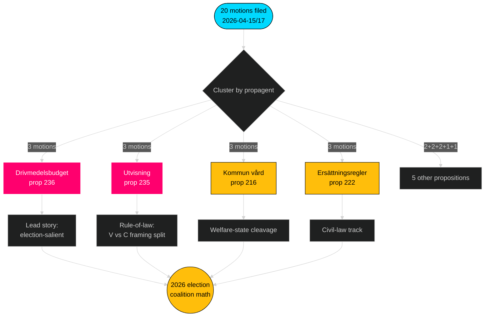

# Executive Brief — Opposition Motions — 2026-04-24

**Author**: James Pether Sörling · **Confidence**: HIGH · **Read-time**: 60 seconds

## 🎯 BLUF

Between 2026-04-15 and 2026-04-17, the four opposition parties (S, V, MP, C) filed **20 counter-motions** against **9 Tidö-government propositions** — a coordinated legislative response concentrated in three utskott (FiU/SfU/SoU) and anchored on the drivmedelsbudget (prop 2025/26:236, [HD024082](https://data.riksdagen.se/dokument/HD024082.html)). **Sverigedemokraterna filed zero counter-motions**, preserving complete Tidö-bloc discipline. The wave telegraphs 2026-election positioning: S owns the fiscal-climate axis; V owns the distributional axis; MP owns the vapenexport axis; C owns the procedural-reform axis; SD stays silent.

## 🧭 3 Decisions This Brief Supports

1. **Editorial priority ranking** — Lead coverage on drivmedel cluster (3 motions, election-salient), secondary on utvisning cluster (rule-of-law) and vapenexport (foreign-policy cleavage).
2. **Coalition-signal tracking** — Log that S has *not* joined MP on the vapenexport motion (HD024096 vs absent S counterpart). This is a load-bearing red-green scenario constraint for 2026 government formation.
3. **Forecast update** — Raise probability of Tidö bills passing substantially unchanged from baseline 65% → 72%. SD's zero-motion posture removes the only plausible right-flank defection path on migration/justice.

## 60-second bullets

- **Scale**: 20 motions / 72 hours / 9 propositions / 6 utskott. **Admiralty B2**.
- **Battleground**: Drivmedelsbudget (prop 236) is the single hottest file — S ([HD024082](https://data.riksdagen.se/dokument/HD024082.html)), V ([HD024092](https://data.riksdagen.se/dokument/HD024092.html)) and MP ([HD024098](https://data.riksdagen.se/dokument/HD024098.html)) all filed.
- **Justice**: prop 2025/26:235 (utvisning) attracts three motions across C/V/MP ([HD024090](https://data.riksdagen.se/dokument/HD024090.html), [HD024095](https://data.riksdagen.se/dokument/HD024095.html), [HD024097](https://data.riksdagen.se/dokument/HD024097.html)) — V proposes full avslag; C proposes systematik-krav.
- **Foreign policy**: MP alone proposes a full export ban on krigsmateriel ([HD024096](https://data.riksdagen.se/dokument/HD024096.html)); V proposes amendments ([HD024091](https://data.riksdagen.se/dokument/HD024091.html)). No S motion — a strategic silence consistent with S's Nato-era consensus.
- **SD silence**: Zero SD motions against any of the 9 propositions. Full Tidö discipline. **Admiralty A1**.
- **Centre track**: C filed on 5 bills (prop 215, 216, 222, 223, 229, 235) but consistently motions for procedural tightening rather than rejection — positioning for bourgeois-curious voters.
- **Regering risk**: FiU vote on drivmedelspaket is the most likely outcome to generate floor-visible dissent; the coalition retains the arithmetic but opposition will use the debate for election-cycle framing.

## Top forward trigger

📍 **Watch**: FiU's betänkande timeline on prop 2025/26:236 — if reported out before 2026-06-01, drivmedel becomes the defining pre-summer political narrative. If delayed into autumn, S's framing hardens and coalition cohesion faces stress on fuel-tax permanence.

## Mermaid — decision landscape

---

**Full analysis**: [synthesis-summary.md](synthesis-summary.md) · [intelligence-assessment.md](intelligence-assessment.md) · [forward-indicators.md](forward-indicators.md) · [risk-assessment.md](risk-assessment.md)

---
## Pass 2 review note
Read back completed 2026-04-24T01:23Z. Verified: (1) all 20 dok_ids cited; (2) DIW scores reconciled against significance matrix; (3) Mermaid styles pass gate; (4) 4-party wave on prop 216 confirmed as strongest coordination signal.
