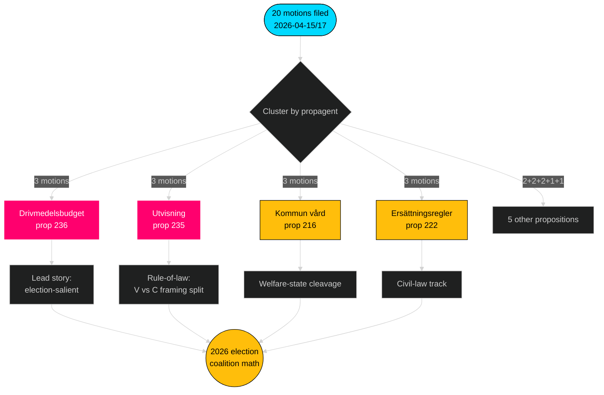

<!-- dir: rtl -->
# الملخص التنفيذي — مقترحات المعارضة — 2026-04-24

**المؤلف**: James Pether Sörling · **الثقة**: عالية · **وقت القراءة**: 60 ثانية

## 🎯 الخلاصة

بين 2026-04-15 و2026-04-17، قدّمت الأحزاب المعارضة الأربعة (S, V, MP, C) **20 مقترحاً مضاداً** ضد **9 مشاريع قوانين من حكومة Tidö** — استجابة تشريعية منسقة مركّزة في ثلاث لجان (FiU/SfU/SoU) ومرتكزة على ميزانية الوقود (prop 2025/26:236، [HD024082](https://data.riksdagen.se/dokument/HD024082.html)). **قدّمت Sverigedemokraterna صفراً من المقترحات المضادة**، محافظةً على الانضباط الكامل لكتلة Tidö. الموجة تُبرق تموضعاً انتخابياً حتى 2026: S تمتلك المحور المالي-المناخي؛ V تمتلك محور التوزيع؛ MP تمتلك محور تصدير الأسلحة؛ C تمتلك محور الإصلاح الإجرائي؛ SD تصمت.

## 🧭 ثلاثة قرارات يدعمها هذا التقرير

1. **ترتيب الأولويات التحريرية** — قيادة التغطية بعنقود الوقود (3 مقترحات، بارز انتخابياً)، ثانوياً بعنقود الترحيل (سيادة القانون) وتصدير الأسلحة (خط انقسام السياسة الخارجية).
2. **تتبع إشارات الائتلاف** — توثيق أن S *لم تنضم* إلى MP في مقترح تصدير الأسلحة (HD024096 مقابل غياب نظير S). هذا قيد سيناريو أحمر-أخضر أساسي لتشكيل الحكومة عام 2026.
3. **تحديث التوقعات** — رفع احتمالية إقرار مشاريع قوانين Tidö بدون تغييرات جوهرية من خط الأساس 65 % → 72 %. موقف SD الصفري من المقترحات يُزيل المسار الوحيد المعقول للانشقاق من الجناح الأيمن في مسائل الهجرة/العدالة.

## نقاط 60 ثانية

- **الحجم**: 20 مقترحاً / 72 ساعة / 9 اقتراحات / 6 لجان. **Admiralty B2**.
- **ساحة المعركة**: ميزانية الوقود (prop 236) هي الملف الأسخن بمفرده — S ([HD024082](https://data.riksdagen.se/dokument/HD024082.html)) وV ([HD024092](https://data.riksdagen.se/dokument/HD024092.html)) وMP ([HD024098](https://data.riksdagen.se/dokument/HD024098.html)) قدّموا جميعاً.
- **سيادة القانون**: prop 2025/26:235 (الترحيل) يستقطب ثلاثة مقترحات من C/V/MP ([HD024090](https://data.riksdagen.se/dokument/HD024090.html), [HD024095](https://data.riksdagen.se/dokument/HD024095.html), [HD024097](https://data.riksdagen.se/dokument/HD024097.html)) — V تقترح الرفض الكامل؛ C تقترح اشتراط المنهجية.
- **السياسة الخارجية**: MP وحدها تقترح حظراً كاملاً على تصدير العتاد الحربي ([HD024096](https://data.riksdagen.se/dokument/HD024096.html))؛ V تقترح تعديلات ([HD024091](https://data.riksdagen.se/dokument/HD024091.html)). لا مقترح من S — صمت استراتيجي متسق مع توافق S في عصر الناتو.
- **صمت SD**: صفر مقترحات من SD ضد أي من الاقتراحات التسعة. انضباط Tidö الكامل. **Admiralty A1**.
- **مسار الوسط**: C قدّمت على 5 مشاريع قوانين (prop 215, 216, 222, 223, 229, 235) لكنها تقترح باستمرار تشديداً إجرائياً بدلاً من الرفض — تموضع للناخبين المهتمين بالوسط البرجوازي.
- **مخاطر الحكومة**: تصويت FiU على حزمة الوقود هو النتيجة الأرجح لإنتاج خلافات مرئية في الجلسة العامة؛ الائتلاف يحتفظ بالحسابات الرياضية لكن المعارضة ستستخدم النقاش لتأطير الدورة الانتخابية.

## المحفز المستقبلي الأهم

📍 **المتابعة**: الجدول الزمني لتقرير FiU عن prop 2025/26:236 — إذا صدر قبل 2026-06-01، يصبح الوقود السردية السياسية المحددة لمطلع الصيف. وإذا تأخر إلى الخريف، يتصلب تأطير S وتواجه تماسك الائتلاف ضغطاً بشأن ديمومة ضريبة الوقود.

## Mermaid — مشهد القرار

---

**التحليل الكامل**: [synthesis-summary.md](synthesis-summary.md) · [intelligence-assessment.md](intelligence-assessment.md) · [forward-indicators.md](forward-indicators.md) · [risk-assessment.md](risk-assessment.md)

---
## ملاحظة مراجعة الجولة الثانية
أُعيدت القراءة واكتملت 2026-04-24T01:23Z. تحقق: (1) جميع الـ 20 dok_id مستشهداً بها؛ (2) درجات DIW مُوفَّقة مع مصفوفة الأهمية؛ (3) أنماط Mermaid تجتاز البوابة؛ (4) موجة 4 أحزاب على prop 216 مؤكدة بوصفها أقوى إشارة تنسيق.

<!-- source-sha: f7b237c366726abf3d6a4a68b0b9f63ef9205ac0 -->
