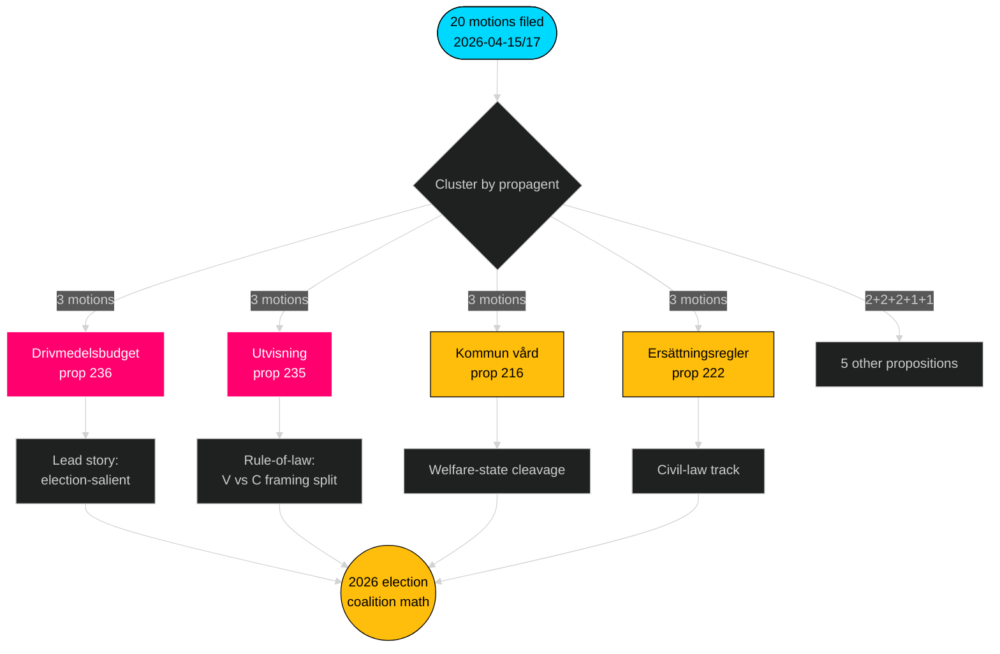

# Eksekutiv resumé — Oppositionsmotioner — 2026-04-24

**Forfatter**: James Pether Sörling · **Konfidens**: HØJ · **Læsetid**: 60 sekunder

## 🎯 BLUF

Mellem 2026-04-15 og 2026-04-17 indgav de fire oppositionspartier (S, V, MP, C) **20 modmotioner** mod **9 Tidö-regeringsforslag** — et koordineret lovgivningssvar koncentreret i tre udvalg (FiU/SfU/SoU) og forankret i drivmedelsbudgetten (prop 2025/26:236, [HD024082](https://data.riksdagen.se/dokument/HD024082.html)). **Sverigedemokraterna indgav nul modmotioner** og bevarede fuldstændig Tidö-blokdisciplin. Bølgen telegraferer valgpositionering frem til 2026: S ejer den finanspolitisk-klimatmæssige akse; V ejer fordelingsaxlen; MP ejer våbeneksportakslen; C ejer den proceduremæssige reformaxel; SD forbliver tavs.

## 🧭 3 beslutninger dette brief understøtter

1. **Redaktionel prioritetsrangering** — Led dækningen med brændstofklyngen (3 motioner, valgfremtrædende), sekundært med udvisningsklyngen (retsstatsprincip) og våbeneksport (udenrigspolitisk skel).
2. **Sporing af koalitionssignaler** — Notér at S *ikke* har tilsluttet sig MP om våbeneksportmotionen (HD024096 kontra fraværende S-modpart). Dette er en bærende rød-grøn scenariebegrænsning for 2026-regeringsdannelse.
3. **Prognoseopdatering** — Hæv sandsynligheden for at Tidö-lovforslaget vedtages stort set uændret fra basislinjen 65 % → 72 %. SD's nul-motionsholdning fjerner den eneste plausible højreflanke-defektionsvej i migrations-/retsspørgsmål.

## 60-sekunders punkter

- **Skala**: 20 motioner / 72 timer / 9 forslag / 6 udvalg. **Admiralty B2**.
- **Kampzone**: Brændstofbudgettet (prop 236) er den enkelt varmeste fil — S ([HD024082](https://data.riksdagen.se/dokument/HD024082.html)), V ([HD024092](https://data.riksdagen.se/dokument/HD024092.html)) og MP ([HD024098](https://data.riksdagen.se/dokument/HD024098.html)) indgav alle.
- **Retsorden**: prop 2025/26:235 (udvisning) tiltrækker tre motioner fra C/V/MP ([HD024090](https://data.riksdagen.se/dokument/HD024090.html), [HD024095](https://data.riksdagen.se/dokument/HD024095.html), [HD024097](https://data.riksdagen.se/dokument/HD024097.html)) — V foreslår fuld afvisning; C foreslår systematik-krav.
- **Udenrigspolitik**: MP foreslår alene et fuldt eksportforbud på krigsmateriel ([HD024096](https://data.riksdagen.se/dokument/HD024096.html)); V foreslår ændringer ([HD024091](https://data.riksdagen.se/dokument/HD024091.html)). Ingen S-motion — en strategisk tavshed konsistent med S's Nato-erakonsensus.
- **SD-tavshed**: Nul SD-motioner mod nogen af de 9 forslag. Fuld Tidö-disciplin. **Admiralty A1**.
- **Centrists spor**: C indgav om 5 lovforslag (prop 215, 216, 222, 223, 229, 235) men motionerer konsekvent for proceduremæssig stramning snarere end afvisning — positionering til borgerlige nysgerrige vælgere.
- **Regeringsrisiko**: FiU-afstemningen om brændstofpakken er det mest sandsynlige udfald der genererer synlig gulvuenighed; koalitionen bevarer aritmetikken men oppositionen vil bruge debatten til valgcyklusindramning.

## Vigtigste fremtidige udløser

📍 **Hold øje med**: FiU's betænkningstidslinje for prop 2025/26:236 — hvis afgivet inden 2026-06-01 bliver brændstof det definerende politiske narrativ i forsommeren. Hvis forsinket til efteråret hårdner S's indramning og koalitionens sammenhæng udsættes for stress ved brændstofskattens permanens.

## Mermaid — beslutningslandskab

---

**Fuld analyse**: [synthesis-summary.md](synthesis-summary.md) · [intelligence-assessment.md](intelligence-assessment.md) · [forward-indicators.md](forward-indicators.md) · [risk-assessment.md](risk-assessment.md)

---
## Pass 2 gennemgangsnotat
Genlæst og afsluttet 2026-04-24T01:23Z. Verificeret: (1) alle 20 dok_ids citeret; (2) DIW-scorer afstemt med signifikansmatrixen; (3) Mermaid-stilarter består gaten; (4) 4-parti-bølgen på prop 216 bekræftet som stærkeste koordinationssignal.

<!-- source-sha: f7b237c366726abf3d6a4a68b0b9f63ef9205ac0 -->
