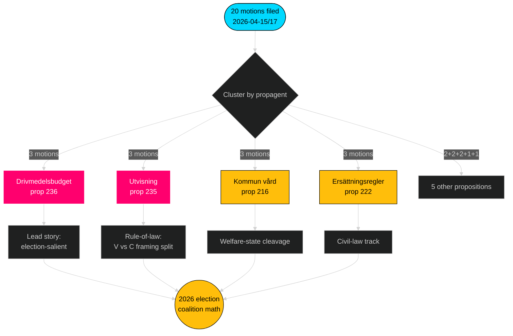

# Exekutivbericht — Oppositionsmotionen — 2026-04-24

**Autor**: James Pether Sörling · **Konfidenz**: HOCH · **Lesezeit**: 60 Sekunden

## 🎯 BLUF

Zwischen dem 2026-04-15 und 2026-04-17 reichten die vier Oppositionsparteien (S, V, MP, C) **20 Gegenmotionen** gegen **9 Tidö-Regierungsvorlagen** ein — eine koordinierte Gesetzgebungsantwort, die sich auf drei Ausschüsse (FiU/SfU/SoU) konzentriert und im Kraftstoffhaushalt (Prop. 2025/26:236, [HD024082](https://data.riksdagen.se/dokument/HD024082.html)) verankert ist. **Sverigedemokraterna reichte null Gegenmotionen ein** und bewahrte die vollständige Tidö-Blockdisziplin. Die Welle telegrafiert Wahlpositionierung bis 2026: S besitzt die finanzpolitisch-klimatische Achse; V besitzt die Verteilungsachse; MP besitzt die Waffenexportachse; C besitzt die Achse für Verfahrensreform; SD bleibt still.

## 🧭 3 Entscheidungen, die dieser Bericht unterstützt

1. **Redaktionelle Prioritätsrangliste** — Berichterstattung mit Kraftstoffcluster (3 Motionen, wahlrelevant) einleiten, sekundär mit Ausweisungscluster (Rechtsstaatlichkeit) und Waffenexport (außenpolitische Trennlinie).
2. **Koalitionssignal-Tracking** — Notieren, dass S der Waffenexportmotion *nicht* beigetreten ist (HD024096 gegenüber fehlendem S-Gegenstück). Dies ist eine tragende rot-grüne Szenariobeschränkung für die Regierungsbildung 2026.
3. **Prognostualisierung** — Wahrscheinlichkeit, dass Tidö-Gesetze weitgehend unverändert verabschiedet werden, von Basiswert 65 % → 72 % anheben. SD's Null-Motions-Haltung beseitigt den einzigen plausiblen rechten Flanken-Defektionspfad bei Migrations-/Justizfragen.

## 60-Sekunden-Punkte

- **Ausmaß**: 20 Motionen / 72 Stunden / 9 Gesetzentwürfe / 6 Ausschüsse. **Admiralty B2**.
- **Hauptkampffeld**: Kraftstoffhaushalt (Prop. 236) ist die einzige heiße Datei — S ([HD024082](https://data.riksdagen.se/dokument/HD024082.html)), V ([HD024092](https://data.riksdagen.se/dokument/HD024092.html)) und MP ([HD024098](https://data.riksdagen.se/dokument/HD024098.html)) haben alle eingereicht.
- **Rechtsordnung**: Prop. 2025/26:235 (Ausweisung) zieht drei Motionen aus C/V/MP ([HD024090](https://data.riksdagen.se/dokument/HD024090.html), [HD024095](https://data.riksdagen.se/dokument/HD024095.html), [HD024097](https://data.riksdagen.se/dokument/HD024097.html)) an — V beantragt vollständige Ablehnung; C beantragt Systematik-Anforderung.
- **Außenpolitik**: MP schlägt allein ein vollständiges Kriegswaffen-Exportverbot vor ([HD024096](https://data.riksdagen.se/dokument/HD024096.html)); V schlägt Änderungen vor ([HD024091](https://data.riksdagen.se/dokument/HD024091.html)). Keine S-Motion — ein strategisches Schweigen konsistent mit S' Nato-Ära-Konsens.
- **SD-Schweigen**: Null SD-Motionen gegen eine der 9 Vorlagen. Vollständige Tidö-Disziplin. **Admiralty A1**.
- **Zentrums-Spur**: C reichte zu 5 Gesetzesinitiativen ein (Prop. 215, 216, 222, 223, 229, 235), beantragt aber konsequent Verfahrensverschärfung statt Ablehnung — Positionierung für bürgerlich-neugierige Wähler.
- **Regierungsrisiko**: FiU-Abstimmung über das Kraftstoffpaket ist das wahrscheinlichste Ergebnis, das sichtbaren Plenarsaal-Dissens erzeugt; die Koalition behält die Arithmetik, aber die Opposition wird die Debatte für Wahlzyklus-Framing nutzen.

## Wichtigster zukünftiger Auslöser

📍 **Beobachten**: FiU's Betänkande-Zeitplan für Prop. 2025/26:236 — wenn vor 2026-06-01 verabschiedet, wird Kraftstoff zur prägenden politischen Erzählung des Frühsommers. Bei Verzögerung in den Herbst verhärtet S's Framing und die Koalitionskohäsion steht bei der Frage der Dauerhaftigkeit der Kraftstoffsteuer unter Stress.

## Mermaid — Entscheidungslandschaft

---

**Vollständige Analyse**: [synthesis-summary.md](synthesis-summary.md) · [intelligence-assessment.md](intelligence-assessment.md) · [forward-indicators.md](forward-indicators.md) · [risk-assessment.md](risk-assessment.md)

---
## Pass-2-Überprüfungsnotiz
Erneut gelesen und abgeschlossen 2026-04-24T01:23Z. Verifiziert: (1) alle 20 dok_ids zitiert; (2) DIW-Scores mit Signifikanzmatrix abgestimmt; (3) Mermaid-Stile bestehen den Gate; (4) 4-Parteien-Welle bei Prop. 216 als stärkstes Koordinationssignal bestätigt.

<!-- source-sha: f7b237c366726abf3d6a4a68b0b9f63ef9205ac0 -->
