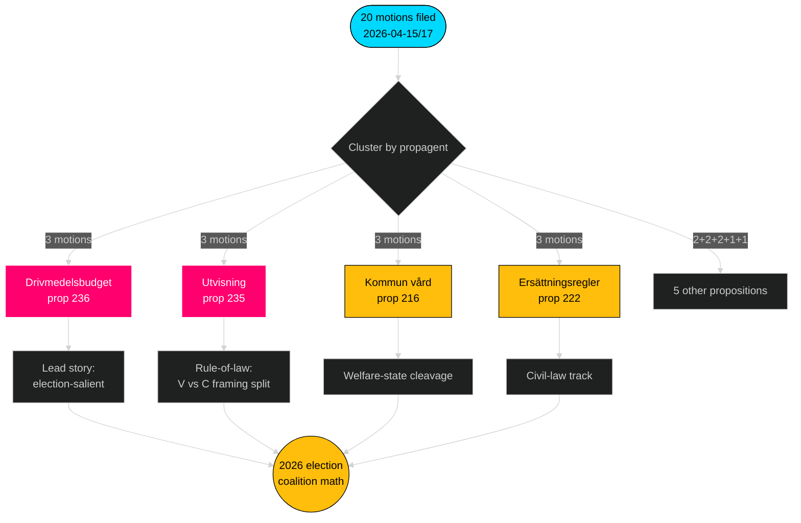

# Resumen ejecutivo — Mociones de oposición — 2026-04-24

**Autor**: James Pether Sörling · **Confianza**: ALTA · **Tiempo de lectura**: 60 segundos

## 🎯 BLUF

Entre el 2026-04-15 y el 2026-04-17, los cuatro partidos de la oposición (S, V, MP, C) presentaron **20 contramociones** contra **9 proposiciones del gobierno Tidö** — una respuesta legislativa coordinada concentrada en tres comisiones (FiU/SfU/SoU) y anclada en el presupuesto de combustibles (prop 2025/26:236, [HD024082](https://data.riksdagen.se/dokument/HD024082.html)). **Sverigedemokraterna no presentó ninguna contramoción**, preservando la plena disciplina del bloque Tidö. La oleada telegrafía el posicionamiento electoral hasta 2026: S posee el eje fiscal-climático; V posee el eje distributivo; MP posee el eje de exportación de armas; C posee el eje de reforma procedimental; SD guarda silencio.

## 🧭 3 decisiones que apoya este informe

1. **Clasificación de prioridades editoriales** — Encabezar la cobertura con el clúster de combustibles (3 mociones, relevante electoralmente), secundariamente con el clúster de expulsión (estado de derecho) y exportación de armas (fractura de política exterior).
2. **Seguimiento de señales de coalición** — Registrar que S *no* se ha unido a MP en la moción de exportación de armas (HD024096 frente a la ausencia de contrapartida de S). Esta es una restricción de escenario rojo-verde fundamental para la formación del gobierno 2026.
3. **Actualización de pronóstico** — Aumentar la probabilidad de que los proyectos de ley Tidö sean aprobados prácticamente sin cambios desde la línea base 65 % → 72 %. La postura de cero mociones de SD elimina el único camino de defección del flanco derecho plausible en cuestiones de migración/justicia.

## Puntos en 60 segundos

- **Escala**: 20 mociones / 72 horas / 9 proposiciones / 6 comisiones. **Admiralty B2**.
- **Campo de batalla**: El presupuesto de combustibles (prop 236) es el archivo más caliente — S ([HD024082](https://data.riksdagen.se/dokument/HD024082.html)), V ([HD024092](https://data.riksdagen.se/dokument/HD024092.html)) y MP ([HD024098](https://data.riksdagen.se/dokument/HD024098.html)) presentaron todos.
- **Estado de derecho**: prop 2025/26:235 (expulsión) atrae tres mociones de C/V/MP ([HD024090](https://data.riksdagen.se/dokument/HD024090.html), [HD024095](https://data.riksdagen.se/dokument/HD024095.html), [HD024097](https://data.riksdagen.se/dokument/HD024097.html)) — V propone rechazo total; C propone requisito de sistematismo.
- **Política exterior**: MP propone solo una prohibición total de exportación de material de guerra ([HD024096](https://data.riksdagen.se/dokument/HD024096.html)); V propone enmiendas ([HD024091](https://data.riksdagen.se/dokument/HD024091.html)). Sin moción de S — un silencio estratégico coherente con el consenso de S en la era de la OTAN.
- **Silencio de SD**: Cero mociones de SD contra ninguna de las 9 proposiciones. Plena disciplina Tidö. **Admiralty A1**.
- **Trayectoria del Centro**: C presentó sobre 5 proyectos (prop 215, 216, 222, 223, 229, 235) pero propone sistemáticamente restricción procedimental en lugar de rechazo — posicionamiento para votantes burgueses curiosos.
- **Riesgo gubernamental**: La votación del FiU sobre el paquete de combustibles es el resultado más probable de generar disenso visible en el hemiciclo; la coalición mantiene la aritmética pero la oposición usará el debate para el encuadre del ciclo electoral.

## Principal desencadenante futuro

📍 **Vigilar**: El calendario del betänkande del FiU para prop 2025/26:236 — si se publica antes del 2026-06-01, el combustible se convierte en la narrativa política definitoria del inicio del verano. Si se retrasa al otoño, el encuadre de S se endurece y la cohesión de la coalición enfrenta tensión sobre la permanencia del impuesto al combustible.

## Mermaid — Panorama de decisiones

---

**Análisis completo**: [synthesis-summary.md](synthesis-summary.md) · [intelligence-assessment.md](intelligence-assessment.md) · [forward-indicators.md](forward-indicators.md) · [risk-assessment.md](risk-assessment.md)

---
## Nota de revisión Pass 2
Vuelto a leer y completado 2026-04-24T01:23Z. Verificado: (1) los 20 dok_ids citados; (2) puntuaciones DIW reconciliadas con la matriz de significancia; (3) los estilos Mermaid superan la puerta; (4) la ola de 4 partidos en prop 216 confirmada como la señal de coordinación más fuerte.

<!-- source-sha: f7b237c366726abf3d6a4a68b0b9f63ef9205ac0 -->
