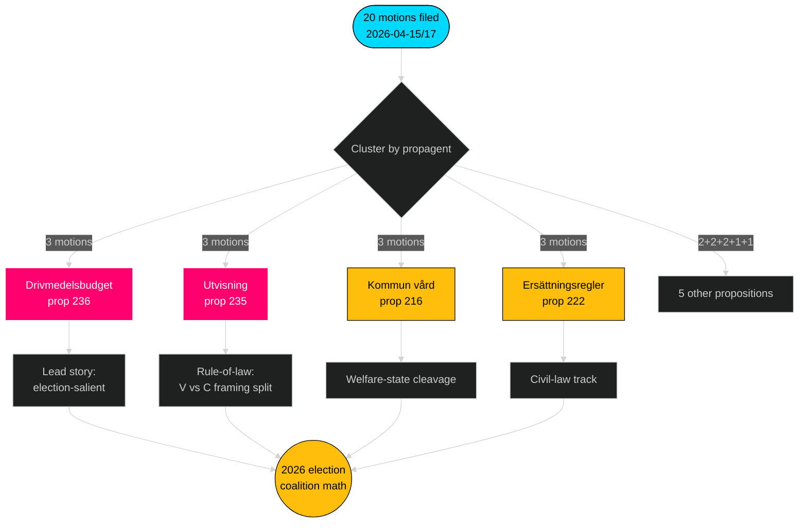

# Toimeenpaneva tiivistelmä — Oppositiomietinnöt — 2026-04-24

**Tekijä**: James Pether Sörling · **Luottamus**: KORKEA · **Lukuaika**: 60 sekuntia

## 🎯 Ydintiivistelmä

Välillä 2026-04-15–2026-04-17 neljä oppositiopuoluetta (S, V, MP, C) jätti **20 vastamietintöä** **9 Tidö-hallituksen esitystä** vastaan — koordinoitu lainsäädäntövastaus, joka on keskittynyt kolmeen valiokuntaan (FiU/SfU/SoU) ja ankkuroitunut polttoainebudjettiin (prop 2025/26:236, [HD024082](https://data.riksdagen.se/dokument/HD024082.html)). **Sverigedemokraterna ei jättänyt yhtään vastamietintöä** ja säilytti täydellisen Tidö-blokkikurin. Aalto ennakoi vuoden 2026 vaaliasemointia: S omistaa finanssi-ilmastoakselin; V omistaa jakautumisakselin; MP omistaa asevienninakselin; C omistaa prosessuaalisen uudistuksen akselin; SD pysyy hiljaa.

## 🧭 Kolme päätöstä, joita tämä tiivistelmä tukee

1. **Toimituksellinen prioriteettijärjestys** — Johda kattavuus polttoaineklusterilla (3 mietintöä, vaalikorostettu), toissijaisesti karkotusklusterilla (oikeusvaltio) ja aseviennillä (ulkopoliittinen jakolinja).
2. **Koalitiosignaalien seuranta** — Kirjaa ylös, että S *ei* ole liittynyt MP:hen asevientimietinnössä (HD024096 versus poissa oleva S-vastinpari). Tämä on keskeinen punavihreä skenaariopakote vuoden 2026 hallitusmuodostukselle.
3. **Ennustepäivitys** — Nosta todennäköisyyttä, että Tidö-lakiesitykset hyväksytään olennaisesti muuttumattomina lähtötasosta 65 % → 72 %. SD:n nolla-mietintöasenne poistaa ainoan uskottavan oikean laidan irtiottoreitin maahanmuutto-/oikeusasioissa.

## 60 sekunnin pisteet

- **Laajuus**: 20 mietintöä / 72 tuntia / 9 esitystä / 6 valiokuntaa. **Admiralty B2**.
- **Taistelukenttä**: Polttoainebudjetti (prop 236) on yksittäinen kuumin tiedosto — S ([HD024082](https://data.riksdagen.se/dokument/HD024082.html)), V ([HD024092](https://data.riksdagen.se/dokument/HD024092.html)) ja MP ([HD024098](https://data.riksdagen.se/dokument/HD024098.html)) jättivät kaikki.
- **Oikeusvaltion tila**: prop 2025/26:235 (karkotus) houkuttelee kolme mietintöä C/V/MP:ltä ([HD024090](https://data.riksdagen.se/dokument/HD024090.html), [HD024095](https://data.riksdagen.se/dokument/HD024095.html), [HD024097](https://data.riksdagen.se/dokument/HD024097.html)) — V ehdottaa täyttä hylkäämistä; C ehdottaa järjestelmällistä vaatimusta.
- **Ulkopolitiikka**: MP ehdottaa yksin täyttä sotatarvikkeiden vientikieltoa ([HD024096](https://data.riksdagen.se/dokument/HD024096.html)); V ehdottaa muutoksia ([HD024091](https://data.riksdagen.se/dokument/HD024091.html)). Ei S-mietintöä — strateginen hiljaisuus, joka on johdonmukainen S:n Nato-aikakauden konsensuksen kanssa.
- **SD:n hiljaisuus**: Nolla SD-mietintöä yhtäkään 9 esityksestä vastaan. Täydellinen Tidö-kuri. **Admiralty A1**.
- **Keskustan linja**: C jätti 5 lakiesitykseen (prop 215, 216, 222, 223, 229, 235), mutta mietii johdonmukaisesti prosessuaalista tiukentamista hylkäämisen sijaan — asemoituu porvarillisesti uteliaille äänestäjille.
- **Hallitusriski**: FiU:n äänestys polttoainepaketista on todennäköisin tulos, joka tuottaa näkyvää erimielisyyttä; koalitio säilyttää aritmetiikan, mutta oppositio käyttää keskustelua vaalikiertoraamitukseen.

## Tärkein tulevaisuuden laukaisin

📍 **Seuraa**: FiU:n mietintöaikataulu prop 2025/26:236 — jos se julkaistaan ennen 2026-06-01, polttoaineesta tulee kesän määrittävä poliittinen narratiivi. Jos se viivästyy syksyyn, S:n kehystys kovettuu ja koalition koheesio kohtaa stressiä polttoaineveron pysyvyyden suhteen.

## Mermaid — päätösmaasto

---

**Täydellinen analyysi**: [synthesis-summary.md](synthesis-summary.md) · [intelligence-assessment.md](intelligence-assessment.md) · [forward-indicators.md](forward-indicators.md) · [risk-assessment.md](risk-assessment.md)

---
## Pass 2 -tarkastushuomio
Luettu uudelleen ja valmistunut 2026-04-24T01:23Z. Todennettu: (1) kaikki 20 dok_ids-viitteet; (2) DIW-pisteet sovitettu merkittävyysmatriisiin; (3) Mermaid-tyylit läpäisevät portin; (4) 4 puolueen aalto prop 216 -kohdassa vahvistettu vahvimpana koordinaatiosignaalina.

<!-- source-sha: f7b237c366726abf3d6a4a68b0b9f63ef9205ac0 -->
