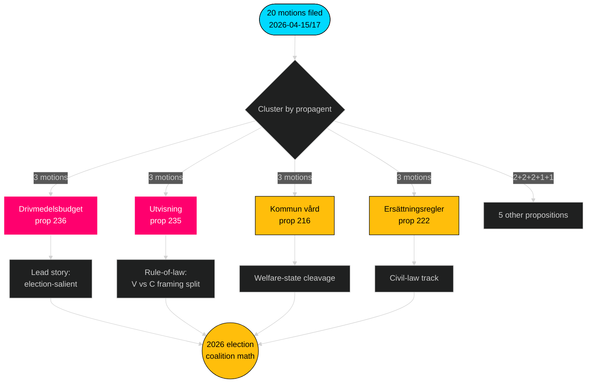

# Note de synthèse — Motions d'opposition — 2026-04-24

**Auteur** : James Pether Sörling · **Confiance** : ÉLEVÉE · **Durée de lecture** : 60 secondes

## 🎯 BLUF

Entre le 2026-04-15 et le 2026-04-17, les quatre partis d'opposition (S, V, MP, C) ont déposé **20 contre-motions** contre **9 propositions du gouvernement Tidö** — une réponse législative coordonnée concentrée dans trois commissions (FiU/SfU/SoU) et ancrée dans le budget des carburants (prop 2025/26:236, [HD024082](https://data.riksdagen.se/dokument/HD024082.html)). **Sverigedemokraterna n'a déposé aucune contre-motion**, préservant la pleine discipline du bloc Tidö. La vague télégraphie le positionnement électoral jusqu'en 2026 : S possède l'axe fiscal-climatique ; V possède l'axe distributif ; MP possède l'axe export d'armes ; C possède l'axe réforme procédurale ; SD reste silencieux.

## 🧭 3 décisions que ce rapport soutient

1. **Classement des priorités éditoriales** — Ouvrir la couverture avec le cluster carburant (3 motions, saillance électorale), secondairement avec le cluster expulsion (état de droit) et l'exportation d'armes (clivage de politique étrangère).
2. **Suivi des signaux de coalition** — Notez que S *n'a pas* rejoint MP sur la motion d'exportation d'armes (HD024096 contre l'absence de contrepartie S). C'est une contrainte de scénario rouge-vert portante pour la formation du gouvernement 2026.
3. **Mise à jour des prévisions** — Augmenter la probabilité d'adoption des projets de loi Tidö largement inchangés par rapport à la base 65 % → 72 %. La posture zéro-motion de SD supprime le seul chemin de défection d'aile droite plausible sur les questions de migration/justice.

## Points en 60 secondes

- **Échelle** : 20 motions / 72 heures / 9 propositions / 6 commissions. **Admiralty B2**.
- **Champ de bataille** : le budget carburant (prop 236) est le dossier le plus chaud — S ([HD024082](https://data.riksdagen.se/dokument/HD024082.html)), V ([HD024092](https://data.riksdagen.se/dokument/HD024092.html)) et MP ([HD024098](https://data.riksdagen.se/dokument/HD024098.html)) ont tous déposé.
- **État de droit** : prop 2025/26:235 (expulsion) attire trois motions de C/V/MP ([HD024090](https://data.riksdagen.se/dokument/HD024090.html), [HD024095](https://data.riksdagen.se/dokument/HD024095.html), [HD024097](https://data.riksdagen.se/dokument/HD024097.html)) — V propose le rejet intégral ; C propose l'exigence de systématique.
- **Politique étrangère** : MP propose seul une interdiction totale des exportations de matériel de guerre ([HD024096](https://data.riksdagen.se/dokument/HD024096.html)) ; V propose des amendements ([HD024091](https://data.riksdagen.se/dokument/HD024091.html)). Pas de motion S — un silence stratégique cohérent avec le consensus de S à l'ère de l'OTAN.
- **Silence de SD** : Zéro motion de SD contre l'une des 9 propositions. Pleine discipline Tidö. **Admiralty A1**.
- **Piste du Centre** : C a déposé sur 5 projets de loi (prop 215, 216, 222, 223, 229, 235) mais propose systématiquement un durcissement procédural plutôt qu'un rejet — positionnement pour les électeurs bourgeois curieux.
- **Risque gouvernemental** : Le vote FiU sur le paquet carburant est le résultat le plus probable générant une dissension visible dans la salle ; la coalition conserve l'arithmétique mais l'opposition utilisera le débat pour le cadrage du cycle électoral.

## Principal déclencheur futur

📍 **À surveiller** : Le calendrier du betänkande de FiU pour prop 2025/26:236 — si publié avant 2026-06-01, le carburant devient le récit politique définissant le début de l'été. S'il est retardé jusqu'à l'automne, le cadrage de S se durcit et la cohésion de la coalition est soumise au stress de la permanence de la taxe sur les carburants.

## Mermaid — Paysage décisionnel

---

**Analyse complète** : [synthesis-summary.md](synthesis-summary.md) · [intelligence-assessment.md](intelligence-assessment.md) · [forward-indicators.md](forward-indicators.md) · [risk-assessment.md](risk-assessment.md)

---
## Note de révision Pass 2
Relu et terminé 2026-04-24T01:23Z. Vérifié : (1) les 20 dok_ids cités ; (2) scores DIW réconciliés avec la matrice de signification ; (3) les styles Mermaid passent la porte ; (4) la vague à 4 partis sur prop 216 confirmée comme signal de coordination le plus fort.

<!-- source-sha: f7b237c366726abf3d6a4a68b0b9f63ef9205ac0 -->
