<!-- dir: rtl -->
# סיכום מנהלים — מוצעי האופוזיציה — 2026-04-24

**מחבר**: James Pether Sörling · **רמת ביטחון**: גבוהה · **זמן קריאה**: 60 שניות

## 🎯 תמצית

בין 2026-04-15 ל-2026-04-17, ארבעת מפלגות האופוזיציה (S, V, MP, C) הגישו **20 הצעות נגד** כנגד **9 הצעות חוק ממשלת Tidö** — תגובה חקיקתית מתואמת מרוכזת בשלוש ועדות (FiU/SfU/SoU) ומעוגנת בתקציב הדלק (prop 2025/26:236, [HD024082](https://data.riksdagen.se/dokument/HD024082.html)). **Sverigedemokraterna הגישה אפס הצעות נגד** ושמרה על משמעת בלוק Tidö מלאה. הגל מסמן מיצוב בחירות לקראת 2026: S מחזיקה בציר הפיסקלי-אקלימי; V מחזיקה בציר החלוקתי; MP מחזיקה בציר ייצוא הנשק; C מחזיקה בציר רפורמת הנהלים; SD שותקת.

## 🧭 3 החלטות שדוח זה תומך בהן

1. **דירוג עדיפויות עריכתיות** — להוביל כיסוי עם אשכול הדלק (3 הצעות, בולט בחירותית), משנית עם אשכול גירוש (שלטון החוק) וייצוא נשק (קו שבר של מדיניות חוץ).
2. **מעקב אחר אותות קואליציה** — לתעד ש-S *לא* הצטרפה ל-MP בהצעת ייצוא הנשק (HD024096 מול היעדר מקביל מ-S). זהו אילוץ תרחיש אדום-ירוק קריטי להרכבת הממשלה 2026.
3. **עדכון תחזית** — להעלות את ההסתברות שמשאלות Tidö יאושרו ללא שינויים משמעותיים מבסיס 65 % → 72 %. עמדת אפס-הצעות של SD מסירה את המסלול היחיד האפשרי לעריקה מהאגף הימני בסוגיות הגירה/משפט.

## נקודות 60 שניות

- **היקף**: 20 הצעות / 72 שעות / 9 מצעים / 6 ועדות. **Admiralty B2**.
- **שדה הקרב**: תקציב הדלק (prop 236) הוא הקובץ החם ביותר — S ([HD024082](https://data.riksdagen.se/dokument/HD024082.html)), V ([HD024092](https://data.riksdagen.se/dokument/HD024092.html)) ו-MP ([HD024098](https://data.riksdagen.se/dokument/HD024098.html)) הגישו כולם.
- **שלטון החוק**: prop 2025/26:235 (גירוש) מושך שלוש הצעות מ-C/V/MP ([HD024090](https://data.riksdagen.se/dokument/HD024090.html), [HD024095](https://data.riksdagen.se/dokument/HD024095.html), [HD024097](https://data.riksdagen.se/dokument/HD024097.html)) — V מציעה דחייה מלאה; C מציעה דרישת שיטתיות.
- **מדיניות חוץ**: MP לבדה מציעה איסור ייצוא מלא על חומרי מלחמה ([HD024096](https://data.riksdagen.se/dokument/HD024096.html)); V מציעה תיקונים ([HD024091](https://data.riksdagen.se/dokument/HD024091.html)). אין הצעה מ-S — שתיקה אסטרטגית עקבית עם קונצנזוס S בעידן הנאטו.
- **שתיקת SD**: אפס הצעות מ-SD כנגד אף אחד מ-9 המצעים. משמעת Tidö מלאה. **Admiralty A1**.
- **מסלול המרכז**: C הגישה ב-5 הצעות חוק (prop 215, 216, 222, 223, 229, 235) אך מציעה בעקביות הידוק פרוצדורלי ולא דחייה — מיצוב לבוחרים הסקרנים בעלי הנטייה הבורגנית.
- **סיכון ממשלתי**: הצבעת FiU על חבילת הדלק היא התוצאה הסבירה ביותר ליצור מחלוקת גלויה במליאה; הקואליציה שומרת על החשבון הרוב אך האופוזיציה תשתמש בוויכוח למסגור מחזור הבחירות.

## הטריגר המוביל לעתיד

📍 **מעקב**: לוח הזמנים של betänkande של FiU עבור prop 2025/26:236 — אם יפורסם לפני 2026-06-01, הדלק הופך לסיפור הפוליטי המגדיר של ראשית הקיץ. אם יתעכב לסתיו, המסגור של S מתקשה והלכידות הקואליציונית עומדת בפני לחץ בנוגע לקביעות מס הדלק.

## Mermaid — נוף ההחלטות

```mermaid
%%{init: {'theme':'dark'}}%%
flowchart TB
    Start([20 motions filed<br/>2026-04-15/17]) --> Cluster{Cluster by propagent}
    Cluster -->|3 motions| Fiscal[Drivmedelsbudget<br/>prop 236]
    Cluster -->|3 motions| Justice[Utvisning<br/>prop 235]
    Cluster -->|3 motions| Welfare[Kommun vård<br/>prop 216]
    Cluster -->|3 motions| Civil[Ersättningsregler<br/>prop 222]
    Cluster -->|2+2+2+1+1| Rest[5 other propositions]

    Fiscal --> Decision1[Lead story:<br/>election-salient]
    Justice --> Decision2[Rule-of-law:<br/>V vs C framing split]
    Welfare --> Decision3[Welfare-state cleavage]
    Civil --> Decision4[Civil-law track]

    Decision1 --> Impact((2026 election<br/>coalition math))
    Decision2 --> Impact
    Decision3 --> Impact
    Decision4 --> Impact

    style Start fill:#00d9ff,stroke:#000,color:#000
    style Fiscal fill:#ff006e,stroke:#fff,color:#fff
    style Justice fill:#ff006e,stroke:#fff,color:#fff
    style Welfare fill:#ffbe0b,stroke:#000,color:#000
    style Civil fill:#ffbe0b,stroke:#000,color:#000
    style Impact fill:#ffbe0b,stroke:#000,color:#000
```

---

**ניתוח מלא**: [synthesis-summary.md](synthesis-summary.md) · [intelligence-assessment.md](intelligence-assessment.md) · [forward-indicators.md](forward-indicators.md) · [risk-assessment.md](risk-assessment.md)

---
## הערת סקירת מעבר 2
נקרא מחדש והושלם 2026-04-24T01:23Z. אומת: (1) כל 20 הdok_ids מצוינים; (2) ציוני DIW הותאמו למטריצת המשמעות; (3) סגנונות Mermaid עוברים את הסף; (4) גל 4 המפלגות ב-prop 216 אושר כאות תיאום החזק ביותר.

<!-- source-sha: f7b237c366726abf3d6a4a68b0b9f63ef9205ac0 -->
