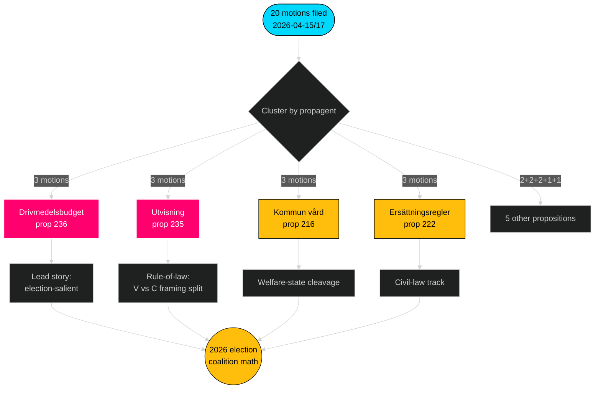

# エグゼクティブブリーフ — 野党動議 — 2026-04-24

**著者**: James Pether Sörling · **信頼度**: 高 · **読了時間**: 60秒

## 🎯 要点

2026年4月15日から17日の間に、4つの野党(S, V, MP, C)が**9つのTidö政府法案**に対して**20件の対抗動議**を提出した — FiU/SfU/SoUの3委員会に集中し、燃料予算(prop 2025/26:236、[HD024082](https://data.riksdagen.se/dokument/HD024082.html))を軸とする協調した立法対応である。**Sverigedemokraternaは対抗動議ゼロ件**で、Tidöブロックの完全な規律を維持した。この波は2026年に向けた選挙ポジショニングを示す: SはFiUの財政-気候軸を保有; Vは分配軸を保有; MPは武器輸出軸を保有; Cは手続改革軸を保有; SDは沈黙を保つ。

## 🧭 このブリーフが支援する3つの意思決定

1. **編集優先度ランキング** — 燃料クラスター(3動議、選挙的顕在性)で報道を先導し、次に追放クラスター(法の支配)と武器輸出(外交政策の亀裂)を扱う。
2. **連立シグナルの追跡** — Sが武器輸出動議でMPに加わっていないことを記録(HD024096対不在のS対応動議)。これは2026年政府形成における根幹的な赤緑シナリオ制約である。
3. **予測更新** — Tidö法案が実質的に変更なく可決される確率をベースラインの65 %→72 %に引き上げる。SDのゼロ動議姿勢は、移住/司法問題における右翼フランクからの唯一の現実的離脱経路を排除する。

## 60秒の要点

- **規模**: 20動議 / 72時間 / 9法案 / 6委員会。**Admiralty B2**。
- **主戦場**: 燃料予算(prop 236)が単独最多の注目ファイル — S ([HD024082](https://data.riksdagen.se/dokument/HD024082.html))、V ([HD024092](https://data.riksdagen.se/dokument/HD024092.html))、MP ([HD024098](https://data.riksdagen.se/dokument/HD024098.html))すべてが提出。
- **法の支配**: prop 2025/26:235(追放)がC/V/MPから3動議を引き寄せる([HD024090](https://data.riksdagen.se/dokument/HD024090.html)、[HD024095](https://data.riksdagen.se/dokument/HD024095.html)、[HD024097](https://data.riksdagen.se/dokument/HD024097.html)) — Vは完全否決を提案; Cは体系的要件を提案。
- **外交政策**: MPのみが戦争物資の完全輸出禁止を提案([HD024096](https://data.riksdagen.se/dokument/HD024096.html)); Vが修正案を提案([HD024091](https://data.riksdagen.se/dokument/HD024091.html))。S動議なし — NATOの時代のSのコンセンサスに整合する戦略的沈黙。
- **SDの沈黙**: 9法案いずれに対してもSD動議ゼロ。完全なTidö規律。**Admiralty A1**。
- **中央党の軌跡**: Cは5法案(prop 215, 216, 222, 223, 229, 235)に提出したが、否決よりも一貫して手続的引き締めを求める動議 — 保守系の好奇心ある有権者向けのポジショニング。
- **政府リスク**: 燃料パッケージに関するFiUの採決が、本会議で表立った反対を生む最も可能性の高い結果; 連立は算術上の多数を保つが、野党は討論を選挙サイクルのフレーミングに利用する。

## 最重要将来トリガー

📍 **注目**: prop 2025/26:236に関するFiUのbetänkande — 2026年6月1日前に報告されれば、燃料は初夏の定義的な政治的物語となる。秋に遅延すれば、Sのフレーミングが硬化し、燃料税の恒久化をめぐって連立の結束に圧力がかかる。

## Mermaid — 意思決定の景観

---

**完全な分析**: [synthesis-summary.md](synthesis-summary.md) · [intelligence-assessment.md](intelligence-assessment.md) · [forward-indicators.md](forward-indicators.md) · [risk-assessment.md](risk-assessment.md)

---
## 第2パスレビューノート
2026-04-24T01:23Z に再読了・完了。確認済み: (1) 20件すべてのdok_ids引用済み; (2) DIWスコアを重要度マトリックスと照合; (3) Mermaidスタイルがゲートを通過; (4) prop 216における4党の波が最強の調整シグナルとして確認。

<!-- source-sha: f7b237c366726abf3d6a4a68b0b9f63ef9205ac0 -->
