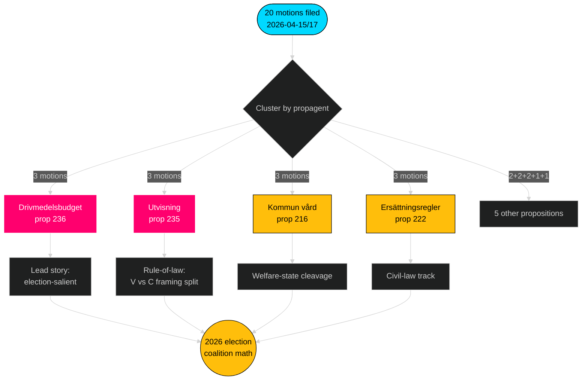

# 집행 요약 — 야당 동의 — 2026-04-24

**저자**: James Pether Sörling · **신뢰도**: 높음 · **읽기 시간**: 60초

## 🎯 핵심 요약

2026년 4월 15일부터 17일 사이에 4개 야당(S, V, MP, C)이 **9개 Tidö 정부 법안**에 대해 **20건의 대항 동의**를 제출했다 — FiU/SfU/SoU 3개 위원회에 집중되고 연료 예산(prop 2025/26:236, [HD024082](https://data.riksdagen.se/dokument/HD024082.html))에 고정된 조율된 입법 대응이다. **Sverigedemokraterna는 대항 동의 제로 건**으로 Tidö 블록의 완전한 규율을 유지했다. 이 물결은 2026년을 향한 선거 포지셔닝을 예고한다: S는 재정-기후 축을 보유; V는 분배 축을 보유; MP는 무기 수출 축을 보유; C는 절차 개혁 축을 보유; SD는 침묵을 유지한다.

## 🧭 이 브리핑이 지원하는 3가지 결정

1. **편집 우선순위 결정** — 연료 클러스터(3건의 동의, 선거 돌출)로 보도를 이끌고, 이차적으로 추방 클러스터(법치주의)와 무기 수출(외교 정책 단층선)을 다룬다.
2. **연립 신호 추적** — S가 무기 수출 동의에서 MP에 합류하지 않았음을 기록(HD024096 대 부재 S 대응 동의). 이는 2026년 정부 구성을 위한 근본적인 적녹 시나리오 제약이다.
3. **예측 업데이트** — Tidö 법안이 기준치 65 %에서 → 72 %로 실질적으로 변경 없이 통과될 확률을 올린다. SD의 제로 동의 자세는 이민/사법 문제에서 우파 측에서의 유일한 그럴듯한 이탈 경로를 제거한다.

## 60초 요점

- **규모**: 20건의 동의 / 72시간 / 9건의 법안 / 6개 위원회. **Admiralty B2**.
- **전장**: 연료 예산(prop 236)이 단일 가장 뜨거운 파일 — S ([HD024082](https://data.riksdagen.se/dokument/HD024082.html)), V ([HD024092](https://data.riksdagen.se/dokument/HD024092.html)), MP ([HD024098](https://data.riksdagen.se/dokument/HD024098.html)) 모두 제출.
- **법치주의**: prop 2025/26:235 (추방)이 C/V/MP에서 세 건의 동의를 끌어들인다([HD024090](https://data.riksdagen.se/dokument/HD024090.html), [HD024095](https://data.riksdagen.se/dokument/HD024095.html), [HD024097](https://data.riksdagen.se/dokument/HD024097.html)) — V는 완전 거부 제안; C는 체계적 요건 제안.
- **외교 정책**: MP만이 전쟁 물자의 완전 수출 금지를 제안([HD024096](https://data.riksdagen.se/dokument/HD024096.html)); V가 수정안 제안([HD024091](https://data.riksdagen.se/dokument/HD024091.html)). S 동의 없음 — NATO 시대 S의 합의에 일관된 전략적 침묵.
- **SD의 침묵**: 9건의 법안 중 어느 것에도 SD 동의 제로. 완전한 Tidö 규율. **Admiralty A1**.
- **중앙당 궤도**: C는 5개의 법안(prop 215, 216, 222, 223, 229, 235)에 제출했지만 거부보다 절차적 강화를 일관되게 동의 — 부르주아적 호기심 있는 유권자를 위한 포지셔닝.
- **정부 위험**: FiU의 연료 패키지 투표가 본회의에서 가시적인 이의를 만들어낼 가능성이 가장 높은 결과; 연립은 산술을 유지하지만 야당은 선거 사이클 프레이밍을 위해 토론을 사용한다.

## 최우선 미래 트리거

📍 **주목**: prop 2025/26:236에 대한 FiU의 betänkande 타임라인 — 2026년 6월 1일 이전에 보고되면 연료가 초여름의 정치적 주요 내러티브가 된다. 가을로 지연되면 S의 프레이밍이 굳어지고 연립의 응집력이 연료세의 영구화에 관해 압박을 받는다.

## Mermaid — 결정 지형

---

**전체 분석**: [synthesis-summary.md](synthesis-summary.md) · [intelligence-assessment.md](intelligence-assessment.md) · [forward-indicators.md](forward-indicators.md) · [risk-assessment.md](risk-assessment.md)

---
## 2차 통과 검토 노트
2026-04-24T01:23Z에 다시 읽고 완료됨. 확인: (1) 20개의 dok_id 모두 인용됨; (2) DIW 점수가 유의성 행렬과 조정됨; (3) Mermaid 스타일이 게이트 통과; (4) prop 216에 대한 4당 물결이 가장 강한 조율 신호로 확인됨.

<!-- source-sha: f7b237c366726abf3d6a4a68b0b9f63ef9205ac0 -->
