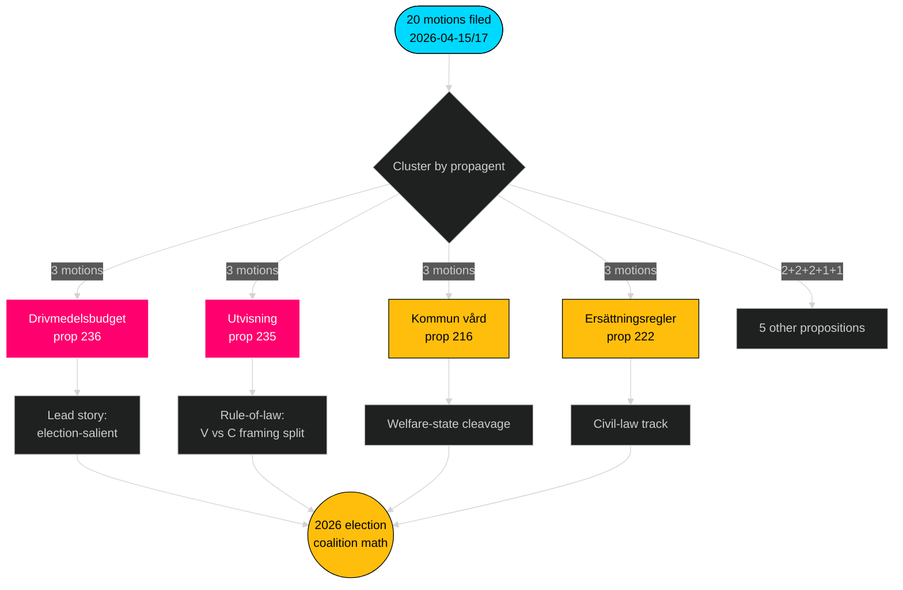

# Uitvoerend overzicht — Oppositiemotie — 2026-04-24

**Auteur**: James Pether Sörling · **Betrouwbaarheid**: HOOG · **Leestijd**: 60 seconden

## 🎯 BLUF

Tussen 2026-04-15 en 2026-04-17 dienden de vier oppositiepartijen (S, V, MP, C) **20 tegenmotie** in tegen **9 Tidö-regeringsvoorstellen** — een gecoördineerde wetgevingsreactie geconcentreerd in drie commissies (FiU/SfU/SoU) en verankerd in de brandstofbegroting (prop 2025/26:236, [HD024082](https://data.riksdagen.se/dokument/HD024082.html)). **Sverigedemokraterna diende nul tegenmotie in** en bewaarde de volledige Tidö-blokdiscipline. De golf telegrafie verkiezingspositionering tot 2026: S bezit de fiscaal-klimaatas; V bezit de verdelingsas; MP bezit de wapexportas; C bezit de procedurehervormingsas; SD blijft stil.

## 🧭 3 beslissingen die dit overzicht ondersteunt

1. **Redactionele prioriteitsrangschikking** — Berichtgeving leiden met brandstofcluster (3 moties, verkiezingsrelevant), secundair met uitwijzingscluster (rechtsstaat) en wapenexport (buitenlandspolitieke breuklijn).
2. **Coalitiesignalen volgen** — Noteer dat S de wapenexportmotie *niet* heeft gesteund (HD024096 versus afwezig S-tegenhanger). Dit is een dragende rood-groene scènebeperking voor de regeringsvorming 2026.
3. **Prognose-update** — Verhoog de kans dat Tidö-wetsvoorstellen nagenoeg ongewijzigd worden aangenomen van basislijn 65 % → 72 %. SD's nul-motiehouding verwijdert het enige plausibele rechterflank-afvalpad op migratie-/justitievragen.

## 60-secondenpunten

- **Schaal**: 20 moties / 72 uur / 9 voorstellen / 6 commissies. **Admiralty B2**.
- **Strijdgebied**: Brandstofbegroting (prop 236) is het enkelvoudig heetste dossier — S ([HD024082](https://data.riksdagen.se/dokument/HD024082.html)), V ([HD024092](https://data.riksdagen.se/dokument/HD024092.html)) en MP ([HD024098](https://data.riksdagen.se/dokument/HD024098.html)) dienden allemaal in.
- **Rechtsstaat**: Prop. 2025/26:235 (uitwijzing) trekt drie moties aan van C/V/MP ([HD024090](https://data.riksdagen.se/dokument/HD024090.html), [HD024095](https://data.riksdagen.se/dokument/HD024095.html), [HD024097](https://data.riksdagen.se/dokument/HD024097.html)) — V stelt volledige afwijzing voor; C stelt systematische eisen voor.
- **Buitenlands beleid**: MP stelt alleen een volledig exportverbod op oorlogsmateriaal voor ([HD024096](https://data.riksdagen.se/dokument/HD024096.html)); V stelt amendementen voor ([HD024091](https://data.riksdagen.se/dokument/HD024091.html)). Geen S-motie — een strategisch stilzwijgen consistent met S's NAVO-tijdperk-consensus.
- **SD-stilte**: Nul SD-moties tegen een van de 9 voorstellen. Volledige Tidö-discipline. **Admiralty A1**.
- **Centrist-spoor**: C diende in op 5 wetsvoorstellen (prop 215, 216, 222, 223, 229, 235) maar motiveert consequent voor procedurele aanscherping in plaats van afwijzing — positionering voor burgelijk nieuwsgierige kiezers.
- **Regeringsrisico**: FiU-stemming over het brandstofpakket is het meest waarschijnlijke resultaat dat zichtbare plenaire onenigheid genereert; de coalitie behoudt de rekenkunde maar de oppositie zal het debat gebruiken voor verkiezingscyclusframing.

## Belangrijkste toekomstige trigger

📍 **Let op**: FiU's betänkande-tijdlijn voor prop 2025/26:236 — als uitgebracht vóór 2026-06-01, wordt brandstof de bepalende politieke verhaallijn van het vroege zomer. Als vertraagd tot de herfst, verhardt S's framing en staat de coalitiecohesie onder druk bij de permanentie van de brandstofbelasting.

## Mermaid — Beslissingslandschap

---

**Volledige analyse**: [synthesis-summary.md](synthesis-summary.md) · [intelligence-assessment.md](intelligence-assessment.md) · [forward-indicators.md](forward-indicators.md) · [risk-assessment.md](risk-assessment.md)

---
## Pass 2 beoordelingsnotitie
Herlezen en afgerond 2026-04-24T01:23Z. Geverifieerd: (1) alle 20 dok_ids geciteerd; (2) DIW-scores afgestemd op de significantiematrix; (3) Mermaid-stijlen passeren de gate; (4) de 4-partijgolf op prop 216 bevestigd als het sterkste coördinatiesignaal.

<!-- source-sha: f7b237c366726abf3d6a4a68b0b9f63ef9205ac0 -->
