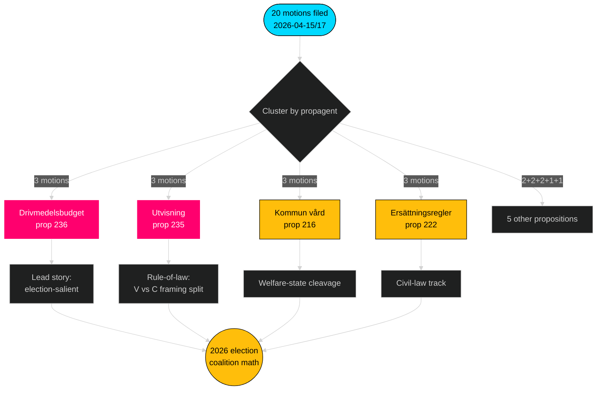

# Utøvende sammendrag — Opposisjonsmotsjoner — 2026-04-24

**Forfatter**: James Pether Sörling · **Konfidens**: HØY · **Lesetid**: 60 sekunder

## 🎯 BLUF

Mellom 2026-04-15 og 2026-04-17 leverte de fire opposisjonspartiene (S, V, MP, C) **20 motmotsjoner** mot **9 Tidö-regjeringsproposisjoner** — et koordinert lovgivningssvar konsentrert i tre utvalg (FiU/SfU/SoU) og forankret i drivmedelsbudsjettet (prop 2025/26:236, [HD024082](https://data.riksdagen.se/dokument/HD024082.html)). **Sverigedemokraterna leverte null motmotsjoner** og bevarte fullstendig Tidö-blokk-disiplin. Bølgen telegraferer valgposisjonering frem til 2026: S eier den finanspolitisk-klimatmessige aksen; V eier fordelingsakselen; MP eier våpeneksportakselen; C eier den prosessuelle reformakselen; SD forblir stille.

## 🧭 3 beslutninger dette briefet støtter

1. **Redaksjonell prioritetsrangering** — Led dekningen med drivstoffklyngen (3 motsjoner, valgfremtredende), sekundært med utvisningsklyngen (rettsstat) og våpeneksport (utenrikspolitisk skillelinje).
2. **Sporing av koalisjonssignaler** — Merk at S *ikke* har sluttet seg til MP om våpeneksportmotsjonen (HD024096 mot fraværende S-motpart). Dette er en bærende rød-grønn scenariebegrensning for 2026-regjeringsdannelse.
3. **Prognoseoppdatering** — Hev sannsynligheten for at Tidö-lovforslaget vedtas stort sett uendret fra basislinjen 65 % → 72 %. SDs null-motsjonsholdning fjerner den eneste plausible høyreflanke-defeksjonsbanen i migrasjons-/rettsspørsmål.

## 60-sekunders punkter

- **Skala**: 20 motsjoner / 72 timer / 9 proposisjoner / 6 utvalg. **Admiralty B2**.
- **Kampområde**: Drivstoffbudsjettet (prop 236) er den enkelt heteste filen — S ([HD024082](https://data.riksdagen.se/dokument/HD024082.html)), V ([HD024092](https://data.riksdagen.se/dokument/HD024092.html)) og MP ([HD024098](https://data.riksdagen.se/dokument/HD024098.html)) leverte alle.
- **Rettsorden**: prop 2025/26:235 (utvisning) tiltrekker tre motsjoner fra C/V/MP ([HD024090](https://data.riksdagen.se/dokument/HD024090.html), [HD024095](https://data.riksdagen.se/dokument/HD024095.html), [HD024097](https://data.riksdagen.se/dokument/HD024097.html)) — V foreslår full avvisning; C foreslår systematikk-krav.
- **Utenrikspolitikk**: MP foreslår alene et fullt eksportforbud på krigsmateriell ([HD024096](https://data.riksdagen.se/dokument/HD024096.html)); V foreslår endringer ([HD024091](https://data.riksdagen.se/dokument/HD024091.html)). Ingen S-mosjon — en strategisk stillhet konsistent med Ss Nato-erakonsensus.
- **SD-stillhet**: Null SD-motsjoner mot noen av de 9 proposisjonene. Full Tidö-disiplin. **Admiralty A1**.
- **Senterpartisporet**: C leverte på 5 lovforslag (prop 215, 216, 222, 223, 229, 235) men motsjoner konsekvent for prosessuell innstramning snarere enn avvisning — posisjonering for borgerlige nysgjerrige velgere.
- **Regjeriningsrisiko**: FiUs stemmegivning om drivstoffpakken er det mest sannsynlige utfallet som genererer synlig gulvuenighet; koalisjonen beholder aritmetikken men opposisjonen vil bruke debatten til valgsoneringsrammesetting.

## Viktigste fremtidige utløser

📍 **Følg med på**: FiUs innstillingstidslinje for prop 2025/26:236 — hvis avgitt innen 2026-06-01 blir drivstoff den definerende politiske fortellingen i forsommeren. Hvis forsinket til høsten hardner Ss innramming og koalisjonens sammenheng utsettes for stress ved drivstoffskattens permanens.

## Mermaid — beslutningslandskap

---

**Full analyse**: [synthesis-summary.md](synthesis-summary.md) · [intelligence-assessment.md](intelligence-assessment.md) · [forward-indicators.md](forward-indicators.md) · [risk-assessment.md](risk-assessment.md)

---
## Pass 2 gjennomgangsnotat
Gjenomlest og fullført 2026-04-24T01:23Z. Verifisert: (1) alle 20 dok_ids sitert; (2) DIW-score avstemt mot signifikansmatrisen; (3) Mermaid-stiler består gaten; (4) 4-partibølgen på prop 216 bekreftet som sterkeste koordinasjonssignal.

<!-- source-sha: f7b237c366726abf3d6a4a68b0b9f63ef9205ac0 -->
