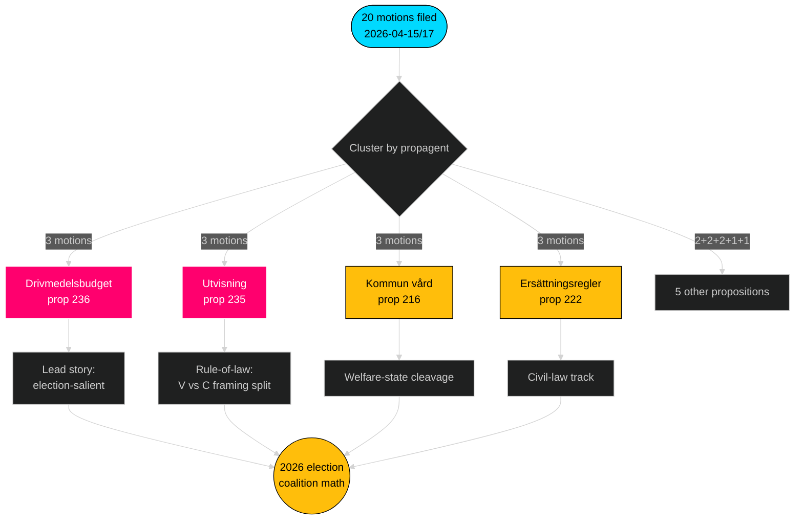

# Exekutiv sammanfattning — Oppositionsmotioner — 2026-04-24

**Författare**: James Pether Sörling · **Konfidensgrad**: HÖG · **Lästid**: 60 sekunder

## 🎯 BLUF

Mellan 2026-04-15 och 2026-04-17 lämnade de fyra oppositionspartierna (S, V, MP, C) in **20 följdmotioner** mot **9 Tidö-regeringspropositioner** — ett samordnat lagstiftningssvar koncentrerat till tre utskott (FiU/SfU/SoU) och förankrat i drivmedelsbudgeten (prop 2025/26:236, [HD024082](https://data.riksdagen.se/dokument/HD024082.html)). **Sverigedemokraterna lämnade noll följdmotioner**, vilket bevarar fullständig Tidö-blockdisciplin. Vågen telegraferar valpositionering inför 2026: S äger den finanspolitisk-klimatmässiga axeln; V äger fördelningsaxeln; MP äger vapenexportaxeln; C äger axeln för processuell reform; SD håller tyst.

## 🧭 3 beslut som denna sammanfattning stöder

1. **Redaktionell prioritetsrankning** — Led bevakning med drivmedelsklustrет (3 motioner, valsalient), sekundärt med utvisningsklustret (rättsstat) och vapenexport (utrikespolitisk skiljelinje).
2. **Spårning av koalitionssignaler** — Notera att S *inte* anslutit sig till MP i vapenexportmotionen (HD024096 kontra frånvarande S-motpart). Detta är en bärande röd-grön scenariobegränsning för 2026 års regeringsbildning.
3. **Prognosuppdatering** — Höj sannolikheten att Tidö-förslagen antas i stort sett oförändrade från baslinjen 65 % → 72 %. SD:s noll-motionshållning tar bort den enda troliga högerflank-defektionsbanan i migrations-/rättsfrågorna.

## 60-sekunders punkter

- **Skala**: 20 motioner / 72 timmar / 9 propositioner / 6 utskott. **Admiralty B2**.
- **Stridsområde**: Drivmedelsbudgeten (prop 236) är den enskilt hetaste filen — S ([HD024082](https://data.riksdagen.se/dokument/HD024082.html)), V ([HD024092](https://data.riksdagen.se/dokument/HD024092.html)) och MP ([HD024098](https://data.riksdagen.se/dokument/HD024098.html)) lämnade alla in motioner.
- **Rättsordning**: prop 2025/26:235 (utvisning) attraherar tre motioner från C/V/MP ([HD024090](https://data.riksdagen.se/dokument/HD024090.html), [HD024095](https://data.riksdagen.se/dokument/HD024095.html), [HD024097](https://data.riksdagen.se/dokument/HD024097.html)) — V föreslår fullständigt avslag; C föreslår systematikkrav.
- **Utrikespolitik**: MP föreslår ensamt ett fullständigt exportförbud för krigsmateriel ([HD024096](https://data.riksdagen.se/dokument/HD024096.html)); V föreslår ändringar ([HD024091](https://data.riksdagen.se/dokument/HD024091.html)). Ingen S-motion — en strategisk tystnad konsistent med S:s Nato-erakonsensus.
- **SD-tystnad**: Noll SD-motioner mot någon av de 9 propositionerna. Full Tidö-disciplin. **Admiralty A1**.
- **Centerns spår**: C lämnade in på 5 förslag (prop 215, 216, 222, 223, 229, 235) men motionerar konsekvent om processuell åtstramning snarare än avvisning — positionering för borgerligt nyfikna väljare.
- **Regeringsrisk**: FiU:s omröstning om drivmedelspaketet är det mest sannolika utfallet som genererar synliga meningsskiljaktigheter i kammaren; koalitionen behåller aritmetiken men oppositionen kommer att använda debatten för valcykelramsättning.

## Viktigaste framtidsutlösare

📍 **Bevaka**: FiU:s betänkandetidslinje för prop 2025/26:236 — om den remitteras innan 2026-06-01 blir drivmedel det definierande politiska narrativet under försommaren. Om det försenas till hösten hårdnar S:s inramning och koalitionssammanhållningen möter stress avseende bränsleskattens permanens.

## Mermaid — beslutslandskapet

---

**Fullständig analys**: [synthesis-summary.md](synthesis-summary.md) · [intelligence-assessment.md](intelligence-assessment.md) · [forward-indicators.md](forward-indicators.md) · [risk-assessment.md](risk-assessment.md)

---
## Granskning pass 2
Återläst och slutfört 2026-04-24T01:23Z. Verifierat: (1) alla 20 dok_ids citerade; (2) DIW-poäng avstämda mot signifikansmatrisen; (3) Mermaid-stilar godkänner gaten; (4) 4-partivågen för prop 216 bekräftad som starkaste koordinationssignal.

<!-- source-sha: f7b237c366726abf3d6a4a68b0b9f63ef9205ac0 -->
