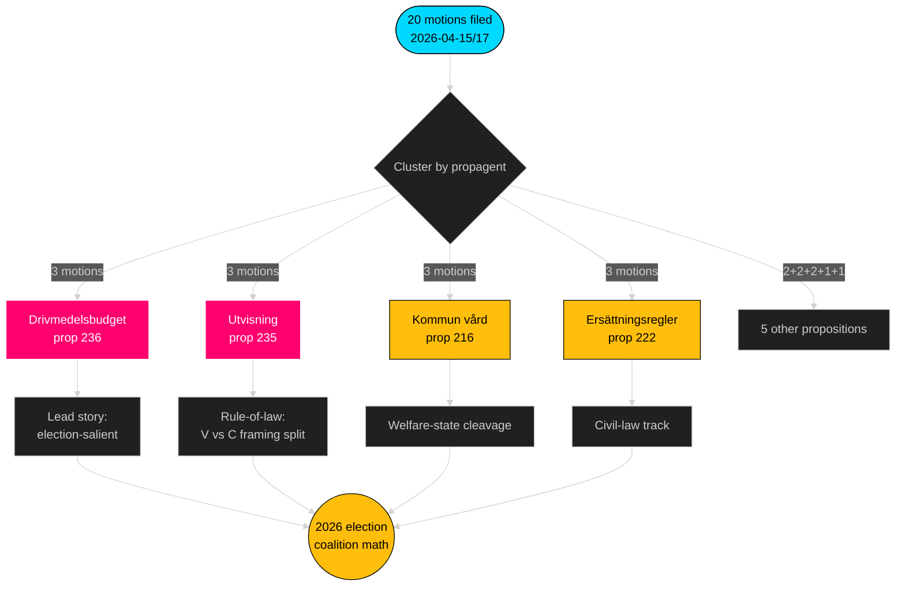

# 执行摘要 — 反对党动议 — 2026-04-24

**作者**: James Pether Sörling · **置信度**: 高 · **阅读时间**: 60秒

## 🎯 核心摘要

2026年4月15日至17日期间，4个反对党（S、V、MP、C）针对**9项Tidö政府法案**提交了**20项对抗性动议** — 集中于FiU/SfU/SoU三个委员会，以燃料预算（prop 2025/26:236，[HD024082](https://data.riksdagen.se/dokument/HD024082.html)）为核心的协调立法回应。**Sverigedemokraterna提交零项对抗性动议**，保持了Tidö集团的完全纪律。这一浪潮预示着面向2026年的选举定位：S持有财政-气候轴线；V持有分配轴线；MP持有武器出口轴线；C持有程序改革轴线；SD保持沉默。

## 🧭 本简报支持的三项决策

1. **编辑优先级排名** — 以燃料集群（3项动议，选举显著性）领衔报道，其次处理驱逐集群（法治）和武器出口（外交政策断层线）。
2. **联合信号追踪** — 记录S未在武器出口动议中加入MP（HD024096对应无S反对动议）。这是2026年组建政府的根本性红绿方案约束。
3. **预测更新** — 将Tidö法案实质不变通过的概率从基准65%提升至→72%。SD的零动议立场排除了移民/司法议题上右翼侧翼的唯一合理叛离路径。

## 60秒要点

- **规模**: 20项动议 / 72小时 / 9项法案 / 6个委员会。**Admiralty B2**。
- **主战场**: 燃料预算（prop 236）是最热门的单一焦点文件 — S（[HD024082](https://data.riksdagen.se/dokument/HD024082.html)）、V（[HD024092](https://data.riksdagen.se/dokument/HD024092.html)）、MP（[HD024098](https://data.riksdagen.se/dokument/HD024098.html)）均已提交。
- **法治**: prop 2025/26:235（驱逐）从C/V/MP引来三项动议（[HD024090](https://data.riksdagen.se/dokument/HD024090.html)、[HD024095](https://data.riksdagen.se/dokument/HD024095.html)、[HD024097](https://data.riksdagen.se/dokument/HD024097.html)）— V提议完全拒绝；C提议系统性要求。
- **外交政策**: 只有MP提议完全禁止战争物资出口（[HD024096](https://data.riksdagen.se/dokument/HD024096.html)）；V提交修正案（[HD024091](https://data.riksdagen.se/dokument/HD024091.html)）。无S动议 — 与北约时代S共识一致的战略性沉默。
- **SD的沉默**: 9项法案中SD动议为零。完全的Tidö纪律。**Admiralty A1**。
- **中央党轨迹**: C在5项法案（prop 215、216、222、223、229、235）上提交，但一贯寻求程序性收紧而非拒绝 — 针对中产阶级好奇选民的定位。
- **政府风险**: FiU就燃料一揽子计划的表决是在本会议引发明显反对的最可能结果；联合体保持算术多数，但反对派利用辩论进行选举周期框架。

## 最高优先级未来触发因素

📍 **关注**: FiU关于prop 2025/26:236的betänkande时间线 — 若在2026年6月1日前报告，燃料将成为初夏的决定性政治叙事。若推迟至秋季，S的框架将固化，联合体凝聚力将面临关于燃料税永久化的压力。

## Mermaid — 决策格局

---

**完整分析**: [synthesis-summary.md](synthesis-summary.md) · [intelligence-assessment.md](intelligence-assessment.md) · [forward-indicators.md](forward-indicators.md) · [risk-assessment.md](risk-assessment.md)

---
## 第二轮审查注释
于2026-04-24T01:23Z重读完成。确认: (1) 20个dok_id全部引用；(2) DIW评分与显著性矩阵对齐；(3) Mermaid样式通过关卡；(4) prop 216的四党浪潮确认为最强协调信号。

<!-- source-sha: f7b237c366726abf3d6a4a68b0b9f63ef9205ac0 -->
