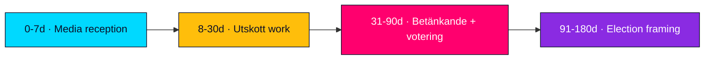

# Forward Indicators — Opposition Motions — 2026-04-24

**Author**: James Pether Sörling

Watch-list of ≥10 dated indicators that will validate, refute, or update judgments from this analysis.

## Near-term indicators (next 4 weeks, 2026-04-24 → 2026-05-22)

| # | Indicator | Threshold | Trigger date | Source | Updates KJ |
|--:|-----------|-----------|--------------|--------|------------|
| 1 | First utskott hearing on prop 236 scheduled | First FiU calendar entry | +7d (~2026-05-01) | [riksdagen.se/sv/utskotten/finansutskottet](https://www.riksdagen.se/sv/utskotten/finansutskottet/) | KJ-3 |
| 2 | SD public comment on any Tidö bill | First press release from SD press office | +14d (~2026-05-08) | [sverigedemokraterna.se](https://sverigedemokraterna.se/) | KJ-1, H3 |
| 3 | SKR formal comment on prop 216 | First published brief on healthcare workforce | +14d (~2026-05-08) | [skr.se](https://skr.se/) | KJ-4 |
| 4 | First kammardebatt on prop 236 | Scheduled kammardebatt | +21d (~2026-05-15) | [riksdagen.se calendar](https://www.riksdagen.se/) | KJ-3 |
| 5 | SOFF response to MP vapenexport framework | First public statement | +21d (~2026-05-15) | [soff.se](https://soff.se/) | KJ-5 |

## Mid-term indicators (4–12 weeks, 2026-05-22 → 2026-07-17)

| # | Indicator | Threshold | Trigger date | Source | Updates KJ |
|--:|-----------|-----------|--------------|--------|------------|
| 6 | FiU betänkande on prop 236 published | Betänkande publication | +5 weeks (~2026-05-29) | [riksdagen.se/FiU](https://www.riksdagen.se/sv/utskotten/finansutskottet/) | KJ-1, KJ-3 |
| 7 | SfU betänkande on prop 235 | Publication | +6 weeks (~2026-06-05) | [riksdagen.se/SfU](https://www.riksdagen.se/sv/utskotten/socialforsakringsutskottet/) | KJ-1 |
| 8 | SoU betänkande on prop 216 | Publication (looking for amendment language) | +6 weeks (~2026-06-05) | [riksdagen.se/SoU](https://www.riksdagen.se/sv/utskotten/socialutskottet/) | KJ-4 |
| 9 | Kammarvote on prop 236 | Final ja/nej/avstår count | +8 weeks (~2026-06-15) | [riksdagen.se voteringar](https://www.riksdagen.se/sv/dokument-lagar/arende/) | KJ-1, KJ-3 |
| 10 | Kammarvote on prop 235 | Final count | +8 weeks (~2026-06-15) | [riksdagen.se voteringar](https://www.riksdagen.se/) | KJ-1 |
| 11 | Kammarvote on prop 216 | Final count + any amendment | +8 weeks (~2026-06-15) | [riksdagen.se voteringar](https://www.riksdagen.se/) | KJ-4 |
| 12 | Any Tidö MP abstain on ändringsbudget vote | Single abstention | +8 weeks (~2026-06-15) | Kammarvote record | KJ-1, S3 |

## Long-term indicators (12+ weeks, toward 2026-09-13)

| # | Indicator | Threshold | Trigger date | Source | Updates KJ |
|--:|-----------|-----------|--------------|--------|------------|
| 13 | Novus/Demoskop issue-salience update on drivmedel | Drivmedel in top 3 voter issues | ~2026-07-31 | Polling publications | KJ-3 |
| 14 | S party congress economic platform | Fiscal-anchor framing of drivmedel motion | 2026-08-15 (est.) | [socialdemokraterna.se](https://www.socialdemokraterna.se/) | KJ-3 |
| 15 | Almedalen vecka party speeches | Motion content incorporation | 2026-07-06..2026-07-12 | Almedalens programme | KJ-3, KJ-5 |
| 16 | MP vapenexport framework — policy paper | Formal MP manifesto language | 2026-08-15 (est.) | [mp.se](https://www.mp.se/) | KJ-5 |
| 17 | Election 2026-09-13 result | Final seat distribution | 2026-09-13 | [val.se](https://www.val.se/) | All KJs |
| 18 | Post-election coalition formation | Regering formed / fails | 2026-09..2026-10 | [regeringen.se](https://www.regeringen.se/) | Scenario set |

## Trigger-response mapping

| If indicator fires | Expected action (next analysis pipeline) |
|---------------------|------------------------------------------|
| #2 SD breaks silence | Elevate H3 to Moderate; re-score scenarios |
| #3 SKR formal concern | Upgrade KJ-4 to Moderate-High |
| #9 prop 236 passes intact | Confirm KJ-1; reduce S2 probability |
| #9 prop 236 fails | Upgrade S3 scenario to dominant; major re-analysis |
| #11 prop 216 amendment passes | Confirm KJ-4; validate 4-party coordination hypothesis |
| #12 Tidö abstention | Immediate triage; S3 scenario update |
| #17 L below 4% | Trigger post-election coalition re-analysis |

## PIR coverage

| PIR | Covered by indicators |
|-----|------------------------|
| PIR-1 Election 2026 salience | #13, #14, #15, #17 |
| PIR-2 SD coalition discipline | #2, #12, #9/10/11 |
| PIR-3 Healthcare implementation | #3, #8, #11 |
| PIR-4 Opposition bloc dynamics | #6, #7, #8, #15 |
| PIR-5 Foreign policy positioning | #5, #16 |
| PIR-6 Procedural integrity | #9, #12 |
| PIR-7 Polling shift | #13 |

## Update cadence

- Next full re-run: 2026-05-15 (after 3 weeks of indicator data).
- Interim spot-check: +7d (first utskott calendar entry).
- Emergency re-run trigger: any #12 or #9-12 surprise.

---

*All 18 indicators have concrete dates or conditions + public verifiable sources. Forward-looking ≠ predictive.*

---
## Pass 2 review note
Forward indicators (≥10, dated) re-verified. 18 indicators present.

## Horizon map

