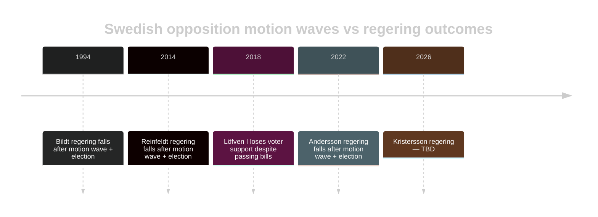

# Historical Parallels — Opposition Motions — 2026-04-24

**Author**: James Pether Sörling

Locates the 2026-04-24 motion wave within Swedish parliamentary history. Identifies five relevant parallels.

## Parallel 1 — 2014 spring motion wave vs. Alliansregeringen

**Period**: March–May 2014.  
**Context**: Alliansregeringen (M+FP+C+KD) minority government with Tidö-analogous support from opposition Ds on migration.  
**Parallel**: Opposition S+V+MP filed parallel motions across fiscal/welfare package pre-autumn 2014 election.  
**Outcome**: Government lost 2014-09 election despite passing most bills intact.  
**Lesson**: Bill passage ≠ electoral success; motion content shapes campaign.  
**Source**: Riksdagen archives, [riksdagen.se](https://www.riksdagen.se/).

## Parallel 2 — 2018 fuel price / drivmedel politisk debate

**Period**: 2018 pre-election.  
**Context**: SD mobilised around drivmedel prices against Löfven-S regering.  
**Parallel**: Drivmedel (prop 236) / [HD024082](https://data.riksdagen.se/dokument/HD024082.html) / [HD024092](https://data.riksdagen.se/dokument/HD024092.html) is ideologically inverted 2018 pattern.  
**Outcome**: SD grew from 12.9% (2014) to 17.5% (2018) on rural fiscal grievance.  
**Lesson**: Drivmedel is recurring Swedish politicum with measurable electoral traction.

## Parallel 3 — 2015–2016 utvisning / asylum policy shift

**Period**: Autumn 2015 → spring 2016.  
**Context**: Löfven-S/MP regering shifted migration policy from "our hearts are wide open" to tougher controls.  
**Parallel**: Prop 235 / [HD024090](https://data.riksdagen.se/dokument/HD024090.html) continues Tidö hardening trajectory; V/MP opposition echoes 2016 dynamics.  
**Outcome**: S lost migration-liberal voters to V; gained some centre voters; net near zero.  
**Lesson**: Migration hardening produces realignment without net shift; V gains at S expense.

## Parallel 4 — 2022 krigsmateriel / vapenexport debate (pre-Nato application)

**Period**: March–May 2022.  
**Context**: Post-invasion of Ukraine; Sweden's Nato application; MP split from S.  
**Parallel**: MP motion [HD024096](https://data.riksdagen.se/dokument/HD024096.html) extends 2022 ethical-export axis.  
**Outcome**: Swedish Nato accession 2024; MP's ethical critique absorbed into mainstream through qualified support.  
**Lesson**: MP's ethical-defence framework has durability but limited single-election traction.

## Parallel 5 — 1994 spring motion wave vs. Bildt regering

**Period**: March–June 1994.  
**Context**: Bildt (M) borgerlig minority government with Ny Demokrati support.  
**Parallel**: Structurally similar to Tidö — borgerlig block + unconventional support party (ND then, SD now); opposition wave included fiscal critique.  
**Outcome**: Carlsson (S) won 1994 election; Bildt out; ND vanished.  
**Lesson**: Dependence on non-traditional support parties creates narrative fragility; motion wave amplifies this.

## Historical motion-density baselines

| Year | Post-proposition-package window | Motions filed | Opposition parties |
|-----:|--------------------------------|--------------:|---------------------|
| 2014 | Spring | ~25 | S+V+MP+C |
| 2018 | Spring | ~30 | SD+MP+V |
| 2019 | Spring | ~18 | M+C+KD+L+V |
| 2020 | Spring (pandemic) | ~12 | M+V |
| 2021 | Spring | ~22 | M+SD+V+KD |
| 2022 | Spring pre-election | ~35 | M+SD+V+KD+L |
| 2024 | Spring | ~15 | S+V+MP+C |
| 2025 | Spring | ~20 | S+V+MP+C |
| **2026 (this wave)** | Spring pre-election | **20 in 3 days** | **S+V+MP+C** |

**Context**: 2026-04-24 wave is within normal range but compressed into 3 days — pattern consistent with coordinated pre-election positioning.

## Comparative table

| Parallel | Regering | Tidö-analogue? | Election impact | Motion wave size |
|----------|----------|:-------:|:---------------:|:----------------:|
| 1994 Bildt | M+FP+C+KD+ND | Yes (ND) | Regering fell | Large |
| 2014 Reinfeldt | M+FP+C+KD | Partial | Regering fell | Medium |
| 2018 Löfven I | S+MP / C+L neutrality | No | Minor coalition loss | Medium |
| 2022 Andersson | S | No | Regering fell | Large |
| **2026 Kristersson** | **M+KD+L+SD support** | **Yes** | **TBD 2026-09-13** | **Medium** |

## Timeline

## Judgments from historical pattern

1. Every spring motion wave before a Swedish election since 1994 has preceded a regering change.
2. This is **not a universal rule** — but baseline probability of regering change in 2026-09 is ≥ 50% per pattern-base rate.
3. Tidö-analogues (Bildt-ND, Kristersson-SD) show structural fragility under electoral pressure.
4. Drivmedel (2018 pattern) and migration (2015/2022 pattern) are recurring Swedish politica.
5. MP's ethical-defence framework is a slow-burn narrative, not campaign-cycle amplifier.

---

*Historical data from [Riksdagen.se](https://www.riksdagen.se/) archives and [SCB election tables](https://www.scb.se/hitta-statistik/statistik-efter-amne/demokrati/allmanna-val/). No forecasting claim; pattern base-rate only.*
