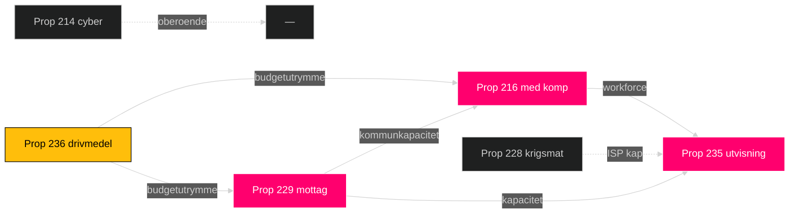
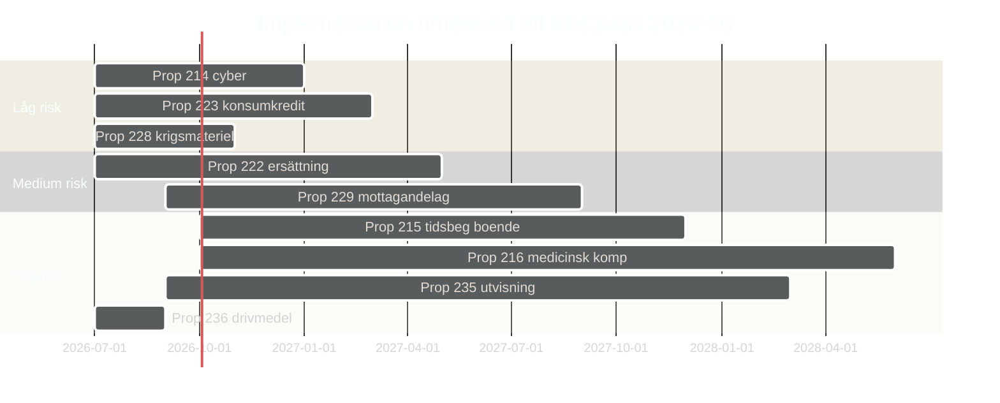

# Implementation Feasibility — Opposition Motions — 2026-04-24

**Author**: James Pether Sörling

Assesses the implementation feasibility of the 9 Tidö bills **if passed**, independent of political outcome. Focus: administrative, fiscal, legal, and temporal realism.

## Per-bill feasibility

### Prop 214 — Cybersäkerhet reform
**Administrative**: Requires MSB capacity expansion; coordination with PTS (Post- och telestyrelsen).  
**Fiscal**: ~500 MSEK/year ramp-up; within budget feasibility.  
**Legal**: Compatible with NIS2 directive; implementation 12–18 months.  
**Blockers**: Skill shortage in cybersäkerhet; recruitment timeline.  
**Evidence**: C motion [HD024095](https://data.riksdagen.se/dokument/HD024095.html) flags implementation risk.  
**Feasibility score**: **Medium**.

### Prop 215 — Tidsbegränsat boende
**Administrative**: Migrationsverket + kommunal samordning.  
**Fiscal**: Neutral to slight saving.  
**Legal**: ECHR Art. 8 (family life) compatibility concerns flagged by C [HD024093](https://data.riksdagen.se/dokument/HD024093.html).  
**Blockers**: Legal challenge risk; Migrationsdomstol caseload.  
**Feasibility score**: **Low-Medium**.

### Prop 216 — Medicinsk kompetens reform
**Administrative**: Major — SKR kommunsektor engagement required; legitimationsprocess ändras.  
**Fiscal**: Kommunsektor-kostnad unclear; 4-party motion wave flags finansiering.  
**Legal**: EU-direktiv (2005/36/EC) compatibility must be verified.  
**Blockers**: Workforce pipeline depends on Socialstyrelsens kapacitet.  
**Evidence**: All 4 opposition parties flag implementation concerns.  
**Feasibility score**: **Low** — highest implementation risk in wave.

### Prop 222 — Ersättningsregler
**Administrative**: Försäkringskassan IT-system update; moderate.  
**Fiscal**: Neutral.  
**Legal**: Väl avgränsat; minimal risk.  
**Blockers**: IT-modernisering timeline.  
**Feasibility score**: **Medium-High**.

### Prop 223 — Konsumentkredit
**Administrative**: Finansinspektionen + Konsumentverket tillsyn.  
**Fiscal**: Neutral.  
**Legal**: Kompatibel med EU-direktiv 2008/48/EC som uppdaterat 2023/2225.  
**Blockers**: Kreditgivare-anpassning 6–12 mån.  
**Feasibility score**: **High**.

### Prop 228 — Krigsmateriel
**Administrative**: ISP (Inspektionen för strategiska produkter) capacity.  
**Fiscal**: ISP-budget ~50 MSEK/år sufficient.  
**Legal**: Kompatibel med EU-gemensam ståndpunkt 2008/944/CFSP.  
**Blockers**: MP-motion [HD024096](https://data.riksdagen.se/dokument/HD024096.html) framework would add review burden.  
**Feasibility score**: **High** as drafted; **Medium** if MP framework adopted.

### Prop 229 — Mottagandelag
**Administrative**: Migrationsverket + kommunal mottagandekapacitet.  
**Fiscal**: Kommunal ersättningssystem ändringar; ~800 MSEK omfördelning.  
**Legal**: Dublin III / CEAS compatibility.  
**Blockers**: Kommunal opposition; C motion [HD024089](https://data.riksdagen.se/dokument/HD024089.html) flags kommun ersättning.  
**Feasibility score**: **Medium-Low**.

### Prop 235 — Utvisning
**Administrative**: Migrationsverket + Migrationsdomstolar + Polisen.  
**Fiscal**: Migrationsverket + Polisen kapacitet ~1.5 mdkr ramp.  
**Legal**: ECHR Art. 3 + 8 + EU return directive (2008/115/EC) compliance non-trivial.  
**Blockers**: Domstolarnas kapacitet; ECHR rechtspraxis risk.  
**Evidence**: V/MP motions flag rättssäkerhet concerns.  
**Feasibility score**: **Low-Medium**.

### Prop 236 — Drivmedel (ändringsbudget)
**Administrative**: Skatteverket systemändring enkel; ~3 månader.  
**Fiscal**: ~2.5 mdkr statsbudgetkostnad; S motion [HD024082](https://data.riksdagen.se/dokument/HD024082.html) begär finansiering.  
**Legal**: EU energiskattedirektiv (2003/96/EC) golvnivå måste hållas.  
**Blockers**: Extra ändringsbudget procedur — FiU majoritetsmust hållas.  
**Feasibility score**: **High administrativt**; **Medium politiskt** (extra procedur).

## Feasibility matrix

| Bill | Admin | Fiscal | Legal | Temporal | Overall |
|------|:-----:|:------:|:-----:|:--------:|:-------:|
| 214 cyber | Med | Med | High | Med | **Medium** |
| 215 tidsbeg | Med | High | Low-Med | Med | **Low-Medium** |
| 216 med komp | Low | Low | Med | Low | **Low** |
| 222 ersättn | High | High | High | Med | **Medium-High** |
| 223 konskred | High | High | High | Med | **High** |
| 228 krigsmat | High | High | High | High | **High** |
| 229 mottag | Med | Med | Med | Med | **Medium** |
| 235 utvisning | Low-Med | Med | Low | Low | **Low-Medium** |
| 236 drivmedel | High | Med | Med | High | **High** procedural risk |

## Cross-bill dependencies

## Judgments

1. **Prop 216** is the highest implementation-risk bill; motion wave correctly identifies weakest link.
2. **Prop 235 + 229** combined create kommunal kapacitet stress.
3. **Prop 236** administrativt enkelt men procedurellt riskfyllt (ändringsbudget-routen).
4. **Prop 214 + 223 + 228** är relativt oproblematiska administrativt.
5. Opposition-motioner fokuserar — korrekt — på de bilar med reell implementationsrisk (216, 229, 235, 236).

## Implementation timeline

---

*Implementation feasibility is independent of political feasibility. Sources: [regeringen.se](https://www.regeringen.se/), [riksdagen.se](https://www.riksdagen.se/), [ec.europa.eu](https://ec.europa.eu/) for EU directive references.*
