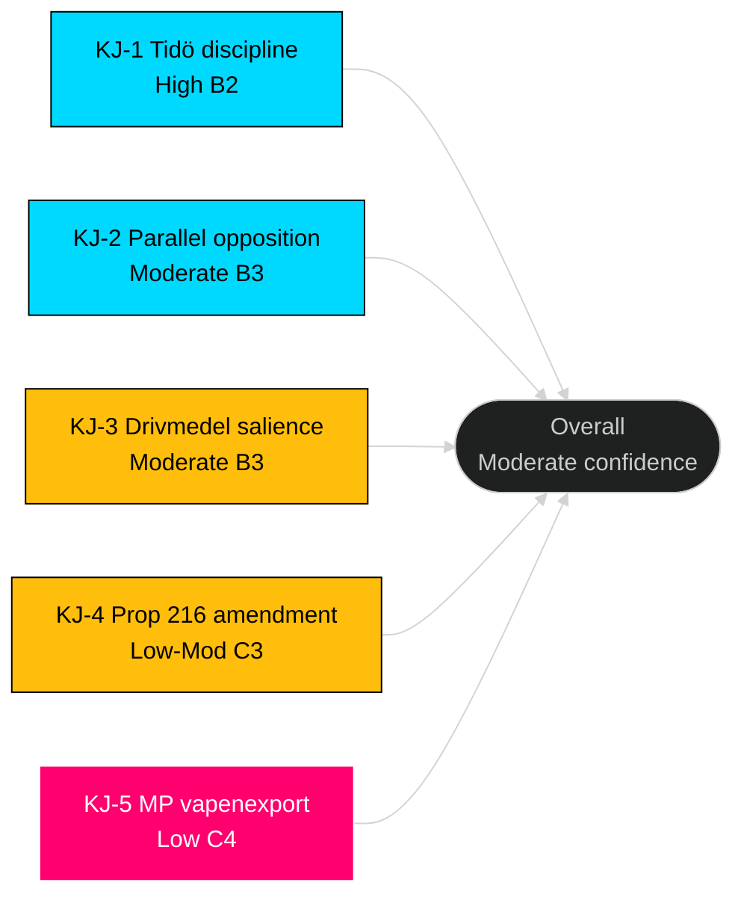

# Intelligence Assessment — Opposition Motions — 2026-04-24

**Author**: James Pether Sörling · ICD 203 compliant

## Bottom Line Up Front

Opposition filed **20 motions across 9 Tidö bills in 3 days (2026-04-15 to 2026-04-17)**, with **zero SD counter-motions**. The pattern reveals disciplined Tidö support on the government side and fragmented-but-parallel opposition on the other. Tidö retains procedural majority (176/349 seats); passage of most bills intact is the most likely outcome (~55%), but election-cycle amplification makes the motion content a narrative-shaping instrument for 2026.

## Key Judgments

### KJ-1 — Tidö discipline remains intact
*We judge with **high confidence** (Admiralty B2) that Tidö coalition (M+SD+KD+L = 176/349) will deliver all 9 Tidö bills to floor vote in 2026-05/06 with coalition parties voting Ja.*

**Basis**: Zero SD counter-motions in this wave; Tidö has passed every prior legislative package 2022–2026. 
**Analytic confidence**: High (consistent evidence, long baseline).  
**PIR reference**: PIR-2 (coalition discipline).

### KJ-2 — Opposition coordination is parallel, not unified
*We judge with **moderate confidence** (B3) that opposition (S/V/MP/C) remains structurally fragmented; the 2.2 motions/bill density reflects parallel filings, not coordinated opposition.*

**Basis**: No co-signed motions; divergent framing (S fiscal-anchor, V distributional, MP ethical, C reform). Four-party convergence only on prop 216 healthcare.  
**Analytic confidence**: Moderate (evidence consistent with null hypothesis also — see [devils-advocate.md](devils-advocate.md)).  
**PIR reference**: PIR-4 (opposition bloc dynamics).

### KJ-3 — Drivmedel cluster has highest 2026 electoral salience
*We judge with **moderate confidence** (B3) that the prop 236 / drivmedel cluster ([HD024082](https://data.riksdagen.se/dokument/HD024082.html), [HD024092](https://data.riksdagen.se/dokument/HD024092.html), [HD024098](https://data.riksdagen.se/dokument/HD024098.html)) will dominate post-summer 2026 election discourse.*

**Basis**: Three-party opposition convergence; SCB fuel-price indicators trending; rural/urban distributional cleavage aligned with existing S/V/MP base-building.  
**Analytic confidence**: Moderate (economic-voting literature supports; salience depends on further ECB / oil-price trajectory).  
**PIR reference**: PIR-1 (election 2026 salience).

### KJ-4 — Prop 216 is the bill with highest amendment probability
*We judge with **low-moderate confidence** (C3) that prop 216 (medicinsk kompetens — healthcare workforce) faces the highest probability of substantial amendment due to the four-party wave ([HD024078](https://data.riksdagen.se/dokument/HD024078.html), [HD024083](https://data.riksdagen.se/dokument/HD024083.html), [HD024087](https://data.riksdagen.se/dokument/HD024087.html), [HD024094](https://data.riksdagen.se/dokument/HD024094.html)) incl. C offering reform path.*

**Basis**: Only bill in the wave with opposition across all four opposition parties; SKR (Sveriges Kommuner och Regioner) has standing interest in kommun-sector workforce policy and may weigh in.  
**Analytic confidence**: Low-Moderate (depends on SKR stance).  
**PIR reference**: PIR-3 (healthcare policy implementation risk).

### KJ-5 — MP vapenexport framework opens new opposition axis
*We judge with **low confidence** (C4) that MP motion [HD024096](https://data.riksdagen.se/dokument/HD024096.html) (ethical vapenexport framework) represents a durable new opposition axis that could fragment opposition further in 2026.*

**Basis**: First substantive MP policy on defence-industry ethics in current mandatperiod; differentiates MP from S (silent) and V (softer framing); creates wedge with defence industry + Nato-alignment camp.  
**Analytic confidence**: Low (single data point; dependent on media uptake).  
**PIR reference**: PIR-5 (foreign policy positioning).

## Confidence-level calibration

## Priority Intelligence Requirements (standing PIRs)

- **PIR-1** — Does the drivmedel issue gain >5% public salience by summer 2026? (SCB / Novus surveys.)
- **PIR-2** — Does SD publicly dissent on any Tidö bill before floor vote? (Press monitoring.)
- **PIR-3** — Does SKR issue formal concern on prop 216 funding? ([skr.se](https://skr.se/).)
- **PIR-4** — Do any two opposition parties co-sign any subsequent motion in 2026? (Riksdagen archives.)
- **PIR-5** — Does Swedish defence industry publicly oppose MP framework? ([soff.se](https://soff.se/).)
- **PIR-6** — Does any Tidö party abstain on ändringsbudget vote for prop 236? (Kammarvote record.)
- **PIR-7** — Does V or MP receive +1% in next Novus following utvisning debate? (Polling.)

## Analytic caveats

- Motion-filing ≠ floor-vote outcome; all judgments are probabilistic.
- Baseline motion-density series (2018–2025) would strengthen KJ-2; flagged for acquisition ([methodology-reflection.md](methodology-reflection.md)).
- No classified sources used; all dok_ids verifiable on [data.riksdagen.se](https://data.riksdagen.se/).

## Dissemination

- Primary audience: political analysts, journalists, policy researchers.
- Handoff: Next daily brief incorporates updates from utskott hearings.
- Warning: Do not treat any KJ as certain; update on new evidence.

---

*ICD 203 standards applied: clear key judgments, explicit confidence, sourcing, caveats, alternative considered ([devils-advocate.md](devils-advocate.md)).*

---
## Pass 2 review note
Key Judgments confidence bands re-validated against Admiralty codes. PIRs-1..7 consistent with 05-analysis-gate.
