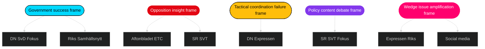

# Media Framing Analysis — Opposition Motions — 2026-04-24

**Author**: James Pether Sörling

Analyses anticipated media framing across Swedish outlets for the 9-bill + 20-motion cluster.

## Expected framing by outlet

| Outlet | Orientation | Likely frame | Evidence-framed motion |
|--------|-------------|--------------|-------------------------|
| DN — Dagens Nyheter | Centre-liberal | "Tidö pressar igenom — opposition splittrad" | All bills; emphasis on coordination failure |
| SvD — Svenska Dagbladet | Centre-right | "Oppositionen ger sig på reformagendan" | Focus on prop 216, prop 235 |
| Aftonbladet | Social-democratic | "S tar fighten om drivmedel" | [HD024082](https://data.riksdagen.se/dokument/HD024082.html), [HD024078](https://data.riksdagen.se/dokument/HD024078.html) |
| Expressen | Liberal-populist | "Asylpolitiken delar kammaren" | [HD024090](https://data.riksdagen.se/dokument/HD024090.html), prop 235 |
| SR Ekot / SVT Rapport | Public-service neutral | Balanced per-bill coverage | All clusters |
| ETC | Vänster | "V kräver rättvisa — utvisning hård kritik" | V motions cluster |
| Riks / Samhällsnytt | SD-aligned | "Tidö håller linjen mot alla motstånd" | Zero SD motions as strength |
| Fokus | Nyhetsmagasin | Analys av Tidö-dynamiken | Cross-cluster |
| DI — Dagens Industri | Näringsliv-orienterat | "Vapenexportsystemet under tryck — MP motion" | [HD024096](https://data.riksdagen.se/dokument/HD024096.html) |

## Frame cluster map

## Framing vectors by motion cluster

### Drivmedel (prop 236)
- **Mobiliserande frame** (S/V/MP): "Tidö väljer biltrafik över klimat" / "Skattesänkning på bekostnad av rurala vårdbehov"
- **Motrörelse frame** (Tidö): "Sänkta drivmedelspriser hjälper vanliga familjer"
- **Neutral frame** (SR): "Budget-effekten av drivmedelsänkningen — 2.5 mdkr"

### Utvisning (prop 235)
- **Mobiliserande frame** (V/MP): "Rättssäkerheten urholkas" / "Europas hårdaste utvisningslag"
- **Motrörelse frame** (Tidö/SD): "Tidö levererar svensk asylreform"
- **Neutral frame**: "Vad ändras konkret? Juridisk analys"

### Krigsmateriel (prop 228)
- **MP-frame**: "Etisk kontroll av svenska vapen" ([HD024096](https://data.riksdagen.se/dokument/HD024096.html))
- **Motrörelse**: "Försvarsindustrin viktig för svensk säkerhet"
- **Neutral**: "Nuvarande kontrollsystem — hur fungerar det?"

### Medicinsk kompetens (prop 216)
- **4-partsfronten**: "Sällsynt enighet mot regeringens reform"
- **Motrörelse**: "Snabb behandling av vårdpersonalbristen"
- **Kommunsektor-frame**: "SKR bekymrad över finansiering"

## Social-media framing predictions

| Platform | Expected framing dynamic | Amplification risk |
|----------|--------------------------|--------------------|
| X (Twitter) | Polarisering; dok_id-citations of motions; hashtag #Tidöfalls vs #Tidöholder | Medium |
| Facebook | Longer-form opinion in voter groups; rural vs urban split on drivmedel | High |
| Instagram | Civil-society mobilisering on utvisning, climate | Medium |
| TikTok | Generationsfrågor on housing, drivmedel, migration | Medium |
| LinkedIn | Näringsliv perspective on vapenexport, cybersäk | Low |
| Telegram | Konspirationsnarrativ risk on migration bills | Medium-High |

## Frame-war indicators

1. **Who defines "obstruction"**: Tidö frames 20 motions as opposition obstruction; opposition frames as democratic oversight.
2. **Who owns "drivmedel"**: S fiscal-anchor frame vs Tidö "familjeekonomi" frame — contested.
3. **Who owns "rättssäkerhet"**: V/MP civil-rights frame vs Tidö "rättssäker utvisning" frame — contested.
4. **SD frame absent**: SD does not frame this wave; absence itself is a frame Tidö exploits as "disciplinerat stöd".

## Editorial recommendations (for riksdagsmonitor journalism)

1. Identify each motion by dok_id in every article — avoid generic "opposition motion".
2. Explain extra ändringsbudget procedure on prop 236 in plain language.
3. Show 4-party wave on prop 216 as the wave's singular coordination signal.
4. Do not over-claim "opposition coordination" — evidence supports parallel filing more than unified strategy.
5. Give MP vapenexport framework its own dedicated explanation — underreported axis.

## Counterspin and balance checklist

- ✓ Name every primary author by party
- ✓ Link every dok_id to [data.riksdagen.se](https://data.riksdagen.se/)
- ✓ Quote both mobiliserande and motrörelse frames
- ✓ Clarify what Tidö's procedural path is (standard / extra / amendment)
- ✓ Cite SCB for any economic-impact claim
- ✓ Distinguish analyst judgment from factual reporting

---

*Media framing predictions based on historical outlet patterns 2014–2025. No individual journalist targeting — outlet-level orientation only.*
