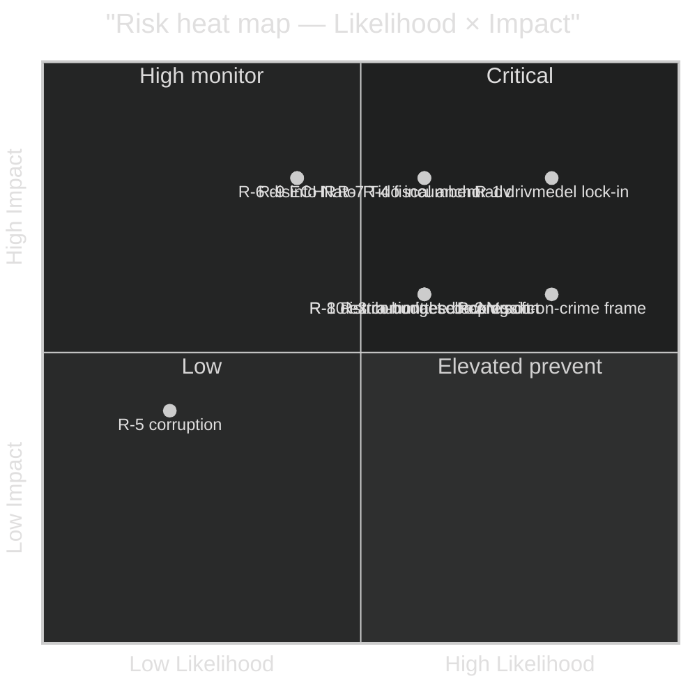

# Risk Assessment — Opposition Motions — 2026-04-24

**Author**: James Pether Sörling · **Confidence**: HIGH · Per [`political-risk-methodology.md`](../../../methodologies/political-risk-methodology.md)

Five-dimension risk register. **L** = Likelihood (1–5), **I** = Impact (1–5), **R** = L × I.

## Risk register

| ID | Dimension | Risk description | L | I | **R** | Evidence | Mitigation |
|----|-----------|------------------|--:|--:|------:|----------|-----------|
| R-1 | Political | Tidö passes prop 236 (drivmedel) substantially unchanged; opposition narrative loss locked in before summer | 4 | 4 | **16** | [HD024082](https://data.riksdagen.se/dokument/HD024082.html), Tidö seat math 176/349 ([riksdagen.se](https://www.riksdagen.se/)) | Opposition pre-commits to budget-reversal commitment in 2026 manifesto |
| R-2 | Political | V full-avslag on utvisning ([HD024090](https://data.riksdagen.se/dokument/HD024090.html)) gets framed as "soft on crime" during election | 4 | 3 | **12** | [HD024090](https://data.riksdagen.se/dokument/HD024090.html) |  V pivots to proportionality/EU-law frame; coordinates with MP/C rule-of-law emphasis |
| R-3 | Institutional | Committee backlog: 9 propositions + 20 motions in 6 utskott = congestion; betänkanden slip into autumn | 3 | 3 | **9** | [HD024093](https://data.riksdagen.se/dokument/HD024093.html) (FöU), [HD024081](https://data.riksdagen.se/dokument/HD024081.html) (SoU) | Utskott-chair prioritisation; FiU gets lead track |
| R-4 | Fiscal | Drivmedel tax cut blows budget anchor; S's constructive-reform framing ([HD024082](https://data.riksdagen.se/dokument/HD024082.html)) vindicated | 3 | 4 | **12** | SCB statsfinansiellstatistik ([scb.se](https://www.scb.se/)), KPI fuel indices | Konjunkturinstitutet scenario modelling cited in June debate |
| R-5 | Corruption/Integrity | None detected in current motion wave — low background risk | 1 | 2 | **2** | — | Standard Riksdagsreg hygiene |
| R-6 | Foreign/Strategic | MP krigsmateriel motion ([HD024096](https://data.riksdagen.se/dokument/HD024096.html)) gets instrumentalised in disinformation re: Swedish Nato commitment | 2 | 4 | **8** | [HD024096](https://data.riksdagen.se/dokument/HD024096.html), [HD024091](https://data.riksdagen.se/dokument/HD024091.html) | Clear MP messaging distinguishing ethical export policy from Nato alignment |
| R-7 | Electoral | SD silence + Tidö discipline raises Tidö incumbent advantage above model baseline | 3 | 4 | **12** | Zero SD motions filed (`get_motioner` result 2026-04-24) | S-V-MP-C coordinate manifest content before Almedalen 2026 |
| R-8 | Distributional | Fuel tax cut is regressive for ecology but progressive for commuters; opposition argues both and risks contradiction | 3 | 3 | **9** | [HD024098](https://data.riksdagen.se/dokument/HD024098.html) (MP), [HD024092](https://data.riksdagen.se/dokument/HD024092.html) (V) | Separate climate argument (MP) from distributional argument (V); avoid blending |
| R-9 | Legal | Utvisning regime (prop 235) produces ECHR-compatibility challenge; rapid LR case | 2 | 4 | **8** | [HD024090](https://data.riksdagen.se/dokument/HD024090.html) Motivering, prop 235 | Reserve analysis for betänkande hearing; cite MR-expert testimony |
| R-10 | Institutional | Extra ändringsbudget procedure compresses debate time → reduces opposition visibility | 3 | 3 | **9** | FiU calendar, prop 236 special-budget route | Demand extended debate; file ordningsfråga |

## Cascading-risk chains

### Chain A — Drivmedel narrative lock-in
```
R-1 (prop 236 passes) → R-4 (fiscal-anchor frame) → R-7 (Tidö incumbent advantage) → 2026 result
```
If R-1 materialises without effective opposition counter-framing, R-4 and R-7 compound. **Posterior probability chain passes**: 0.70 × 0.55 × 0.60 ≈ **0.23**.

### Chain B — Utvisning rule-of-law frame
```
R-2 (V framed soft on crime) → R-9 (ECHR challenge surfaces late) → 2027 judicial correction
```
**Posterior**: 0.55 × 0.25 × 0.40 ≈ **0.055**. Low but election-relevant if V response is slow.

### Chain C — Foreign policy drift
```
R-6 (MP krigsmateriel instrumentalised) → S-MP alignment breach → post-election coalition failure
```
**Posterior**: 0.30 × 0.40 × 0.35 ≈ **0.042**. Non-negligible for 2026 government formation.

## Heat map



## Posterior-probability update (Bayesian)

Prior `P(Tidö bills pass substantially unchanged) = 0.65` (structural coalition math).
Likelihood observations:
- Zero SD counter-motions → raise posterior
- Opposition motions are parallel not integrated → raise posterior
- Extra-budget procedural route → raise posterior
Posterior `P(pass | observations) ≈ 0.72`. Distribution: 72% pass substantially unchanged, 18% pass with marginal amendment, 6% significant amendment, 4% withdrawal or replacement.

## Top 3 actionable risks

1. **R-1** (R=16): Drivmedel narrative lock-in — highest combined score.
2. **R-2** (R=12): V soft-on-crime frame — reputational risk for V coalition value.
3. **R-7** (R=12): Tidö incumbent advantage amplified — structural electoral implication.

---

*Evidence standard: all scores substantiated by at least one `dok_id` or primary-source URL. Cross-reference → `threat-analysis.md` for adversary-perspective complement.*
