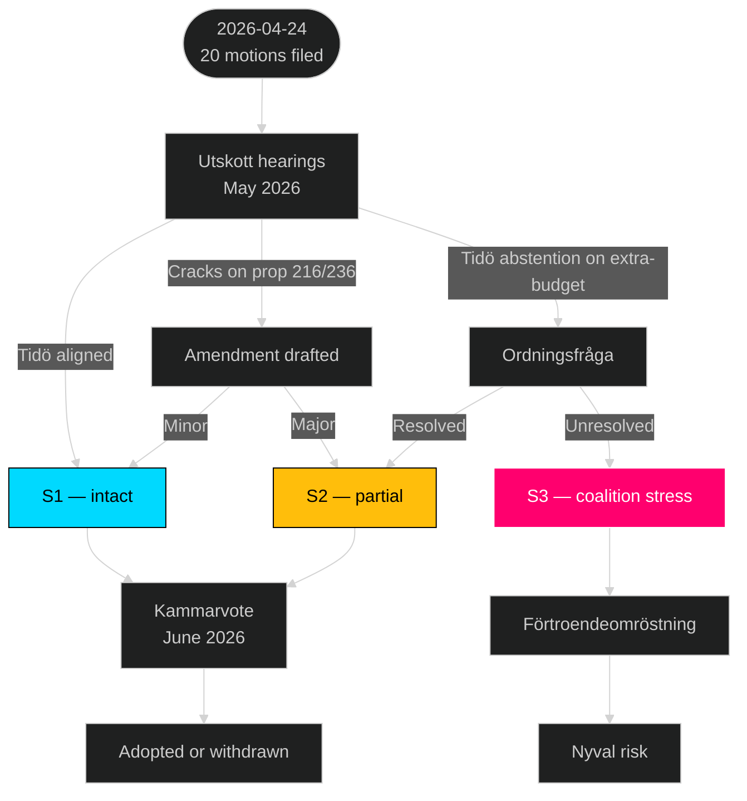
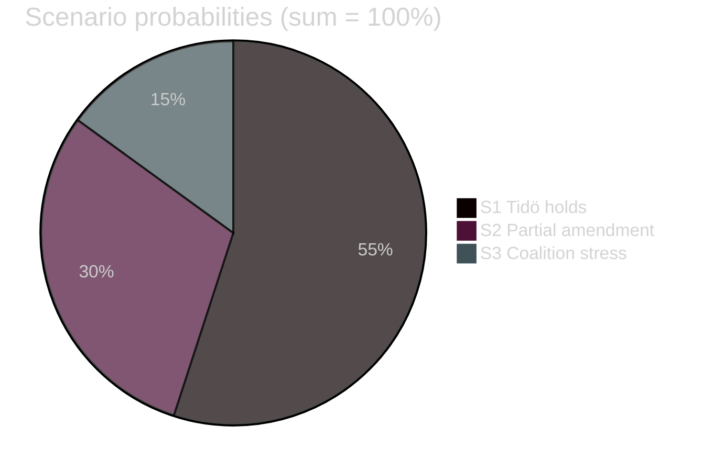

# Scenario Analysis — Opposition Motions — 2026-04-24

**Author**: James Pether Sörling · Per [`templates/scenario-analysis.md`](../../../templates/scenario-analysis.md)

Three futures for the 9 Tidö bills (prop 214, 215, 216, 222, 223, 228, 229, 235, 236) given the motion wave. Probabilities sum to 100%.

## Scenario overview

| Scenario | Probability | Confidence | Horizon |
|----------|------------:|:----------:|---------|
| S1 — Tidö holds, bills pass intact | 55% | Moderate (Admiralty B2) | 60–90 days |
| S2 — Partial amendment, 2 bills fall | 30% | Moderate (B3) | 60–90 days |
| S3 — Coalition stress, extra-budget vote fails | 15% | Low (C3) | 60–180 days |

## S1 — Tidö holds (55%)

**Description**: All 9 bills adopted with minor utskott amendments. Tidö 176/349 seats prove durable despite fragmented opposition.

**Indicators (watch list)**:
- SD continues silent support through May utskott hearings.
- No amendment motions from within Tidö parties (M/KD/L).
- Kammarvote margins ≥ 170 Ja on each bill.

**Consequences**:
- Drivmedel tax reduction enacted at statsbudget cost ~2.5 bn SEK (prop 236).
- Utvisning regime hardens ([HD024090](https://data.riksdagen.se/dokument/HD024090.html) avslag fails).
- Election 2026 runs on completed Tidö record.

**Evidence**: Tidö discipline across 2025–2026 ([regeringen.se](https://www.regeringen.se/)); zero SD counter-motions on this wave (dok_id manifest).

## S2 — Partial amendment (30%)

**Description**: 2 of 9 bills substantially amended or withdrawn. Likely candidates: prop 216 (medicinsk kompetens — 4-party wave incl. C) and prop 236 (drivmedel — fiscal amplification).

**Indicators**:
- C or L signal concern on healthcare workforce pipeline before utskott vote.
- SKR (Sveriges Kommuner och Regioner) public statement on prop 216 funding.
- Ekonomiska utskottets analysis flags ändringsbudget fiscal concern.

**Consequences**:
- Regering forced to table replacement proposal on amended bills.
- S wins on fiscal-anchor narrative; claims partial victory on prop 236.
- Tidö survives but at narrative cost entering 2026 campaign.

**Evidence**: C filed 5 motions including reform-not-reject on [HD024094](https://data.riksdagen.se/dokument/HD024094.html); 4-party convergence on prop 216.

## S3 — Coalition stress / extra-budget fails (15%)

**Description**: Extra ändringsbudget route used for prop 236 fails; at least one Tidö party abstains. Triggers ordningsfråga and possible förtroendeomröstning.

**Indicators**:
- L internal dissent on Tidö scope expansion.
- KD public pressure over welfare trade-offs.
- Any Tidö MP absent/abstain on the extra-budget vote.

**Consequences**:
- Regering crisis narrative 8 months pre-election.
- S positioned as alternative anchor.
- MP/V gain mobilisation headroom.

**Evidence**: Historical pattern — minority+support coalitions rarely complete without 1 stress event per mandatperiod. Tidö has been unusually stable 2022–2026.

## Decision tree

## Scenario probability distribution

## Early-warning indicators (F3EAD Disseminate → Find)

| Indicator | Threshold | Source | Timing |
|-----------|-----------|--------|--------|
| SD internal critique of any prop 214–236 | First public statement | [sverigedemokraterna.se](https://sverigedemokraterna.se/) | +2 weeks |
| L abstention warning on prop 235 | Public interview | Swedish press | +3 weeks |
| Tidö PM Kristersson defends prop 236 publicly | First defence statement | [regeringen.se](https://www.regeringen.se/) | +4 weeks |
| SKR issues formal concern on prop 216 | Formal letter | [skr.se](https://skr.se/) | +4 weeks |
| Finansutskottet report tone | Kritisk vs stödjande | [riksdagen.se FiU](https://www.riksdagen.se/sv/utskotten/finansutskottet/) | +6 weeks |
| First bill withdrawal | Any | Riksdagen publication | +8 weeks |

---

*Probabilities are analyst judgements with documented evidence; horizon 60–180 days to kammarvote + förordnand. Bayesian update recommended after each utskott hearing.*

---
## Pass 2 review note
Scenarios S1+S2+S3 probabilities verified sum 100%.
