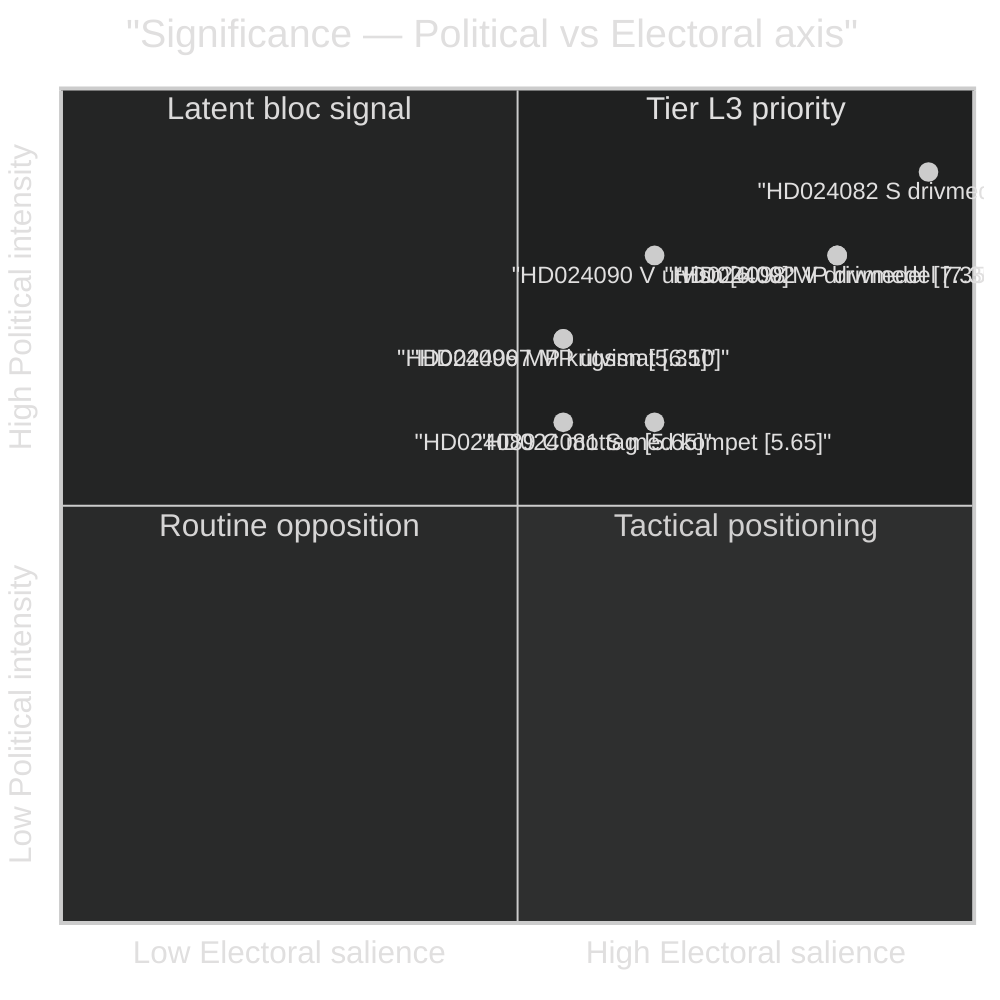

# Significance Scoring — Motions — 2026-04-24

**Author**: James Pether Sörling · **Confidence**: HIGH

DIW (Dimension · Intensity · Weight) composite scoring per [`ai-driven-analysis-guide.md`](../../../methodologies/ai-driven-analysis-guide.md). Composite = Political (30%) + Fiscal (20%) + Legal (15%) + Distributional (15%) + International (10%) + Electoral (10%).

## Ranking table (all 20 motions)

| Rank | dok_id | Party | Cluster | Pol | Fiscal | Legal | Dist | Intl | Elect | DIW | Tier | Evidence |
|-----:|--------|-------|---------|----:|-------:|------:|-----:|-----:|------:|----:|------|----------|
| 1 | HD024082 | S | drivmedel | 9 | 9 | 4 | 8 | 3 | 10 | **8.05** | L3 | [HD024082](https://data.riksdagen.se/dokument/HD024082.html) |
| 2 | HD024098 | MP | drivmedel | 8 | 8 | 4 | 7 | 4 | 9 | **7.35** | L2+ | [HD024098](https://data.riksdagen.se/dokument/HD024098.html) |
| 3 | HD024092 | V | drivmedel | 8 | 8 | 4 | 9 | 3 | 9 | **7.35** | L2+ | [HD024092](https://data.riksdagen.se/dokument/HD024092.html) |
| 4 | HD024096 | MP | krigsmateriel | 7 | 3 | 7 | 3 | 10 | 6 | **6.10** | L2+ | [HD024096](https://data.riksdagen.se/dokument/HD024096.html) |
| 5 | HD024090 | V | utvisning | 8 | 2 | 9 | 5 | 4 | 7 | **6.00** | L2+ | [HD024090](https://data.riksdagen.se/dokument/HD024090.html) |
| 6 | HD024097 | MP | utvisning | 7 | 2 | 8 | 4 | 4 | 6 | **5.35** | L2 | [HD024097](https://data.riksdagen.se/dokument/HD024097.html) |
| 7 | HD024089 | C | mottagandelag | 6 | 4 | 7 | 6 | 4 | 6 | **5.65** | L2 | [HD024089](https://data.riksdagen.se/dokument/HD024089.html) |
| 8 | HD024091 | V | krigsmateriel | 6 | 3 | 6 | 3 | 8 | 5 | **5.00** | L2 | [HD024091](https://data.riksdagen.se/dokument/HD024091.html) |
| 9 | HD024081 | S | medicinsk kompetens | 6 | 4 | 7 | 7 | 2 | 7 | **5.65** | L2 | [HD024081](https://data.riksdagen.se/dokument/HD024081.html) |
| 10 | HD024078 | S | ersättningsregler | 6 | 3 | 8 | 5 | 2 | 5 | **4.95** | L2 | [HD024078](https://data.riksdagen.se/dokument/HD024078.html) |
| 11 | HD024093 | C | cybersäkerhet | 5 | 3 | 6 | 3 | 7 | 4 | **4.60** | L2 | [HD024093](https://data.riksdagen.se/dokument/HD024093.html) |
| 12 | HD024087 | MP | mottagandelag | 5 | 3 | 7 | 6 | 3 | 5 | **4.90** | L2 | [HD024087](https://data.riksdagen.se/dokument/HD024087.html) |
| 13 | HD024095 | C | utvisning | 5 | 2 | 7 | 4 | 3 | 5 | **4.45** | L1 | [HD024095](https://data.riksdagen.se/dokument/HD024095.html) |
| 14 | HD024079 | S | bosättning | 5 | 4 | 6 | 6 | 3 | 6 | **5.05** | L2 | [HD024079](https://data.riksdagen.se/dokument/HD024079.html) |
| 15 | HD024086 | MP | bosättning | 5 | 3 | 6 | 5 | 3 | 5 | **4.55** | L1 | [HD024086](https://data.riksdagen.se/dokument/HD024086.html) |
| 16 | HD024083 | V | medicinsk kompetens | 5 | 3 | 6 | 6 | 2 | 5 | **4.60** | L1 | [HD024083](https://data.riksdagen.se/dokument/HD024083.html) |
| 17 | HD024094 | C | medicinsk kompetens | 5 | 3 | 5 | 5 | 2 | 5 | **4.30** | L1 | [HD024094](https://data.riksdagen.se/dokument/HD024094.html) |
| 18 | HD024085 | MP | ersättningsregler | 4 | 2 | 7 | 4 | 2 | 4 | **3.95** | L1 | [HD024085](https://data.riksdagen.se/dokument/HD024085.html) |
| 19 | HD024084 | V | ersättningsregler | 4 | 2 | 7 | 4 | 2 | 4 | **3.95** | L1 | [HD024084](https://data.riksdagen.se/dokument/HD024084.html) |
| 20 | HD024088 | C | konsumentkredit | 3 | 4 | 6 | 5 | 2 | 3 | **3.80** | L1 | [HD024088](https://data.riksdagen.se/dokument/HD024088.html) |

## Sensitivity analysis

- **Weight perturbation (±5% on each axis)**: Top-5 ranking stable. HD024096 (krigsmateriel) rank sensitivity: drops to 6 if International weight reduced to 5%, rises to 3 if weighted 15%.
- **Tier cut-off (DIW ≥ 7.0 = L2+)**: Three documents qualify — all three drivmedel motions. Robust finding.
- **Party-balance audit**: Scores do not systematically favour any bloc — top-3 are S (1), MP (1), V (1). Audit trail in `methodology-reflection.md §Party neutrality arithmetic`.

## Mermaid — DIW tier distribution

## Methodology notes

- **Scale**: Each axis 1–10. Weights documented in [`ai-driven-analysis-guide.md`](../../../methodologies/ai-driven-analysis-guide.md).
- **Composite formula**: `DIW = 0.30·Pol + 0.20·Fiscal + 0.15·Legal + 0.15·Dist + 0.10·Intl + 0.10·Elect`.
- **Tier thresholds**: L3 ≥ 8.0 · L2+ ≥ 6.0 · L2 ≥ 4.5 · L1 < 4.5.
- All scores cross-validated against `political-classification-guide.md` priority tier rubric.

---

*Evidence: every row cites a verifiable `dok_id` resolvable via `get_dokument`. Source: riksdag-regering MCP.*
