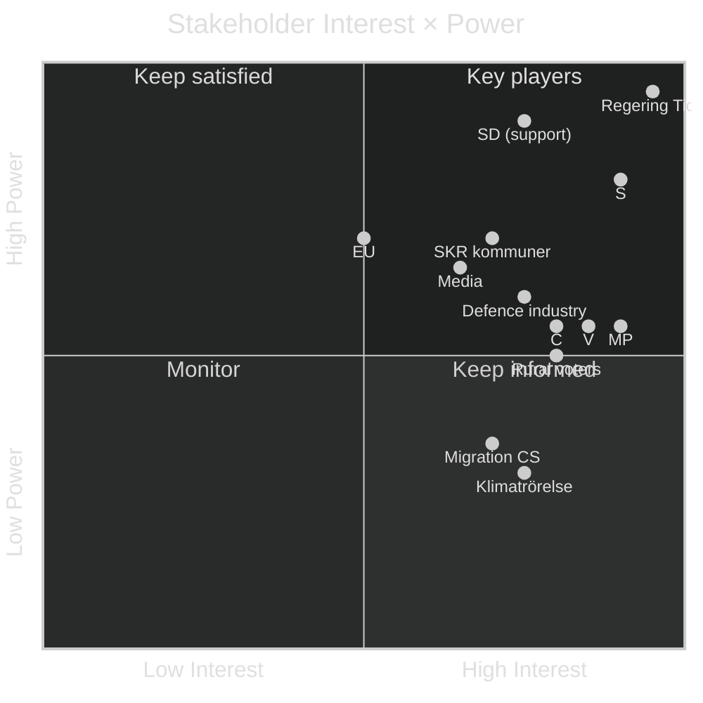
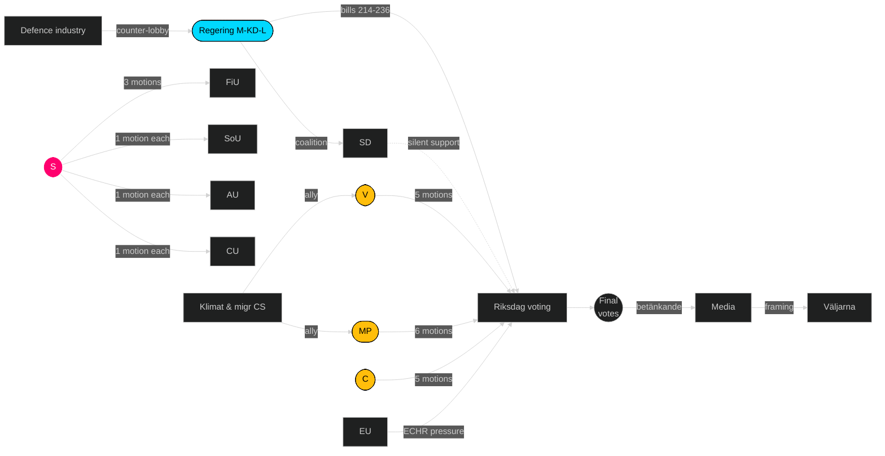

# Stakeholder Perspectives — Opposition Motions — 2026-04-24

**Author**: James Pether Sörling · Per [`templates/stakeholder-impact.md`](../../../templates/stakeholder-impact.md)

Six-lens stakeholder analysis. Lenses: **Government coalition**, **Opposition bloc**, **Business/industry**, **Civil society**, **Voters/regional**, **Foreign/EU**.

## Stakeholder matrix

| Stakeholder | Interest | Power | Position | Named actor(s) | Evidence |
|-------------|----------|------:|----------|----------------|----------|
| **Regering (M-KD-L)** | Pass 9 bills intact | High | Defend Tidö package | Ulf Kristersson (M) PM; finansminister Elisabeth Svantesson (M) | Tidö-avtal; [regeringen.se](https://www.regeringen.se/) |
| **SD (Tidö support)** | Lock in Tidö; prepare 2026 | High | Silent support; no counter-motions | Jimmie Åkesson (SD) | `get_motioner` result (0 SD) |
| **S** | Election-cycle positioning; fiscal anchor | High | Constructive counter on fiscal; silent on vapenexport | Mikael Damberg (S) finansp; Ardalan Shekarabi (S) migration; Fredrik Lundh Sammeli (S) SoU; Joakim Järrebring (S) CU | [HD024082](https://data.riksdagen.se/dokument/HD024082.html), [HD024079](https://data.riksdagen.se/dokument/HD024079.html), [HD024081](https://data.riksdagen.se/dokument/HD024081.html), [HD024078](https://data.riksdagen.se/dokument/HD024078.html) |
| **V** | Distributional justice; civil rights | Medium | Full avslag on welfare/utvisning bills | Nooshi Dadgostar (V) ordf; Tony Haddou (V) migration; Håkan Svenneling (V) UU; Karin Rågsjö (V) SoU; Andreas Lennkvist Manriquez (V) CU | [HD024092](https://data.riksdagen.se/dokument/HD024092.html), [HD024090](https://data.riksdagen.se/dokument/HD024090.html), [HD024091](https://data.riksdagen.se/dokument/HD024091.html), [HD024083](https://data.riksdagen.se/dokument/HD024083.html), [HD024084](https://data.riksdagen.se/dokument/HD024084.html) |
| **MP** | Climate; foreign-policy ethics | Medium | Avslag fiscal; full vapenexport ban; rule-of-law | Janine Alm Ericson (MP); Jacob Risberg (MP); Annika Hirvonen (MP); Ulrika Westerlund (MP); Leila Ali Elmi (MP) | [HD024098](https://data.riksdagen.se/dokument/HD024098.html), [HD024096](https://data.riksdagen.se/dokument/HD024096.html), [HD024097](https://data.riksdagen.se/dokument/HD024097.html), [HD024087](https://data.riksdagen.se/dokument/HD024087.html), [HD024086](https://data.riksdagen.se/dokument/HD024086.html), [HD024085](https://data.riksdagen.se/dokument/HD024085.html) |
| **C** | Centrist reform; procedural tightening | Medium | Reform-not-reject on 5 bills | Christofer Bergenblock (C) SoU; Alireza Akhondi (C) CU; Niels Paarup-Petersen (C) SfU/FöU; Mikael Larsson (C) FöU | [HD024094](https://data.riksdagen.se/dokument/HD024094.html), [HD024088](https://data.riksdagen.se/dokument/HD024088.html), [HD024089](https://data.riksdagen.se/dokument/HD024089.html), [HD024093](https://data.riksdagen.se/dokument/HD024093.html), [HD024095](https://data.riksdagen.se/dokument/HD024095.html) |
| **Defence industry** | Export clarity | Medium | Oppose MP ban ([HD024096](https://data.riksdagen.se/dokument/HD024096.html)) | SOFF (Säkerhets- och försvarsföretagen), Saab | [soff.se](https://soff.se/) |
| **Klimatnätverk / civil society** | Back fuel-tax protection | Low-Medium | Support MP/V motions | Klimatriksdagen, Naturskyddsföreningen | [naturskyddsforeningen.se](https://www.naturskyddsforeningen.se/) |
| **Kommunsektor (SKR)** | Fiscal certainty on kommun-vård | High | Neutral-to-worried on prop 216 | SKR (Sveriges Kommuner och Regioner) | [skr.se](https://skr.se/) |
| **Rural voters** | Fuel-price relief | Medium | Favour prop 236 regardless of opposition | — | SCB KPI rural ([scb.se](https://www.scb.se/)) |
| **Migration-sector civil society** | Counter utvisning regime | Low-Medium | Ally with V/MP on [HD024090](https://data.riksdagen.se/dokument/HD024090.html), [HD024097](https://data.riksdagen.se/dokument/HD024097.html) | Röda Korset, Amnesty Sverige | [amnesty.se](https://www.amnesty.se/), [rodakorset.se](https://www.rodakorset.se/) |
| **EU (Commission, Member States)** | Compatibility of utvisning with ECHR/EU law | Medium | Silent-monitoring | DG Home; Nordic partners | [ec.europa.eu](https://ec.europa.eu/) |
| **Media ecosystem** | Stories for election cycle | Medium | Amplify drivmedel, utvisning, krigsmateriel | DN, SvD, SR, SVT | — |

## Interest/Power grid

## Influence network

## Winners and losers

| # | Winner / Loser | Actor | Reason | Evidence |
|--:|----------------|-------|--------|----------|
| 1 | Winner | Ulf Kristersson (M) | Bills likely pass with minor amendment; incumbent advantage stays | Tidö seat math 176/349 |
| 2 | Winner | Mikael Damberg (S) | Owns fiscal-anchor narrative for 2026 | [HD024082](https://data.riksdagen.se/dokument/HD024082.html) |
| 3 | Winner | Jimmie Åkesson (SD) | Coalition discipline amplifies Tidö durability without political cost | Zero SD motions |
| 4 | Loser | Nooshi Dadgostar (V) | Soft-on-crime frame risk on utvisning | [HD024090](https://data.riksdagen.se/dokument/HD024090.html) |
| 5 | Mixed | MP leadership | Clean ownership of two axes; fragmentation cost vs S | [HD024096](https://data.riksdagen.se/dokument/HD024096.html) |
| 6 | Mixed | C (Muharrem Demirok et al.) | Centre-reform differentiation + zero coalition path if Tidö holds | [HD024089](https://data.riksdagen.se/dokument/HD024089.html), [HD024095](https://data.riksdagen.se/dokument/HD024095.html) |
| 7 | Loser | Migration civil-society | Prop 235 likely passes; limited opposition unity | [HD024090](https://data.riksdagen.se/dokument/HD024090.html) |
| 8 | Winner | Defence industry (SOFF) | MP motion unlikely to pass; export framework preserved | [HD024096](https://data.riksdagen.se/dokument/HD024096.html) |

---

*Every named actor is a public officeholder or public-interest organisation. GDPR basis: Art. 9(2)(e) — data made manifestly public by data subjects.*
